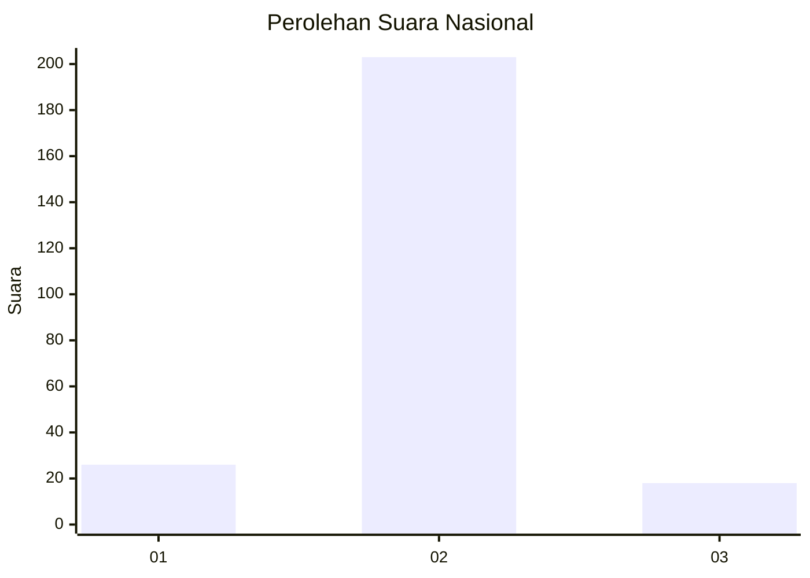
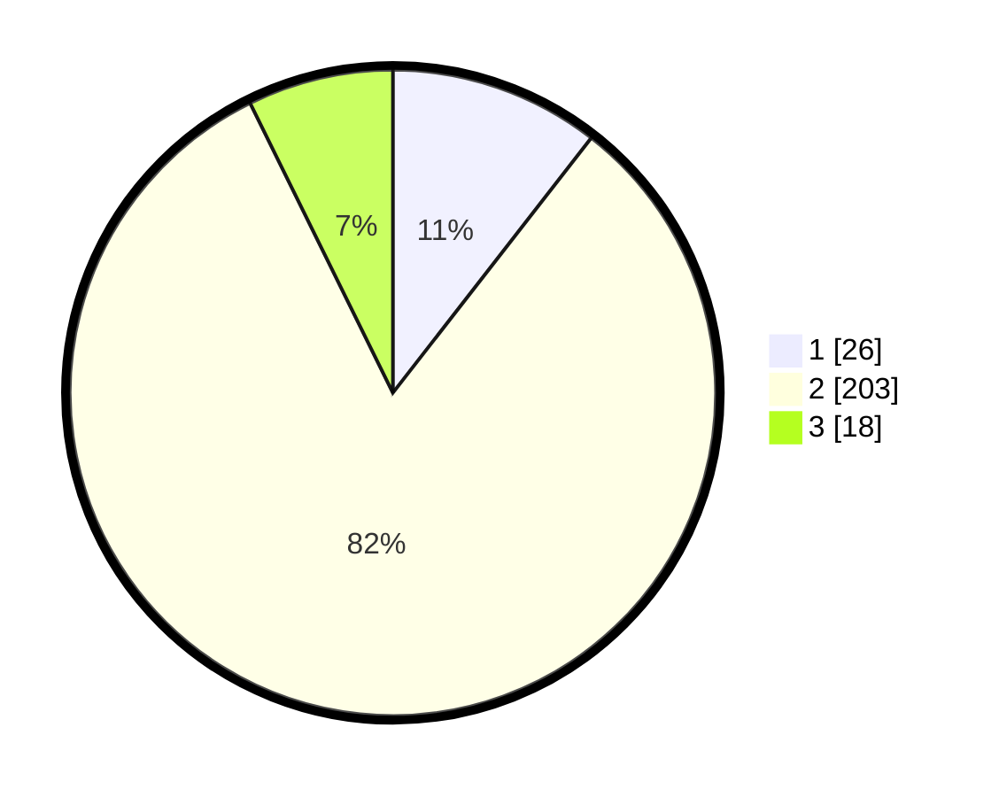

# Hasil

## Grafik

## Tabel

| No. | Nama Paslon    | Suara | Suara (raw) | Persentase |
|:--- |:-------------- | -----:| -----------:| ----------:|
| 1   | ANIES MUHAIMIN | 26    | [26][p-1]   | 10,53      |
| 2   | PRABOWO GIBRAN | 203   | [203][p-2]  | 82,19      |
| 3   | GANJAR MAHFUD  | 18    | [18][p-3]   | 7,29       |

[p-1]: https://github.com/gigit-pemilu/pemilu-2024/blob/main/pilpres/hitung-suara/sub/81-maluku/sub/04-buru/sub/11-lolong-guba/sub/2003-grandeng/sub/002-tps/sub/paslon-1.txt
[p-2]: https://github.com/gigit-pemilu/pemilu-2024/blob/main/pilpres/hitung-suara/sub/81-maluku/sub/04-buru/sub/11-lolong-guba/sub/2003-grandeng/sub/002-tps/sub/paslon-2.txt
[p-3]: https://github.com/gigit-pemilu/pemilu-2024/blob/main/pilpres/hitung-suara/sub/81-maluku/sub/04-buru/sub/11-lolong-guba/sub/2003-grandeng/sub/002-tps/sub/paslon-3.txt

## Foto C Plano

https://sirekap-obj-formc.kpu.go.id/4cf5/pemilu/ppwp/81/04/11/20/03/8104112003002-20240215-233119--41fee925-3bf2-4a93-99a3-2575de242ece.jpg

https://sirekap-obj-formc.kpu.go.id/4cf5/pemilu/ppwp/81/04/11/20/03/8104112003002-20240215-233235--07977334-235e-4f44-bade-bb77a4a378af.jpg

https://sirekap-obj-formc.kpu.go.id/4cf5/pemilu/ppwp/81/04/11/20/03/8104112003002-20240215-233416--d7971d8f-7a43-46fd-8d1e-35d1920de0d4.jpg

## Metadata

| Key        | Value               |
| ---------- | ------------------- |
| Time Stamp | 2024-02-17 12:00:00 |

