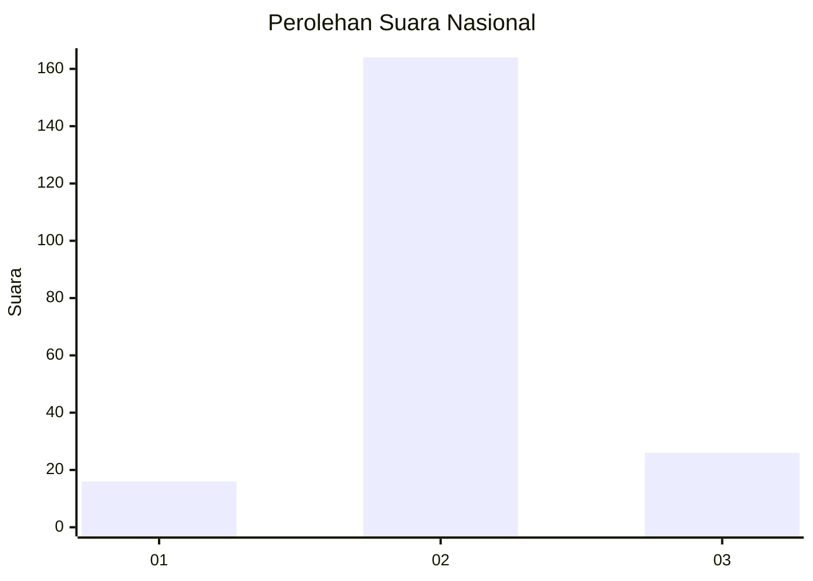
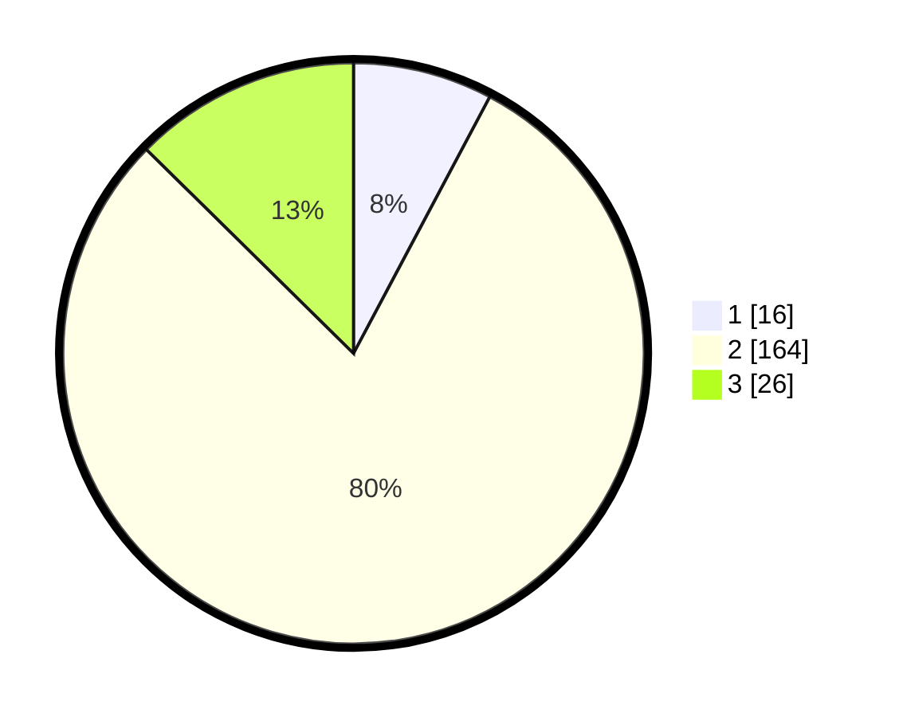

# Hasil

## Grafik

## Tabel

| No. | Nama Paslon    | Suara | Suara (raw) | Persentase |
|:--- |:-------------- | -----:| -----------:| ----------:|
| 1   | ANIES MUHAIMIN | 16    | [16][p-1]   | 7,77       |
| 2   | PRABOWO GIBRAN | 164   | [164][p-2]  | 79,61      |
| 3   | GANJAR MAHFUD  | 26    | [26][p-3]   | 12,62      |

[p-1]: https://github.com/gigit-pemilu/pemilu-2024/blob/main/pilpres/hitung-suara/sub/81-maluku/sub/04-buru/sub/11-lolong-guba/sub/2003-grandeng/sub/003-tps/sub/paslon-1.txt
[p-2]: https://github.com/gigit-pemilu/pemilu-2024/blob/main/pilpres/hitung-suara/sub/81-maluku/sub/04-buru/sub/11-lolong-guba/sub/2003-grandeng/sub/003-tps/sub/paslon-2.txt
[p-3]: https://github.com/gigit-pemilu/pemilu-2024/blob/main/pilpres/hitung-suara/sub/81-maluku/sub/04-buru/sub/11-lolong-guba/sub/2003-grandeng/sub/003-tps/sub/paslon-3.txt

## Foto C Plano

https://sirekap-obj-formc.kpu.go.id/5d15/pemilu/ppwp/81/04/11/20/03/8104112003003-20240215-101045--07d5cef6-1f78-460b-99ce-162533924295.jpg

https://sirekap-obj-formc.kpu.go.id/5d15/pemilu/ppwp/81/04/11/20/03/8104112003003-20240215-101219--1ef5700b-400a-47e7-ab0d-95438bb92ef2.jpg

https://sirekap-obj-formc.kpu.go.id/5d15/pemilu/ppwp/81/04/11/20/03/8104112003003-20240215-101256--82655f92-c2de-4538-8ef4-eea3ab8c2c4e.jpg

## Metadata

| Key        | Value               |
| ---------- | ------------------- |
| Time Stamp | 2024-02-17 13:37:34 |

