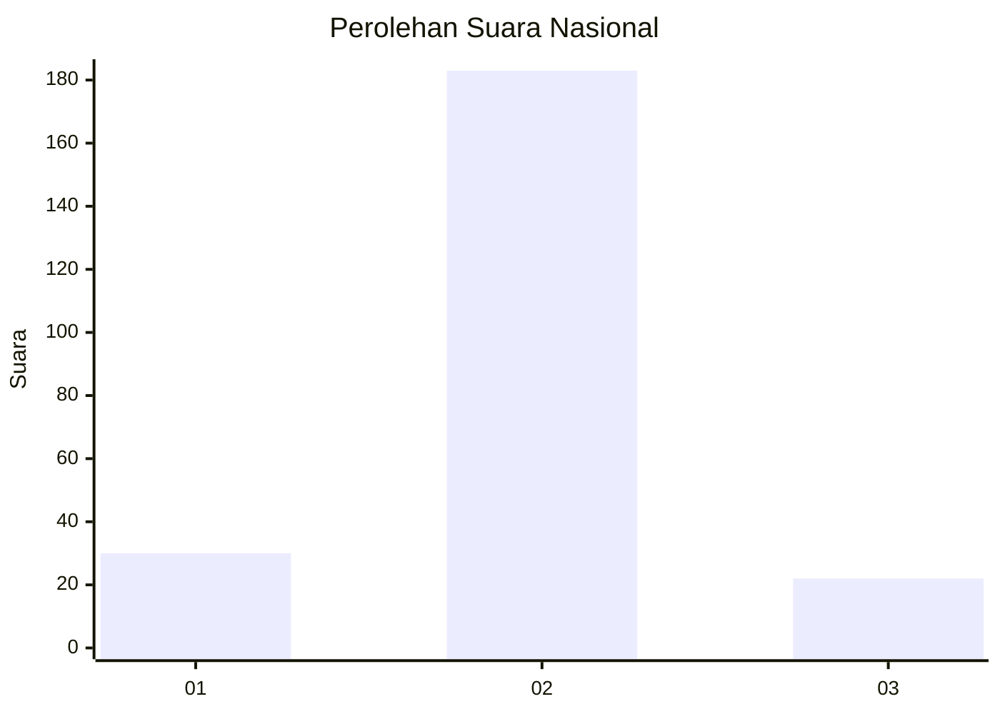
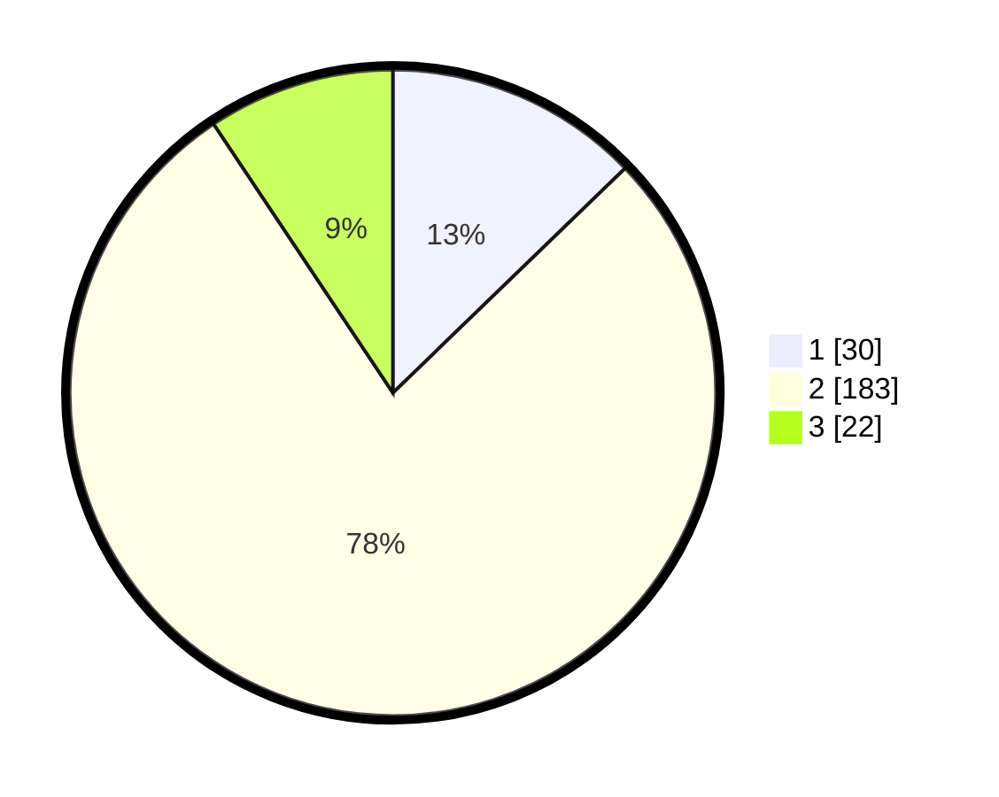

# Hasil

## Grafik

## Tabel

| No. | Nama Paslon    | Suara | Suara (raw) | Persentase |
|:--- |:-------------- | -----:| -----------:| ----------:|
| 1   | ANIES MUHAIMIN | 30    | [30][p-1]   | 12,77      |
| 2   | PRABOWO GIBRAN | 183   | [183][p-2]  | 77,87      |
| 3   | GANJAR MAHFUD  | 22    | [22][p-3]   | 9,36       |

[p-1]: https://github.com/gigit-pemilu/pemilu-2024/blob/main/pilpres/hitung-suara/sub/81-maluku/sub/04-buru/sub/11-lolong-guba/sub/2005-wanakarta/sub/004-tps/sub/paslon-1.txt
[p-2]: https://github.com/gigit-pemilu/pemilu-2024/blob/main/pilpres/hitung-suara/sub/81-maluku/sub/04-buru/sub/11-lolong-guba/sub/2005-wanakarta/sub/004-tps/sub/paslon-2.txt
[p-3]: https://github.com/gigit-pemilu/pemilu-2024/blob/main/pilpres/hitung-suara/sub/81-maluku/sub/04-buru/sub/11-lolong-guba/sub/2005-wanakarta/sub/004-tps/sub/paslon-3.txt

## Foto C Plano

https://sirekap-obj-formc.kpu.go.id/9fc5/pemilu/ppwp/81/04/11/20/05/8104112005004-20240215-095721--5873eef8-6a62-4a0c-86fb-da9bd2f975d0.jpg

https://sirekap-obj-formc.kpu.go.id/9fc5/pemilu/ppwp/81/04/11/20/05/8104112005004-20240215-100436--4bce1343-ba66-4eec-b3c8-50f0af2cc4be.jpg

https://sirekap-obj-formc.kpu.go.id/9fc5/pemilu/ppwp/81/04/11/20/05/8104112005004-20240215-095921--e1e5b852-1892-4717-82dc-a1d241ca69b2.jpg

## Metadata

| Key        | Value               |
| ---------- | ------------------- |
| Time Stamp | 2024-02-15 17:30:25 |

