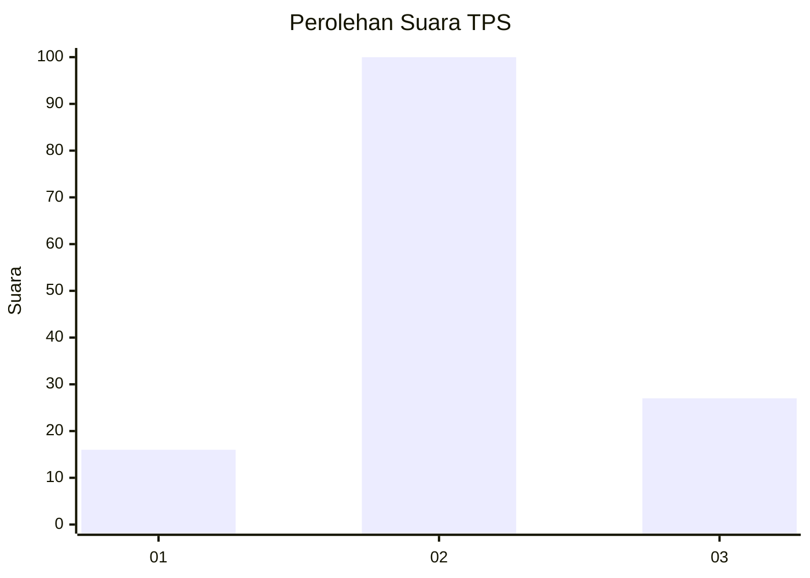
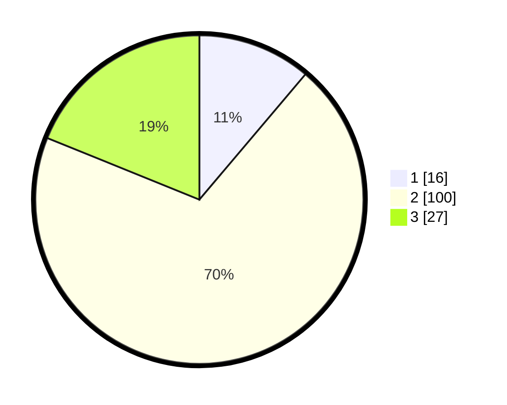

# Hasil

## Grafik

## Tabel

| No. | Nama Paslon    | Suara | Suara (raw) | Persentase |
|:--- |:-------------- | -----:| -----------:| ----------:|
| 1   | ANIES MUHAIMIN | 16    | [16][p-1]   | 11,19      |
| 2   | PRABOWO GIBRAN | 100   | [100][p-2]  | 69,93      |
| 3   | GANJAR MAHFUD  | 27    | [27][p-3]   | 18,88      |

[p-1]: https://github.com/gigit-pemilu/pemilu-2024-81-maluku/blob/main/pilpres/hitung-suara/sub/81-maluku/sub/04-buru/sub/12-waelata/sub/2001-waelo/sub/001-tps/sub/paslon-1.txt
[p-2]: https://github.com/gigit-pemilu/pemilu-2024-81-maluku/blob/main/pilpres/hitung-suara/sub/81-maluku/sub/04-buru/sub/12-waelata/sub/2001-waelo/sub/001-tps/sub/paslon-2.txt
[p-3]: https://github.com/gigit-pemilu/pemilu-2024-81-maluku/blob/main/pilpres/hitung-suara/sub/81-maluku/sub/04-buru/sub/12-waelata/sub/2001-waelo/sub/001-tps/sub/paslon-3.txt

## Foto C Plano

https://sirekap-obj-formc.kpu.go.id/f80e/pemilu/ppwp/81/04/12/20/01/8104122001001-20240215-051809--2bda4a7c-26dd-4c65-8d9e-082880977542.jpg

https://sirekap-obj-formc.kpu.go.id/f80e/pemilu/ppwp/81/04/12/20/01/8104122001001-20240215-052028--5a812d24-1dbc-4eb7-a593-626dce6cf22d.jpg

https://sirekap-obj-formc.kpu.go.id/f80e/pemilu/ppwp/81/04/12/20/01/8104122001001-20240215-052205--a067bf3e-9c62-4787-be02-e2fc1fe33582.jpg

## Metadata

| Key        | Value               |
| ---------- | ------------------- |
| Time Stamp | 2024-02-16 13:30:32 |

