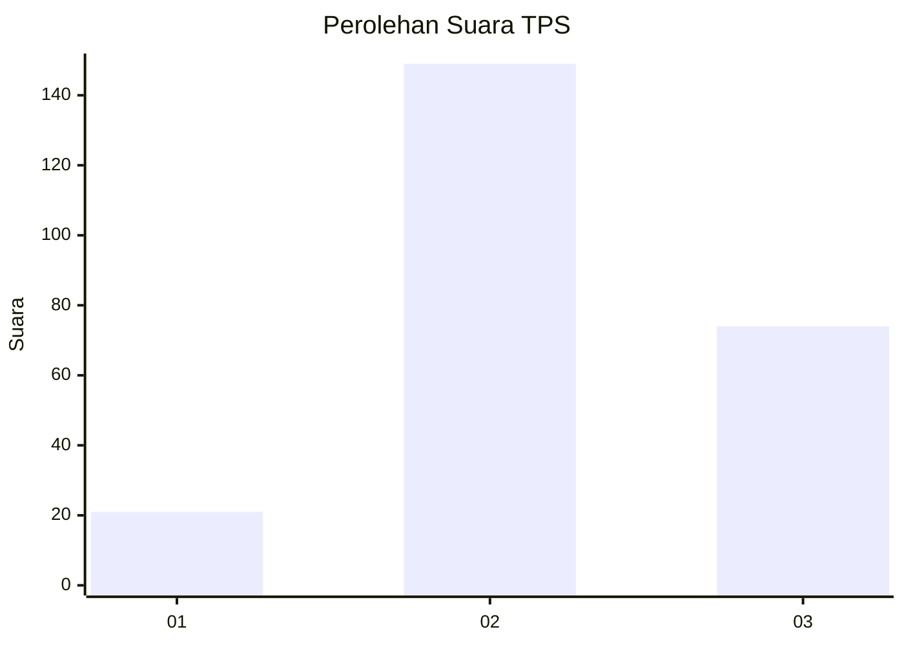
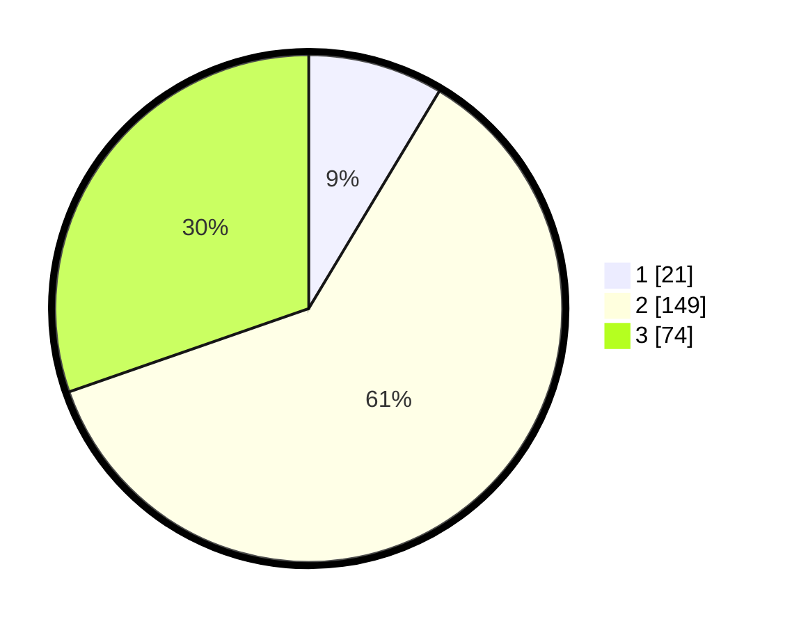

# Hasil

## Grafik

## Tabel

| No. | Nama Paslon    | Suara | Suara (raw) | Persentase |
|:--- |:-------------- | -----:| -----------:| ----------:|
| 1   | ANIES MUHAIMIN | 21    | [21][p-1]   | 8,61       |
| 2   | PRABOWO GIBRAN | 149   | [149][p-2]  | 61,07      |
| 3   | GANJAR MAHFUD  | 74    | [74][p-3]   | 30,33      |

[p-1]: https://github.com/gigit-pemilu/pemilu-2024-81-maluku/blob/main/pilpres/hitung-suara/sub/81-maluku/sub/04-buru/sub/12-waelata/sub/2001-waelo/sub/002-tps/sub/paslon-1.txt
[p-2]: https://github.com/gigit-pemilu/pemilu-2024-81-maluku/blob/main/pilpres/hitung-suara/sub/81-maluku/sub/04-buru/sub/12-waelata/sub/2001-waelo/sub/002-tps/sub/paslon-2.txt
[p-3]: https://github.com/gigit-pemilu/pemilu-2024-81-maluku/blob/main/pilpres/hitung-suara/sub/81-maluku/sub/04-buru/sub/12-waelata/sub/2001-waelo/sub/002-tps/sub/paslon-3.txt

## Foto C Plano

https://sirekap-obj-formc.kpu.go.id/ba6b/pemilu/ppwp/81/04/12/20/01/8104122001002-20240215-083516--400c6a17-8a66-4a57-af49-1fcfac1107e6.jpg

https://sirekap-obj-formc.kpu.go.id/ba6b/pemilu/ppwp/81/04/12/20/01/8104122001002-20240215-083652--d9f32709-4405-4b80-87ea-1f941393232a.jpg

https://sirekap-obj-formc.kpu.go.id/ba6b/pemilu/ppwp/81/04/12/20/01/8104122001002-20240215-083914--cad3b13a-fb71-47cf-a985-0fdbae1e95f1.jpg

## Metadata

| Key        | Value               |
| ---------- | ------------------- |
| Time Stamp | 2024-02-16 13:30:32 |

