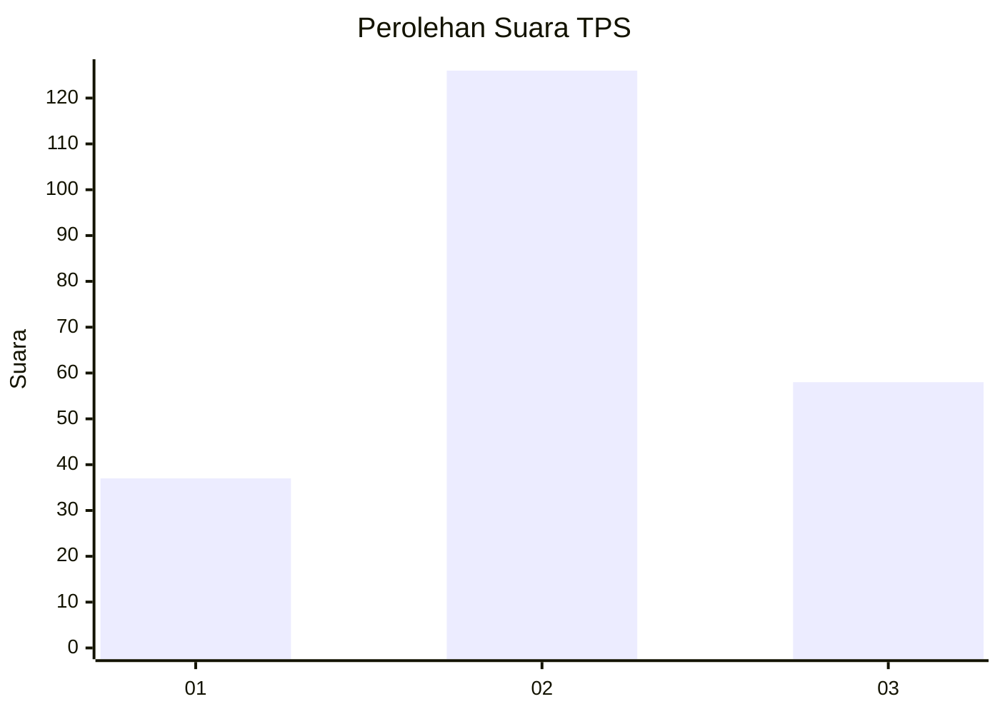
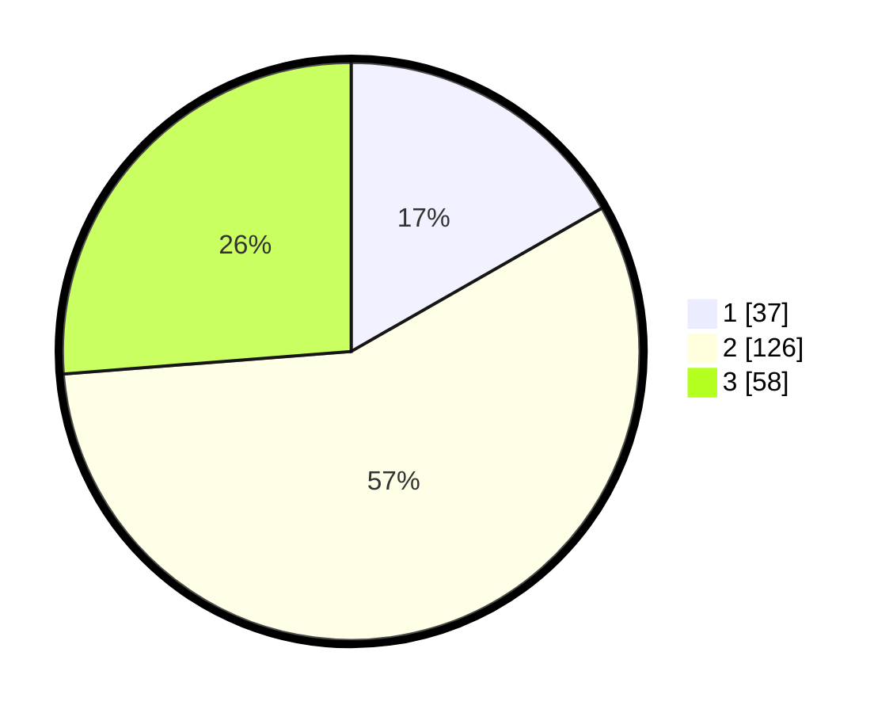

# Hasil

## Grafik

## Tabel

| No. | Nama Paslon    | Suara | Suara (raw) | Persentase |
|:--- |:-------------- | -----:| -----------:| ----------:|
| 1   | ANIES MUHAIMIN | 37    | [37][p-1]   | 16,74      |
| 2   | PRABOWO GIBRAN | 126   | [126][p-2]  | 57,01      |
| 3   | GANJAR MAHFUD  | 58    | [58][p-3]   | 26,24      |

[p-1]: https://github.com/gigit-pemilu/pemilu-2024-81-maluku/blob/main/pilpres/hitung-suara/sub/81-maluku/sub/04-buru/sub/12-waelata/sub/2001-waelo/sub/004-tps/sub/paslon-1.txt
[p-2]: https://github.com/gigit-pemilu/pemilu-2024-81-maluku/blob/main/pilpres/hitung-suara/sub/81-maluku/sub/04-buru/sub/12-waelata/sub/2001-waelo/sub/004-tps/sub/paslon-2.txt
[p-3]: https://github.com/gigit-pemilu/pemilu-2024-81-maluku/blob/main/pilpres/hitung-suara/sub/81-maluku/sub/04-buru/sub/12-waelata/sub/2001-waelo/sub/004-tps/sub/paslon-3.txt

## Foto C Plano

https://sirekap-obj-formc.kpu.go.id/bd0f/pemilu/ppwp/81/04/12/20/01/8104122001004-20240215-035528--6ba38750-2cd2-49a7-9cae-003893b43cf0.jpg

https://sirekap-obj-formc.kpu.go.id/bd0f/pemilu/ppwp/81/04/12/20/01/8104122001004-20240215-022222--0de83b82-fde9-43eb-83e9-9171a0b90484.jpg

https://sirekap-obj-formc.kpu.go.id/bd0f/pemilu/ppwp/81/04/12/20/01/8104122001004-20240215-021537--99e23fc8-c58b-4fb3-ac75-70b7b51c6967.jpg

## Metadata

| Key        | Value               |
| ---------- | ------------------- |
| Time Stamp | 2024-02-17 13:37:34 |

