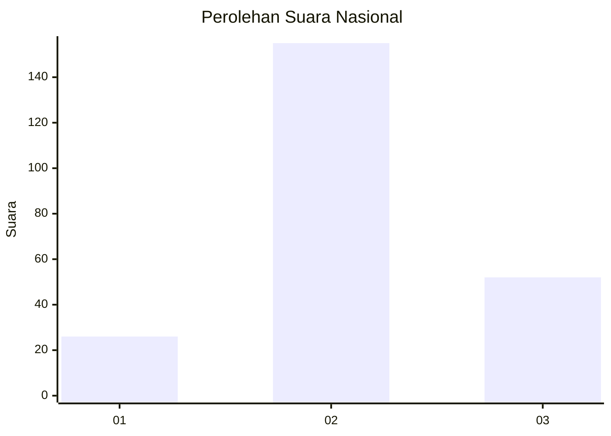
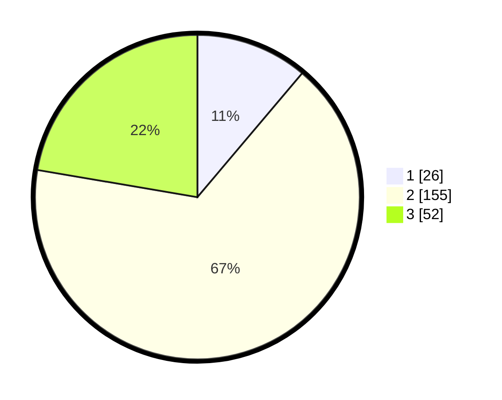

# Hasil

## Grafik

## Tabel

| No. | Nama Paslon    | Suara | Suara (raw) | Persentase |
|:--- |:-------------- | -----:| -----------:| ----------:|
| 1   | ANIES MUHAIMIN | 26    | [26][p-1]   | 11,16      |
| 2   | PRABOWO GIBRAN | 155   | [155][p-2]  | 66,52      |
| 3   | GANJAR MAHFUD  | 52    | [52][p-3]   | 22,32      |

[p-1]: https://github.com/gigit-pemilu/pemilu-2024/blob/main/pilpres/hitung-suara/sub/81-maluku/sub/04-buru/sub/12-waelata/sub/2001-waelo/sub/005-tps/sub/paslon-1.txt
[p-2]: https://github.com/gigit-pemilu/pemilu-2024/blob/main/pilpres/hitung-suara/sub/81-maluku/sub/04-buru/sub/12-waelata/sub/2001-waelo/sub/005-tps/sub/paslon-2.txt
[p-3]: https://github.com/gigit-pemilu/pemilu-2024/blob/main/pilpres/hitung-suara/sub/81-maluku/sub/04-buru/sub/12-waelata/sub/2001-waelo/sub/005-tps/sub/paslon-3.txt

## Foto C Plano

https://sirekap-obj-formc.kpu.go.id/e00a/pemilu/ppwp/81/04/12/20/01/8104122001005-20240214-204524--f53f8f25-0842-45e1-8e14-57db5b509b34.jpg

https://sirekap-obj-formc.kpu.go.id/e00a/pemilu/ppwp/81/04/12/20/01/8104122001005-20240214-204702--f28d5ee8-8fb5-4bdb-9488-b623eafd57cf.jpg

https://sirekap-obj-formc.kpu.go.id/e00a/pemilu/ppwp/81/04/12/20/01/8104122001005-20240214-204818--b443f7b6-037b-4c88-995e-903588f2e412.jpg

## Metadata

| Key        | Value               |
| ---------- | ------------------- |
| Time Stamp | 2024-02-17 13:37:34 |

