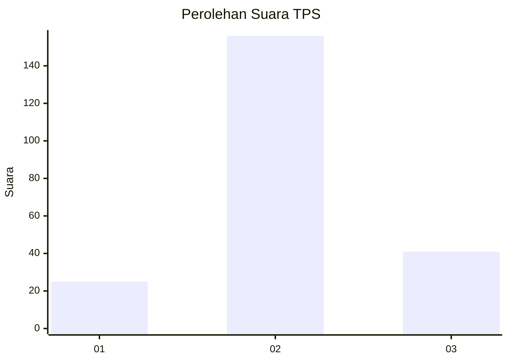
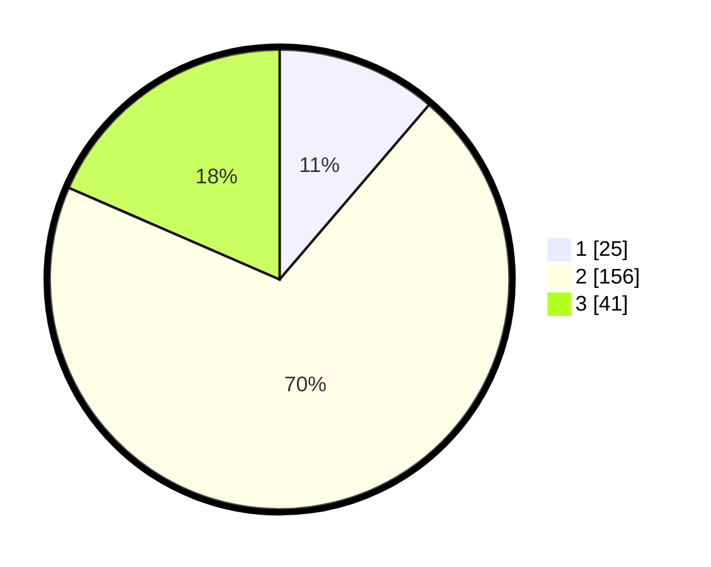

# Hasil

## Grafik

## Tabel

| No. | Nama Paslon    | Suara | Suara (raw) | Persentase |
|:--- |:-------------- | -----:| -----------:| ----------:|
| 1   | ANIES MUHAIMIN | 25    | [25][p-1]   | 11,26      |
| 2   | PRABOWO GIBRAN | 156   | [156][p-2]  | 70,27      |
| 3   | GANJAR MAHFUD  | 41    | [41][p-3]   | 18,47      |

[p-1]: https://github.com/gigit-pemilu/pemilu-2024-81-maluku/blob/main/pilpres/hitung-suara/sub/81-maluku/sub/04-buru/sub/12-waelata/sub/2001-waelo/sub/006-tps/sub/paslon-1.txt
[p-2]: https://github.com/gigit-pemilu/pemilu-2024-81-maluku/blob/main/pilpres/hitung-suara/sub/81-maluku/sub/04-buru/sub/12-waelata/sub/2001-waelo/sub/006-tps/sub/paslon-2.txt
[p-3]: https://github.com/gigit-pemilu/pemilu-2024-81-maluku/blob/main/pilpres/hitung-suara/sub/81-maluku/sub/04-buru/sub/12-waelata/sub/2001-waelo/sub/006-tps/sub/paslon-3.txt

## Foto C Plano

https://sirekap-obj-formc.kpu.go.id/c2d5/pemilu/ppwp/81/04/12/20/01/8104122001006-20240215-055533--d7f7d449-2e26-4093-bcc8-27e5ef82e050.jpg

https://sirekap-obj-formc.kpu.go.id/c2d5/pemilu/ppwp/81/04/12/20/01/8104122001006-20240215-055558--adf8c6dc-77e4-4450-94d9-45cf293bdcd7.jpg

https://sirekap-obj-formc.kpu.go.id/c2d5/pemilu/ppwp/81/04/12/20/01/8104122001006-20240215-055615--4b0cfccb-a4d8-45dd-99e7-d96af3a40366.jpg

## Metadata

| Key        | Value               |
| ---------- | ------------------- |
| Time Stamp | 2024-02-17 13:37:34 |

