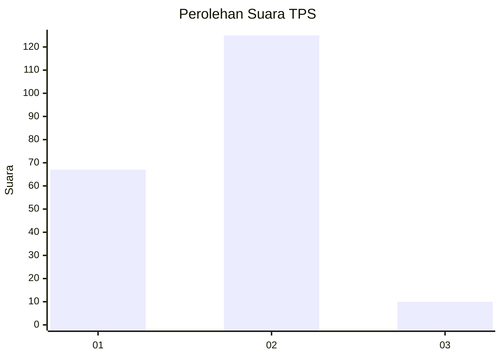
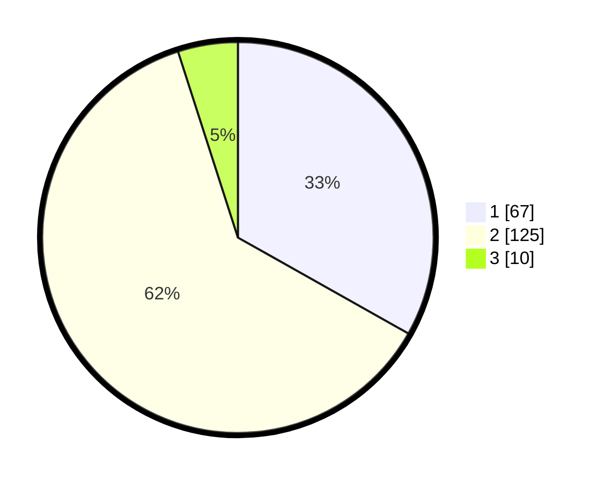

# Hasil

## Grafik

## Tabel

| No. | Nama Paslon    | Suara | Suara (raw) | Persentase |
|:--- |:-------------- | -----:| -----------:| ----------:|
| 1   | ANIES MUHAIMIN | 67    | [67][p-1]   | 33,17      |
| 2   | PRABOWO GIBRAN | 125   | [125][p-2]  | 61,88      |
| 3   | GANJAR MAHFUD  | 10    | [10][p-3]   | 4,95       |

[p-1]: https://github.com/gigit-pemilu/pemilu-2024-81-maluku/blob/main/pilpres/hitung-suara/sub/81-maluku/sub/04-buru/sub/13-fena-leisela/sub/2001-wamlana/sub/004-tps/sub/paslon-1.txt
[p-2]: https://github.com/gigit-pemilu/pemilu-2024-81-maluku/blob/main/pilpres/hitung-suara/sub/81-maluku/sub/04-buru/sub/13-fena-leisela/sub/2001-wamlana/sub/004-tps/sub/paslon-2.txt
[p-3]: https://github.com/gigit-pemilu/pemilu-2024-81-maluku/blob/main/pilpres/hitung-suara/sub/81-maluku/sub/04-buru/sub/13-fena-leisela/sub/2001-wamlana/sub/004-tps/sub/paslon-3.txt

## Foto C Plano

https://sirekap-obj-formc.kpu.go.id/05ce/pemilu/ppwp/81/04/13/20/01/8104132001004-20240215-082616--8918bfa7-89a0-4a3f-bce4-f292e2b9fb74.jpg

https://sirekap-obj-formc.kpu.go.id/05ce/pemilu/ppwp/81/04/13/20/01/8104132001004-20240215-082848--13bdb892-cf0c-40b3-863d-3213e64bc792.jpg

https://sirekap-obj-formc.kpu.go.id/05ce/pemilu/ppwp/81/04/13/20/01/8104132001004-20240215-083055--64f371a5-bda7-49f3-aed0-df92edc9181d.jpg

## Metadata

| Key        | Value               |
| ---------- | ------------------- |
| Time Stamp | 2024-02-17 13:37:34 |

