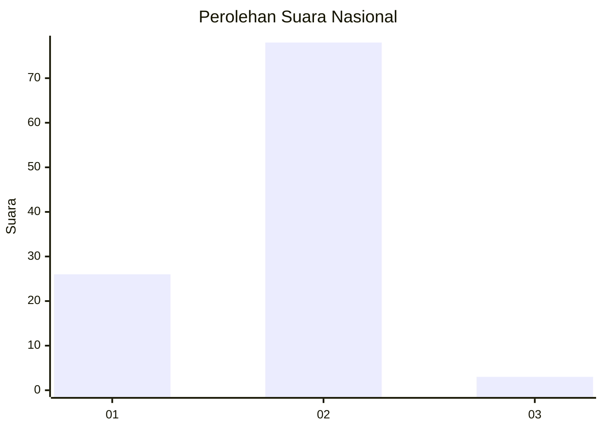
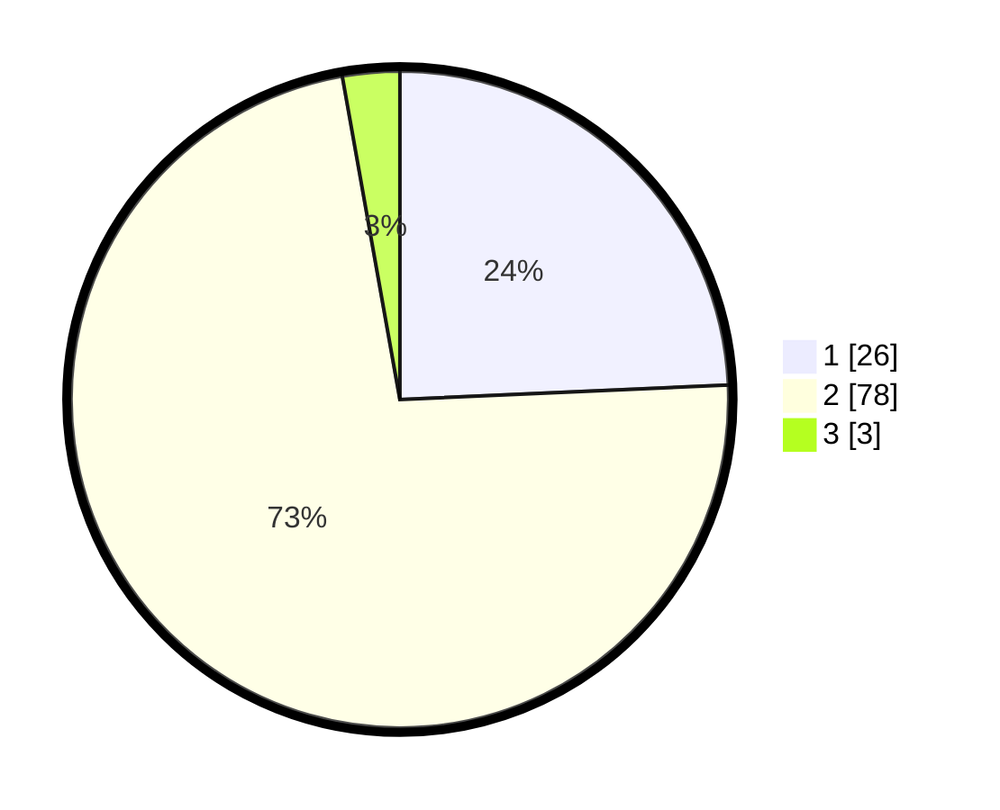

# Hasil

## Grafik

## Tabel

| No. | Nama Paslon    | Suara | Suara (raw) | Persentase |
|:--- |:-------------- | -----:| -----------:| ----------:|
| 1   | ANIES MUHAIMIN | 26    | [26][p-1]   | 24,30      |
| 2   | PRABOWO GIBRAN | 78    | [78][p-2]   | 72,90      |
| 3   | GANJAR MAHFUD  | 3     | [3][p-3]    | 2,80       |

[p-1]: https://github.com/gigit-pemilu/pemilu-2024/blob/main/pilpres/hitung-suara/sub/81-maluku/sub/04-buru/sub/13-fena-leisela/sub/2003-waspait/sub/005-tps/sub/paslon-1.txt
[p-2]: https://github.com/gigit-pemilu/pemilu-2024/blob/main/pilpres/hitung-suara/sub/81-maluku/sub/04-buru/sub/13-fena-leisela/sub/2003-waspait/sub/005-tps/sub/paslon-2.txt
[p-3]: https://github.com/gigit-pemilu/pemilu-2024/blob/main/pilpres/hitung-suara/sub/81-maluku/sub/04-buru/sub/13-fena-leisela/sub/2003-waspait/sub/005-tps/sub/paslon-3.txt

## Foto C Plano

https://sirekap-obj-formc.kpu.go.id/b4fc/pemilu/ppwp/81/04/13/20/03/8104132003005-20240215-075155--b54816a5-15bc-4daf-8750-7ae6ced4d8ce.jpg

https://sirekap-obj-formc.kpu.go.id/b4fc/pemilu/ppwp/81/04/13/20/03/8104132003005-20240215-075306--198cd692-510e-4b13-8909-d6e87de33443.jpg

https://sirekap-obj-formc.kpu.go.id/b4fc/pemilu/ppwp/81/04/13/20/03/8104132003005-20240215-075427--88bf31c4-06f1-4431-a4f7-df9a76161106.jpg

## Metadata

| Key        | Value               |
| ---------- | ------------------- |
| Time Stamp | 2024-02-17 13:37:34 |

