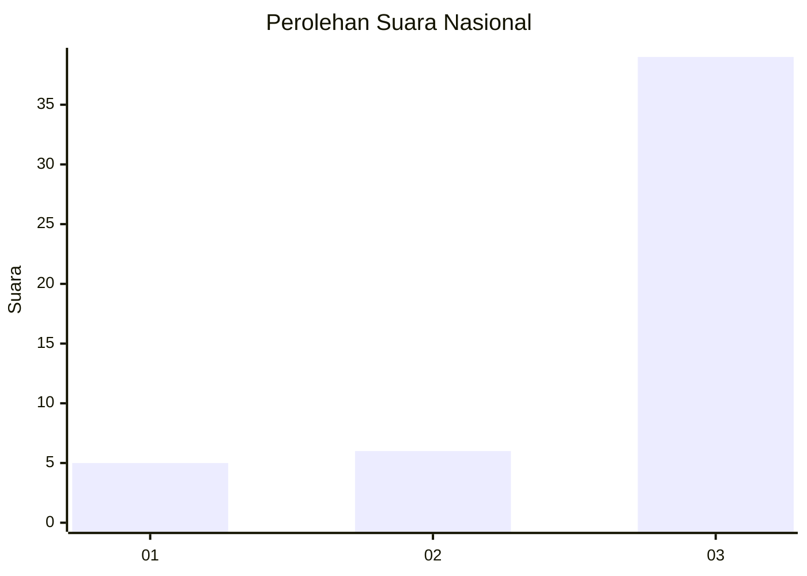
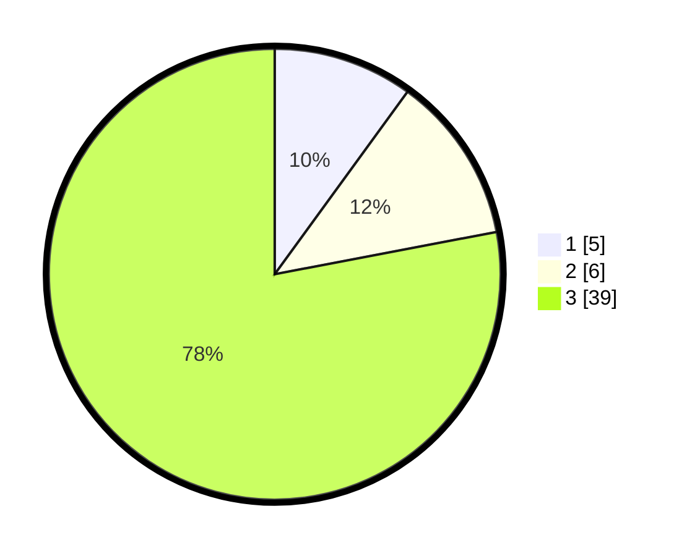

# Hasil

## Grafik

## Tabel

| No. | Nama Paslon    | Suara | Suara (raw) | Persentase |
|:--- |:-------------- | -----:| -----------:| ----------:|
| 1   | ANIES MUHAIMIN | 5     | [5][p-1]    | 10,00      |
| 2   | PRABOWO GIBRAN | 6     | [6][p-2]    | 12,00      |
| 3   | GANJAR MAHFUD  | 39    | [39][p-3]   | 78,00      |

[p-1]: https://github.com/gigit-pemilu/pemilu-2024/blob/main/pilpres/hitung-suara/sub/81-maluku/sub/04-buru/sub/13-fena-leisela/sub/2004-waedanga/sub/001-tps/sub/paslon-1.txt
[p-2]: https://github.com/gigit-pemilu/pemilu-2024/blob/main/pilpres/hitung-suara/sub/81-maluku/sub/04-buru/sub/13-fena-leisela/sub/2004-waedanga/sub/001-tps/sub/paslon-2.txt
[p-3]: https://github.com/gigit-pemilu/pemilu-2024/blob/main/pilpres/hitung-suara/sub/81-maluku/sub/04-buru/sub/13-fena-leisela/sub/2004-waedanga/sub/001-tps/sub/paslon-3.txt

## Foto C Plano

https://sirekap-obj-formc.kpu.go.id/7227/pemilu/ppwp/81/04/13/20/04/8104132004001-20240217-015109--e02bbaa4-33a3-4514-96cf-678c6223d4aa.jpg

https://sirekap-obj-formc.kpu.go.id/7227/pemilu/ppwp/81/04/13/20/04/8104132004001-20240217-015110--e44ce9bc-23d8-4586-b632-77c54ea44347.jpg

https://sirekap-obj-formc.kpu.go.id/7227/pemilu/ppwp/81/04/13/20/04/8104132004001-20240217-015110--51e0fa71-a373-439a-ade6-ccca1bdf725f.jpg

## Metadata

| Key        | Value               |
| ---------- | ------------------- |
| Time Stamp | 2024-02-17 13:37:34 |

## DATA PEMILIH TETAP

Jumlah pemilih dalam DPT: **102**.
 * L: **57**.
 * P: **45**.

## DATA PENGGUNA HAK PILIH

Jumlah pengguna hak pilih dalam DPT: **45**.
 * L: **23**.
 * P: **22**.

Jumlah pengguna hak pilih dalam DPTb: **4**.
 * L: **4**.
 * P: **0**.

Jumlah pengguna hak pilih dalam DPK: **1**.
 * L: **1**.
 * P: **0**.

Jumlah pengguna hak pilih: **50**.
 * L: **28**.
 * P: **22**.

## JUMLAH SUARA SAH DAN TIDAK SAH

JUMLAH SELURUH SUARA SAH: **50**.

JUMLAH SUARA TIDAK SAH: **0**.

JUMLAH SELURUH SUARA SAH DAN SUARA TIDAK SAH: **50**.

