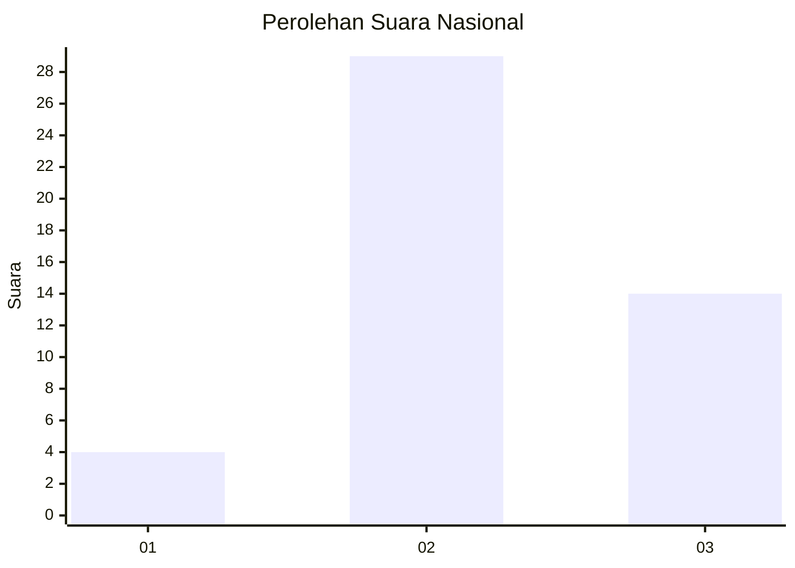
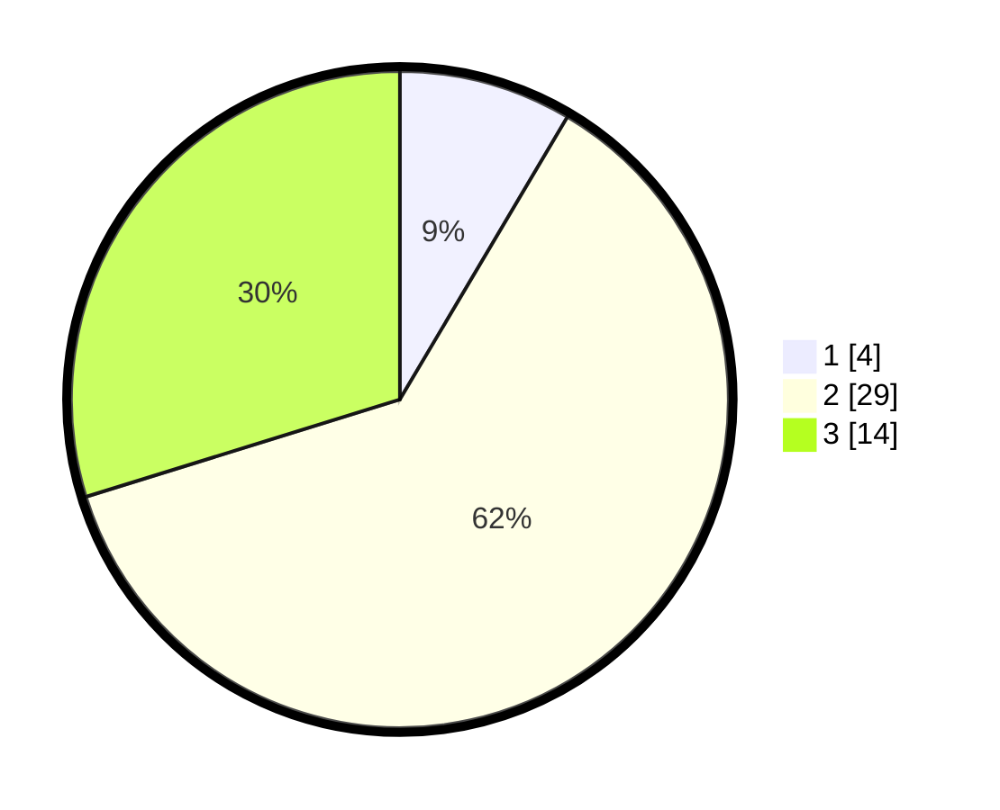

# Hasil

## Grafik

## Tabel

| No. | Nama Paslon    | Suara | Suara (raw) | Persentase |
|:--- |:-------------- | -----:| -----------:| ----------:|
| 1   | ANIES MUHAIMIN | 4     | [4][p-1]    | 8,51       |
| 2   | PRABOWO GIBRAN | 29    | [29][p-2]   | 61,70      |
| 3   | GANJAR MAHFUD  | 14    | [14][p-3]   | 29,79      |

[p-1]: https://github.com/gigit-pemilu/pemilu-2024/blob/main/pilpres/hitung-suara/sub/81-maluku/sub/04-buru/sub/13-fena-leisela/sub/2004-waedanga/sub/002-tps/sub/paslon-1.txt
[p-2]: https://github.com/gigit-pemilu/pemilu-2024/blob/main/pilpres/hitung-suara/sub/81-maluku/sub/04-buru/sub/13-fena-leisela/sub/2004-waedanga/sub/002-tps/sub/paslon-2.txt
[p-3]: https://github.com/gigit-pemilu/pemilu-2024/blob/main/pilpres/hitung-suara/sub/81-maluku/sub/04-buru/sub/13-fena-leisela/sub/2004-waedanga/sub/002-tps/sub/paslon-3.txt

## Foto C Plano

https://sirekap-obj-formc.kpu.go.id/69d9/pemilu/ppwp/81/04/13/20/04/8104132004002-20240216-165509--a4a1e1a5-1369-40f2-9125-a342f473d863.jpg

https://sirekap-obj-formc.kpu.go.id/69d9/pemilu/ppwp/81/04/13/20/04/8104132004002-20240216-165511--8ae3ee17-8a03-488a-adc2-c32af6d13c9b.jpg

https://sirekap-obj-formc.kpu.go.id/69d9/pemilu/ppwp/81/04/13/20/04/8104132004002-20240216-165510--a22d7a36-0a4f-4b12-a9e6-5497a7e78630.jpg

## Metadata

| Key        | Value               |
| ---------- | ------------------- |
| Time Stamp | 2024-02-17 13:37:34 |

## DATA PEMILIH TETAP

Jumlah pemilih dalam DPT: **62**.
 * L: **28**.
 * P: **34**.

## DATA PENGGUNA HAK PILIH

Jumlah pengguna hak pilih dalam DPT: **39**.
 * L: **18**.
 * P: **21**.

Jumlah pengguna hak pilih dalam DPTb: **9**.
 * L: **5**.
 * P: **4**.

Jumlah pengguna hak pilih dalam DPK: **0**.
 * L: **0**.
 * P: **0**.

Jumlah pengguna hak pilih: **48**.
 * L: **23**.
 * P: **25**.

## JUMLAH SUARA SAH DAN TIDAK SAH

JUMLAH SELURUH SUARA SAH: **47**.

JUMLAH SUARA TIDAK SAH: **1**.

JUMLAH SELURUH SUARA SAH DAN SUARA TIDAK SAH: **48**.

