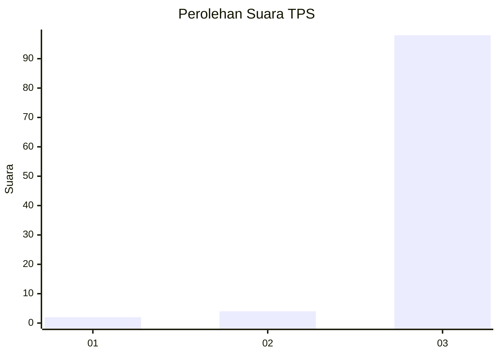
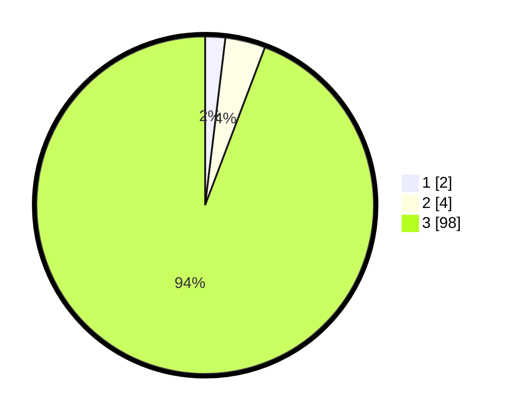

# Hasil

## Grafik

## Tabel

| No. | Nama Paslon    | Suara | Suara (raw) | Persentase |
|:--- |:-------------- | -----:| -----------:| ----------:|
| 1   | ANIES MUHAIMIN | 2     | [2][p-1]    | 1,92       |
| 2   | PRABOWO GIBRAN | 4     | [4][p-2]    | 3,85       |
| 3   | GANJAR MAHFUD  | 98    | [98][p-3]   | 94,23      |

[p-1]: https://github.com/gigit-pemilu/pemilu-2024-81-maluku/blob/main/pilpres/hitung-suara/sub/81-maluku/sub/04-buru/sub/13-fena-leisela/sub/2005-lemanpoli/sub/001-tps/sub/paslon-1.txt
[p-2]: https://github.com/gigit-pemilu/pemilu-2024-81-maluku/blob/main/pilpres/hitung-suara/sub/81-maluku/sub/04-buru/sub/13-fena-leisela/sub/2005-lemanpoli/sub/001-tps/sub/paslon-2.txt
[p-3]: https://github.com/gigit-pemilu/pemilu-2024-81-maluku/blob/main/pilpres/hitung-suara/sub/81-maluku/sub/04-buru/sub/13-fena-leisela/sub/2005-lemanpoli/sub/001-tps/sub/paslon-3.txt

## Foto C Plano

https://sirekap-obj-formc.kpu.go.id/a2ca/pemilu/ppwp/81/04/13/20/05/8104132005001-20240215-095054--724845cb-7c08-44a8-9f96-bbfad9e16509.jpg

https://sirekap-obj-formc.kpu.go.id/a2ca/pemilu/ppwp/81/04/13/20/05/8104132005001-20240215-095201--b899cd6b-799a-439b-bd6c-6731e2a1f48e.jpg

https://sirekap-obj-formc.kpu.go.id/a2ca/pemilu/ppwp/81/04/13/20/05/8104132005001-20240215-141420--33c9dec7-7cc6-49c3-8ea3-1b5a2642f9fd.jpg

## Metadata

| Key        | Value               |
| ---------- | ------------------- |
| Time Stamp | 2024-02-17 13:37:34 |

