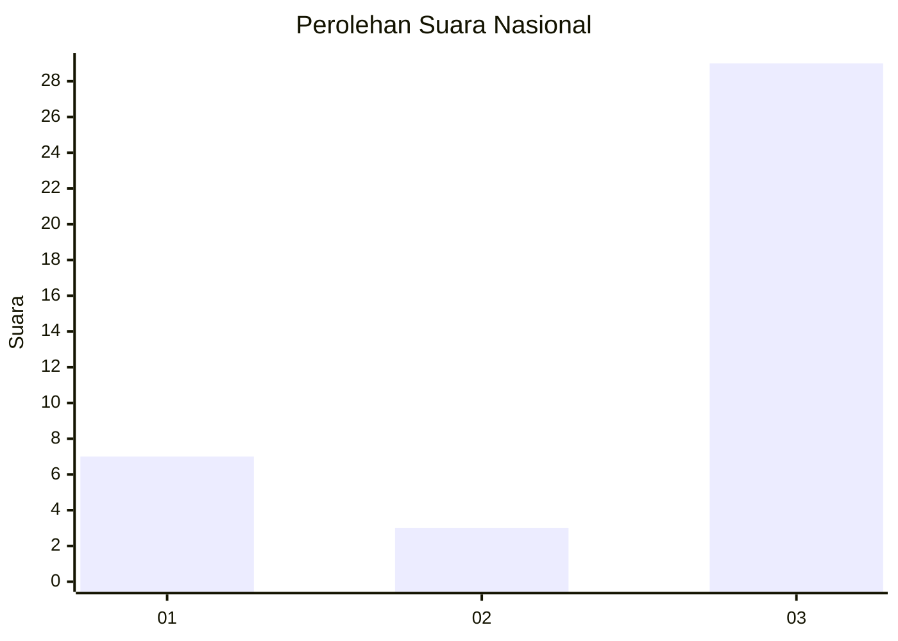
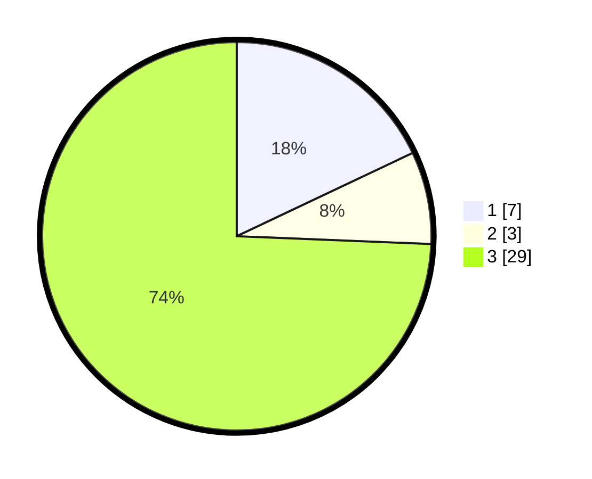

# Hasil

## Grafik

## Tabel

| No. | Nama Paslon    | Suara | Suara (raw) | Persentase |
|:--- |:-------------- | -----:| -----------:| ----------:|
| 1   | ANIES MUHAIMIN | 7     | [7][p-1]    | 17,95      |
| 2   | PRABOWO GIBRAN | 3     | [3][p-2]    | 7,69       |
| 3   | GANJAR MAHFUD  | 29    | [29][p-3]   | 74,36      |

[p-1]: https://github.com/gigit-pemilu/pemilu-2024/blob/main/pilpres/hitung-suara/sub/81-maluku/sub/04-buru/sub/13-fena-leisela/sub/2009-wasi/sub/003-tps/sub/paslon-1.txt
[p-2]: https://github.com/gigit-pemilu/pemilu-2024/blob/main/pilpres/hitung-suara/sub/81-maluku/sub/04-buru/sub/13-fena-leisela/sub/2009-wasi/sub/003-tps/sub/paslon-2.txt
[p-3]: https://github.com/gigit-pemilu/pemilu-2024/blob/main/pilpres/hitung-suara/sub/81-maluku/sub/04-buru/sub/13-fena-leisela/sub/2009-wasi/sub/003-tps/sub/paslon-3.txt

## Foto C Plano

https://sirekap-obj-formc.kpu.go.id/abdd/pemilu/ppwp/81/04/13/20/09/8104132009003-20240215-073441--72fa68ea-5f52-4b3a-9b9e-57e29318d996.jpg

https://sirekap-obj-formc.kpu.go.id/abdd/pemilu/ppwp/81/04/13/20/09/8104132009003-20240215-073700--98b76fd5-d16d-410f-8b0d-8da74f35c4b0.jpg

https://sirekap-obj-formc.kpu.go.id/abdd/pemilu/ppwp/81/04/13/20/09/8104132009003-20240215-073930--156d81f5-f69d-4bc8-8532-805c891dda0e.jpg

## Metadata

| Key        | Value               |
| ---------- | ------------------- |
| Time Stamp | 2024-02-17 13:37:34 |

