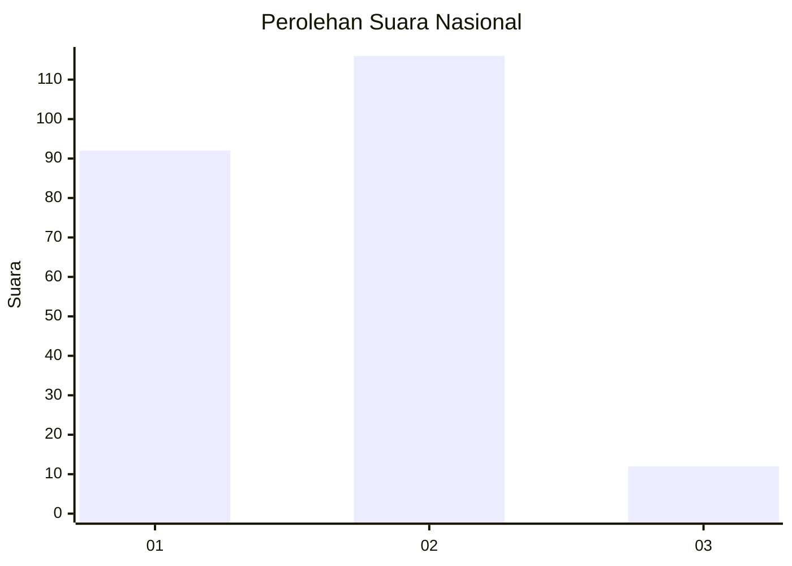
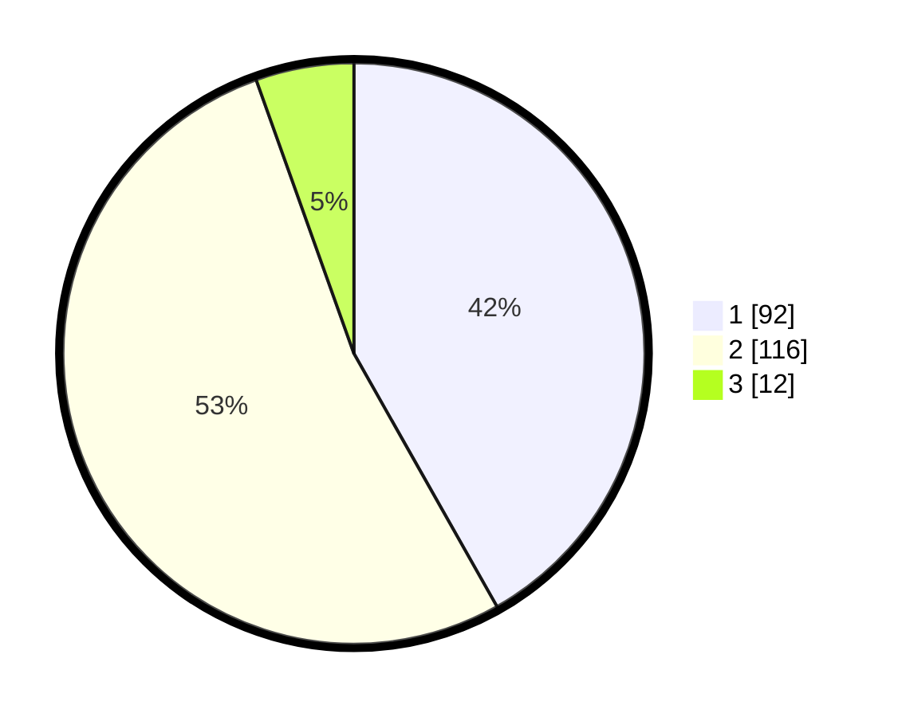

# Hasil

## Grafik

## Tabel

| No. | Nama Paslon    | Suara | Suara (raw) | Persentase |
|:--- |:-------------- | -----:| -----------:| ----------:|
| 1   | ANIES MUHAIMIN | 92    | [92][p-1]   | 41,82      |
| 2   | PRABOWO GIBRAN | 116   | [116][p-2]  | 52,73      |
| 3   | GANJAR MAHFUD  | 12    | [12][p-3]   | 5,45       |

[p-1]: https://github.com/gigit-pemilu/pemilu-2024/blob/main/pilpres/hitung-suara/sub/81-maluku/sub/04-buru/sub/14-teluk-kaiely/sub/2001-kaiely/sub/001-tps/sub/paslon-1.txt
[p-2]: https://github.com/gigit-pemilu/pemilu-2024/blob/main/pilpres/hitung-suara/sub/81-maluku/sub/04-buru/sub/14-teluk-kaiely/sub/2001-kaiely/sub/001-tps/sub/paslon-2.txt
[p-3]: https://github.com/gigit-pemilu/pemilu-2024/blob/main/pilpres/hitung-suara/sub/81-maluku/sub/04-buru/sub/14-teluk-kaiely/sub/2001-kaiely/sub/001-tps/sub/paslon-3.txt

## Foto C Plano

https://sirekap-obj-formc.kpu.go.id/97cf/pemilu/ppwp/81/04/14/20/01/8104142001001-20240216-165445--82262eb9-3038-4563-9897-46a729176b58.jpg

https://sirekap-obj-formc.kpu.go.id/97cf/pemilu/ppwp/81/04/14/20/01/8104142001001-20240215-080457--978ec8e2-0d80-4607-9f00-16874728f091.jpg

https://sirekap-obj-formc.kpu.go.id/97cf/pemilu/ppwp/81/04/14/20/01/8104142001001-20240215-080852--37b73b6b-5634-4455-b96f-5d3d29c5c587.jpg

## Metadata

| Key        | Value               |
| ---------- | ------------------- |
| Time Stamp | 2024-02-16 17:00:00 |

