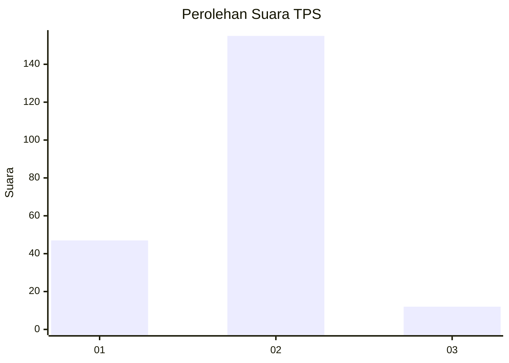
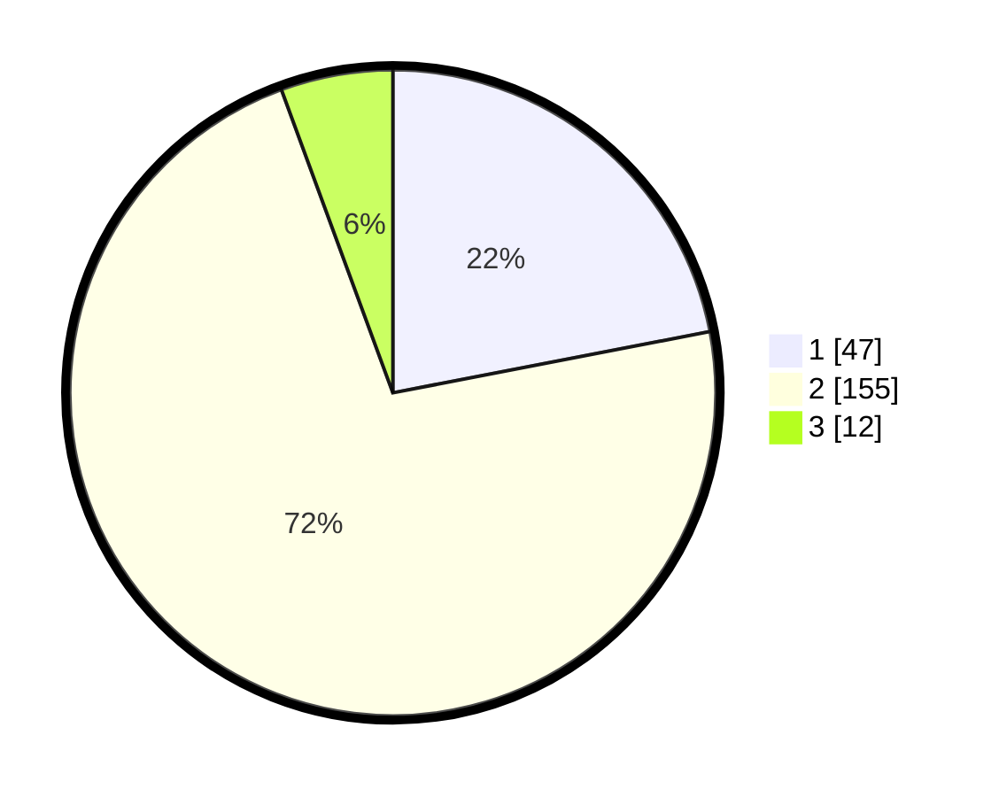

# Hasil

## Grafik

## Tabel

| No. | Nama Paslon    | Suara | Suara (raw) | Persentase |
|:--- |:-------------- | -----:| -----------:| ----------:|
| 1   | ANIES MUHAIMIN | 47    | [47][p-1]   | 21,96      |
| 2   | PRABOWO GIBRAN | 155   | [155][p-2]  | 72,43      |
| 3   | GANJAR MAHFUD  | 12    | [12][p-3]   | 5,61       |

[p-1]: https://github.com/gigit-pemilu/pemilu-2024-81-maluku/blob/main/pilpres/hitung-suara/sub/81-maluku/sub/04-buru/sub/15-lilialy/sub/2001-ubung/sub/003-tps/sub/paslon-1.txt
[p-2]: https://github.com/gigit-pemilu/pemilu-2024-81-maluku/blob/main/pilpres/hitung-suara/sub/81-maluku/sub/04-buru/sub/15-lilialy/sub/2001-ubung/sub/003-tps/sub/paslon-2.txt
[p-3]: https://github.com/gigit-pemilu/pemilu-2024-81-maluku/blob/main/pilpres/hitung-suara/sub/81-maluku/sub/04-buru/sub/15-lilialy/sub/2001-ubung/sub/003-tps/sub/paslon-3.txt

## Foto C Plano

https://sirekap-obj-formc.kpu.go.id/70d9/pemilu/ppwp/81/04/15/20/01/8104152001003-20240214-232416--d46b00f5-ab54-4abd-8f38-2d73631c8372.jpg

https://sirekap-obj-formc.kpu.go.id/70d9/pemilu/ppwp/81/04/15/20/01/8104152001003-20240214-233921--8166ee45-f969-4513-a677-168c0e7e40a3.jpg

https://sirekap-obj-formc.kpu.go.id/70d9/pemilu/ppwp/81/04/15/20/01/8104152001003-20240215-214814--03042206-ab65-4ac5-b171-a629a5cbe8a3.jpg

## Metadata

| Key        | Value               |
| ---------- | ------------------- |
| Time Stamp | 2024-02-17 13:37:34 |

