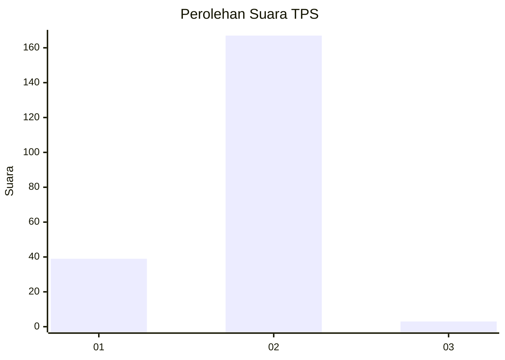
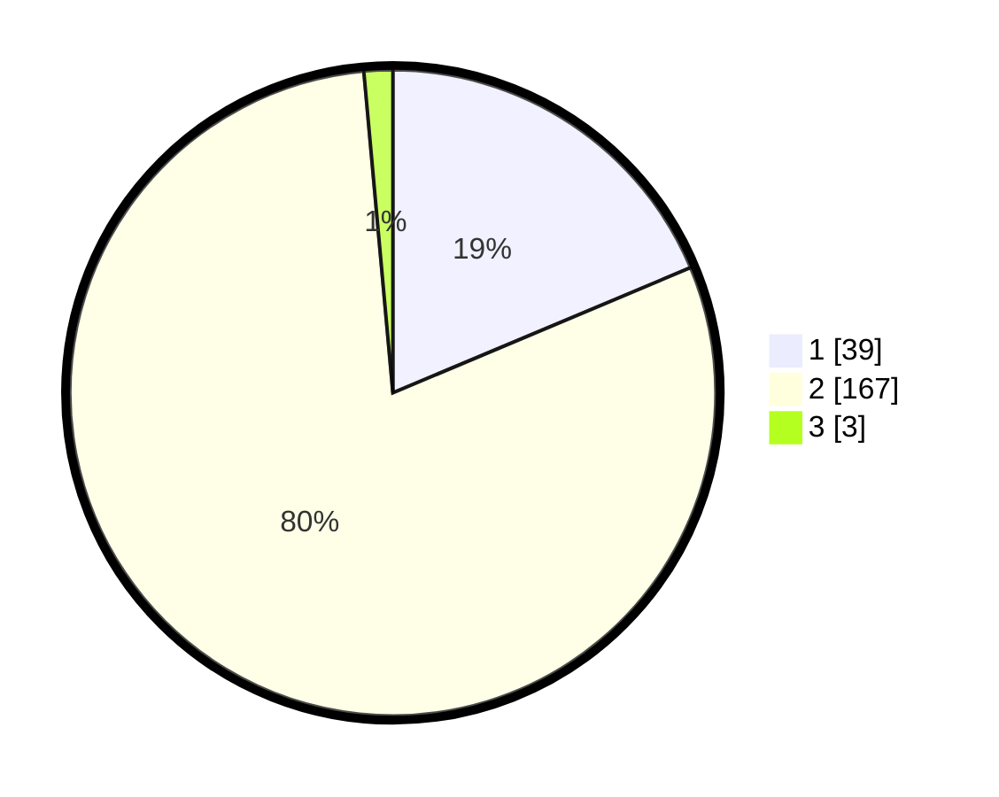

# Hasil

## Grafik

## Tabel

| No. | Nama Paslon    | Suara | Suara (raw) | Persentase |
|:--- |:-------------- | -----:| -----------:| ----------:|
| 1   | ANIES MUHAIMIN | 39    | [39][p-1]   | 18,66      |
| 2   | PRABOWO GIBRAN | 167   | [167][p-2]  | 79,90      |
| 3   | GANJAR MAHFUD  | 3     | [3][p-3]    | 1,44       |

[p-1]: https://github.com/gigit-pemilu/pemilu-2024-81-maluku/blob/main/pilpres/hitung-suara/sub/81-maluku/sub/04-buru/sub/15-lilialy/sub/2001-ubung/sub/005-tps/sub/paslon-1.txt
[p-2]: https://github.com/gigit-pemilu/pemilu-2024-81-maluku/blob/main/pilpres/hitung-suara/sub/81-maluku/sub/04-buru/sub/15-lilialy/sub/2001-ubung/sub/005-tps/sub/paslon-2.txt
[p-3]: https://github.com/gigit-pemilu/pemilu-2024-81-maluku/blob/main/pilpres/hitung-suara/sub/81-maluku/sub/04-buru/sub/15-lilialy/sub/2001-ubung/sub/005-tps/sub/paslon-3.txt

## Foto C Plano

https://sirekap-obj-formc.kpu.go.id/5711/pemilu/ppwp/81/04/15/20/01/8104152001005-20240216-075035--1c65f11d-c6ee-468c-9d4b-0302185995b5.jpg

https://sirekap-obj-formc.kpu.go.id/5711/pemilu/ppwp/81/04/15/20/01/8104152001005-20240216-080206--c24a6f64-d263-4bb1-ad3e-309256338666.jpg

https://sirekap-obj-formc.kpu.go.id/5711/pemilu/ppwp/81/04/15/20/01/8104152001005-20240215-085041--0b0ccb7a-6790-4956-b275-6e48f9a7e2b8.jpg

## Metadata

| Key        | Value               |
| ---------- | ------------------- |
| Time Stamp | 2024-02-16 13:00:29 |

