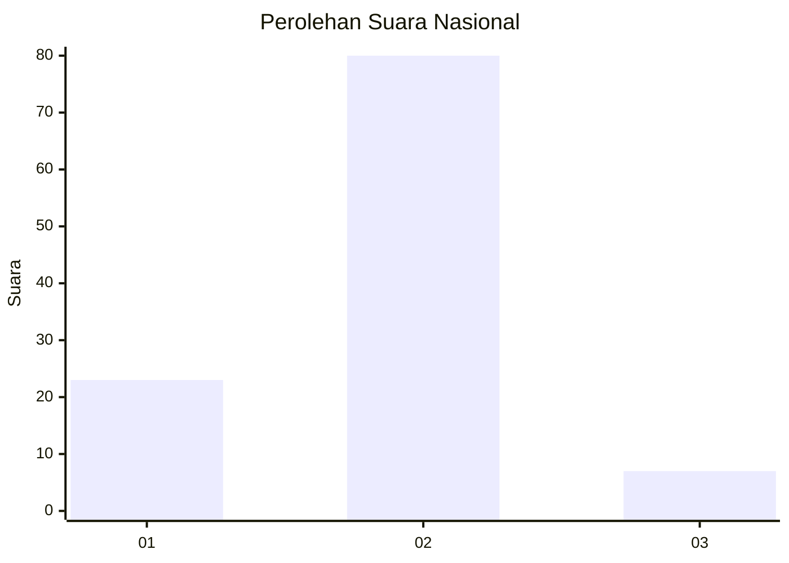
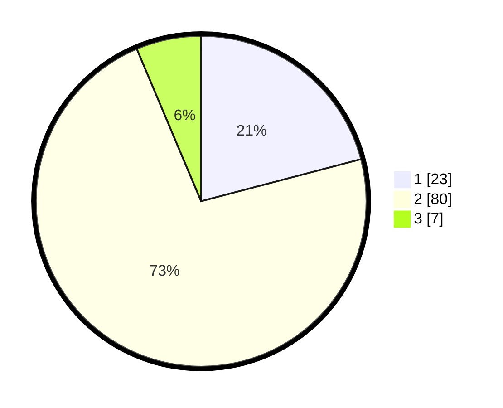

# Hasil

## Grafik

## Tabel

| No. | Nama Paslon    | Suara | Suara (raw) | Persentase |
|:--- |:-------------- | -----:| -----------:| ----------:|
| 1   | ANIES MUHAIMIN | 23    | [23][p-1]   | 20,91      |
| 2   | PRABOWO GIBRAN | 80    | [80][p-2]   | 72,73      |
| 3   | GANJAR MAHFUD  | 7     | [7][p-3]    | 6,36       |

[p-1]: https://github.com/gigit-pemilu/pemilu-2024/blob/main/pilpres/hitung-suara/sub/81-maluku/sub/04-buru/sub/15-lilialy/sub/2003-waemiting/sub/901-tps/sub/paslon-1.txt
[p-2]: https://github.com/gigit-pemilu/pemilu-2024/blob/main/pilpres/hitung-suara/sub/81-maluku/sub/04-buru/sub/15-lilialy/sub/2003-waemiting/sub/901-tps/sub/paslon-2.txt
[p-3]: https://github.com/gigit-pemilu/pemilu-2024/blob/main/pilpres/hitung-suara/sub/81-maluku/sub/04-buru/sub/15-lilialy/sub/2003-waemiting/sub/901-tps/sub/paslon-3.txt

## Foto C Plano

https://sirekap-obj-formc.kpu.go.id/f8aa/pemilu/ppwp/81/04/15/20/03/8104152003901-20240215-064100--f46ec2c3-2d54-4fab-b53d-efed8ebf76d6.jpg

https://sirekap-obj-formc.kpu.go.id/f8aa/pemilu/ppwp/81/04/15/20/03/8104152003901-20240214-233800--51fa54be-a061-4195-a041-4442a3b5b418.jpg

https://sirekap-obj-formc.kpu.go.id/f8aa/pemilu/ppwp/81/04/15/20/03/8104152003901-20240214-233939--8756ba5a-755d-4d40-8d9d-f82f06c3b522.jpg

## Metadata

| Key        | Value               |
| ---------- | ------------------- |
| Time Stamp | 2024-02-15 15:00:29 |

