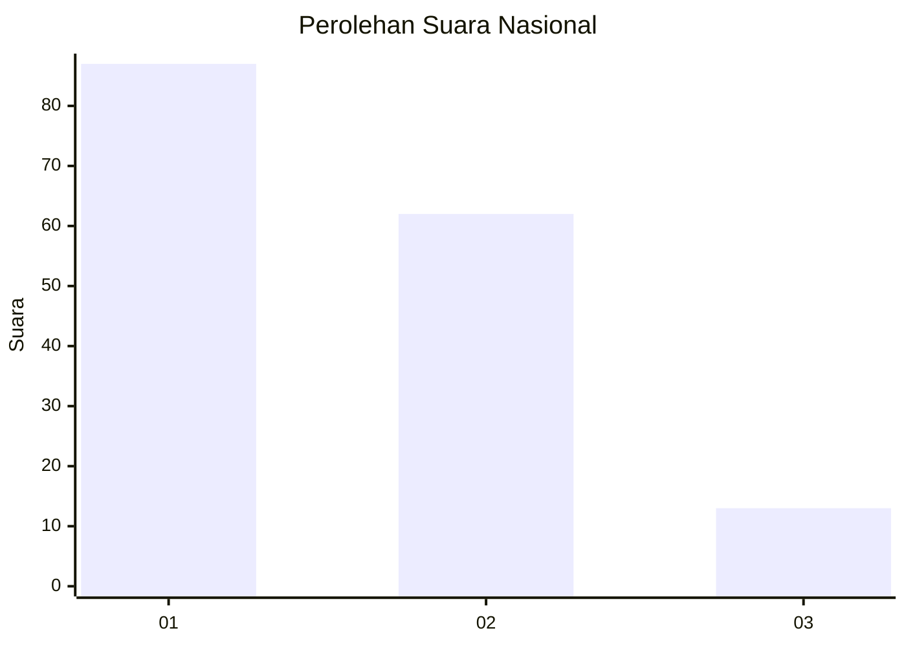
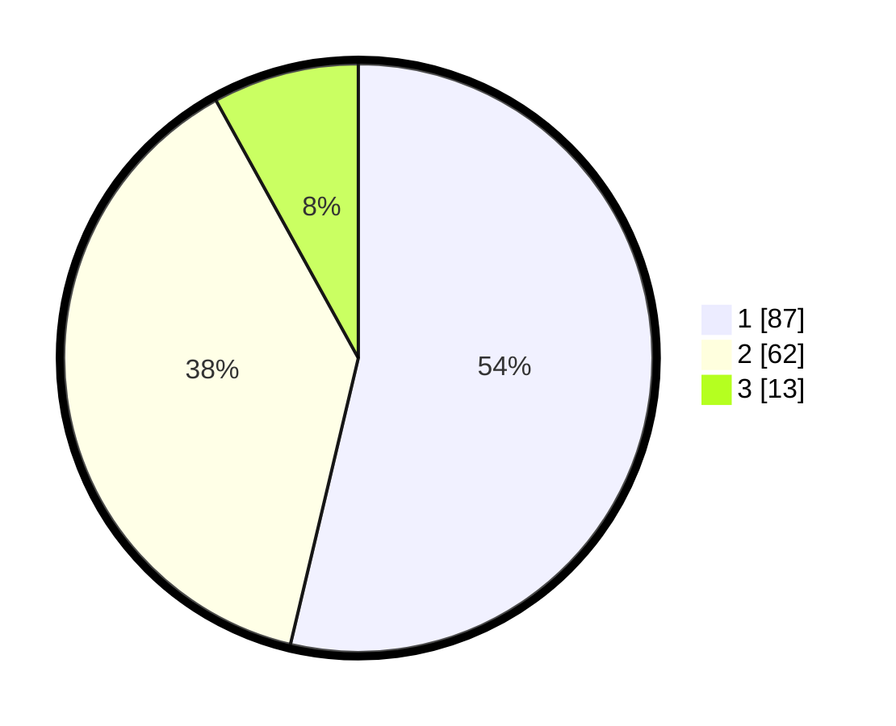

# Hasil

## Grafik

## Tabel

| No. | Nama Paslon    | Suara | Suara (raw) | Persentase |
|:--- |:-------------- | -----:| -----------:| ----------:|
| 1   | ANIES MUHAIMIN | 87    | [87][p-1]   | 53,70      |
| 2   | PRABOWO GIBRAN | 62    | [62][p-2]   | 38,27      |
| 3   | GANJAR MAHFUD  | 13    | [13][p-3]   | 8,02       |

[p-1]: https://github.com/gigit-pemilu/pemilu-2024/blob/main/pilpres/hitung-suara/sub/81-maluku/sub/05-seram-bagian-timur/sub/01-bula/sub/2003-bula/sub/005-tps/sub/paslon-1.txt
[p-2]: https://github.com/gigit-pemilu/pemilu-2024/blob/main/pilpres/hitung-suara/sub/81-maluku/sub/05-seram-bagian-timur/sub/01-bula/sub/2003-bula/sub/005-tps/sub/paslon-2.txt
[p-3]: https://github.com/gigit-pemilu/pemilu-2024/blob/main/pilpres/hitung-suara/sub/81-maluku/sub/05-seram-bagian-timur/sub/01-bula/sub/2003-bula/sub/005-tps/sub/paslon-3.txt

## Foto C Plano

https://sirekap-obj-formc.kpu.go.id/c874/pemilu/ppwp/81/05/01/20/03/8105012003005-20240215-173416--3f6d1149-13cf-42e7-a930-11c59406e04e.jpg

https://sirekap-obj-formc.kpu.go.id/c874/pemilu/ppwp/81/05/01/20/03/8105012003005-20240215-174507--59876e32-ee65-4d8f-ac3a-c098739055ba.jpg

https://sirekap-obj-formc.kpu.go.id/c874/pemilu/ppwp/81/05/01/20/03/8105012003005-20240215-174337--19c3592a-314a-403c-b575-5095f6bc6e20.jpg

## Metadata

| Key        | Value               |
| ---------- | ------------------- |
| Time Stamp | 2024-02-15 21:01:18 |

