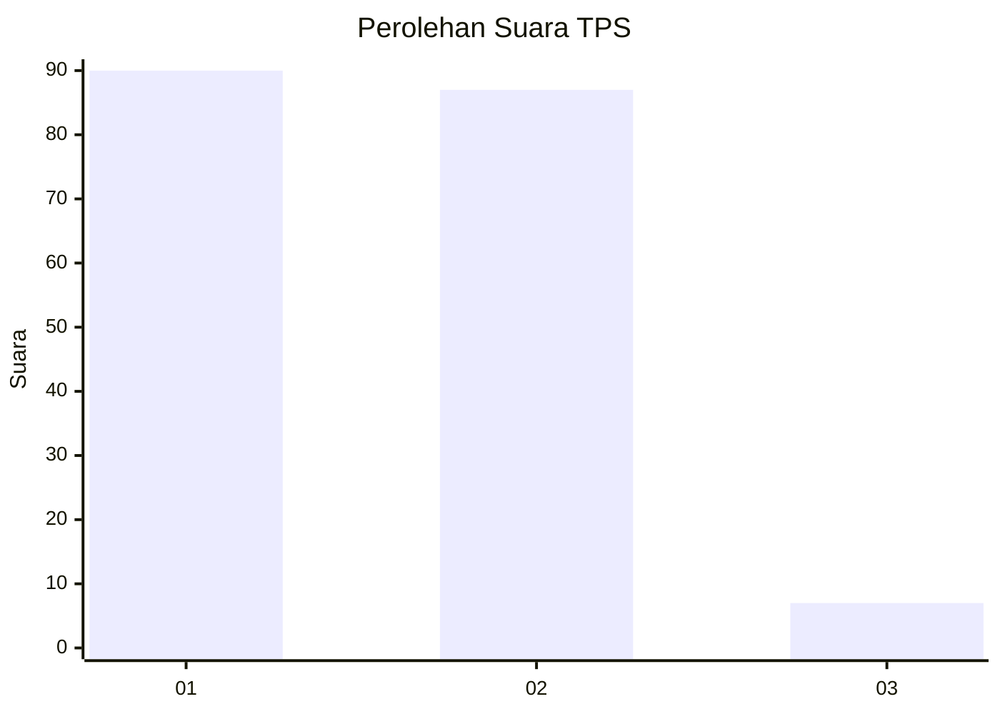
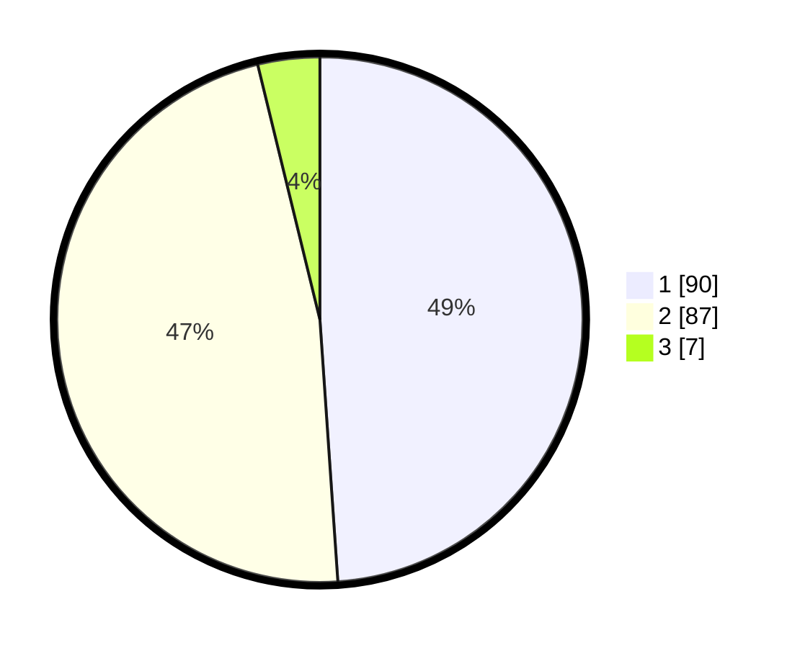

# Hasil

## Grafik

## Tabel

| No. | Nama Paslon    | Suara | Suara (raw) | Persentase |
|:--- |:-------------- | -----:| -----------:| ----------:|
| 1   | ANIES MUHAIMIN | 90    | [90][p-1]   | 48,91      |
| 2   | PRABOWO GIBRAN | 87    | [87][p-2]   | 47,28      |
| 3   | GANJAR MAHFUD  | 7     | [7][p-3]    | 3,80       |

[p-1]: https://github.com/gigit-pemilu/pemilu-2024-81-maluku/blob/main/pilpres/hitung-suara/sub/81-maluku/sub/05-seram-bagian-timur/sub/01-bula/sub/2003-bula/sub/008-tps/sub/paslon-1.txt
[p-2]: https://github.com/gigit-pemilu/pemilu-2024-81-maluku/blob/main/pilpres/hitung-suara/sub/81-maluku/sub/05-seram-bagian-timur/sub/01-bula/sub/2003-bula/sub/008-tps/sub/paslon-2.txt
[p-3]: https://github.com/gigit-pemilu/pemilu-2024-81-maluku/blob/main/pilpres/hitung-suara/sub/81-maluku/sub/05-seram-bagian-timur/sub/01-bula/sub/2003-bula/sub/008-tps/sub/paslon-3.txt

## Foto C Plano

https://sirekap-obj-formc.kpu.go.id/f281/pemilu/ppwp/81/05/01/20/03/8105012003008-20240215-151910--359ca9ad-e8a2-4933-836c-2e7e385850d5.jpg

https://sirekap-obj-formc.kpu.go.id/f281/pemilu/ppwp/81/05/01/20/03/8105012003008-20240215-152351--93a2eae3-d8a7-424e-b881-d12609cd07bc.jpg

https://sirekap-obj-formc.kpu.go.id/f281/pemilu/ppwp/81/05/01/20/03/8105012003008-20240215-152758--ec4413b8-0e27-4be7-8656-df23de8980be.jpg

## Metadata

| Key        | Value               |
| ---------- | ------------------- |
| Time Stamp | 2024-02-15 17:00:25 |

