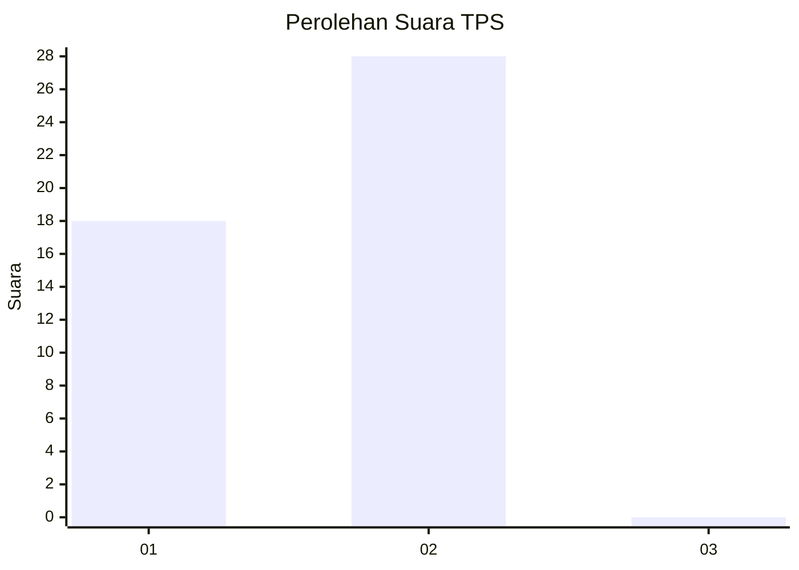
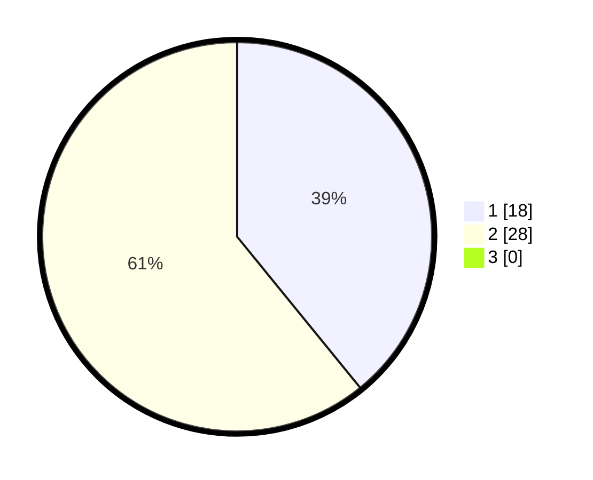

# Hasil

## Grafik

## Tabel

| No. | Nama Paslon    | Suara | Suara (raw) | Persentase |
|:--- |:-------------- | -----:| -----------:| ----------:|
| 1   | ANIES MUHAIMIN | 18    | [18][p-1]   | 39,13      |
| 2   | PRABOWO GIBRAN | 28    | [28][p-2]   | 60,87      |
| 3   | GANJAR MAHFUD  | 0     | [0][p-3]    | 0,00       |

[p-1]: https://github.com/gigit-pemilu/pemilu-2024-81-maluku/blob/main/pilpres/hitung-suara/sub/81-maluku/sub/05-seram-bagian-timur/sub/02-seram-timur/sub/2001-geser/sub/901-tps/sub/paslon-1.txt
[p-2]: https://github.com/gigit-pemilu/pemilu-2024-81-maluku/blob/main/pilpres/hitung-suara/sub/81-maluku/sub/05-seram-bagian-timur/sub/02-seram-timur/sub/2001-geser/sub/901-tps/sub/paslon-2.txt
[p-3]: https://github.com/gigit-pemilu/pemilu-2024-81-maluku/blob/main/pilpres/hitung-suara/sub/81-maluku/sub/05-seram-bagian-timur/sub/02-seram-timur/sub/2001-geser/sub/901-tps/sub/paslon-3.txt

## Foto C Plano

https://sirekap-obj-formc.kpu.go.id/37b4/pemilu/ppwp/81/05/02/20/01/8105022001901-20240214-120353--5e6e1a27-28c6-42a4-9064-f355b041068f.jpg

https://sirekap-obj-formc.kpu.go.id/37b4/pemilu/ppwp/81/05/02/20/01/8105022001901-20240214-120322--ac6ebff0-41d5-465d-b908-83962d2892c5.jpg

https://sirekap-obj-formc.kpu.go.id/37b4/pemilu/ppwp/81/05/02/20/01/8105022001901-20240214-120430--862c5885-6e57-4a0d-852f-6472a10def68.jpg

## Metadata

| Key        | Value               |
| ---------- | ------------------- |
| Time Stamp | 2024-02-15 21:01:18 |

