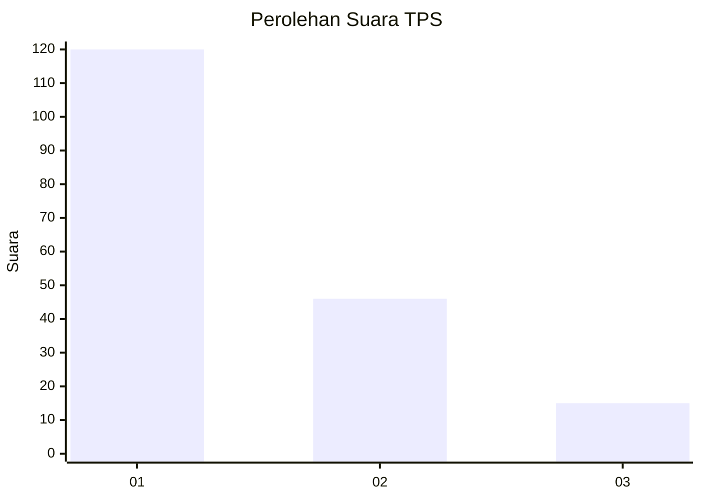
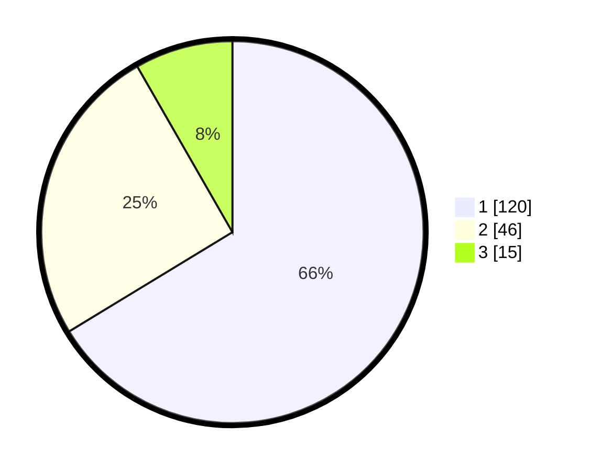

# Hasil

## Grafik

## Tabel

| No. | Nama Paslon    | Suara | Suara (raw) | Persentase |
|:--- |:-------------- | -----:| -----------:| ----------:|
| 1   | ANIES MUHAIMIN | 120   | [120][p-1]  | 66,30      |
| 2   | PRABOWO GIBRAN | 46    | [46][p-2]   | 25,41      |
| 3   | GANJAR MAHFUD  | 15    | [15][p-3]   | 8,29       |

[p-1]: https://github.com/gigit-pemilu/pemilu-2024-81-maluku/blob/main/pilpres/hitung-suara/sub/81-maluku/sub/05-seram-bagian-timur/sub/02-seram-timur/sub/2004-kellu/sub/001-tps/sub/paslon-1.txt
[p-2]: https://github.com/gigit-pemilu/pemilu-2024-81-maluku/blob/main/pilpres/hitung-suara/sub/81-maluku/sub/05-seram-bagian-timur/sub/02-seram-timur/sub/2004-kellu/sub/001-tps/sub/paslon-2.txt
[p-3]: https://github.com/gigit-pemilu/pemilu-2024-81-maluku/blob/main/pilpres/hitung-suara/sub/81-maluku/sub/05-seram-bagian-timur/sub/02-seram-timur/sub/2004-kellu/sub/001-tps/sub/paslon-3.txt

## Foto C Plano

https://sirekap-obj-formc.kpu.go.id/f6af/pemilu/ppwp/81/05/02/20/04/8105022004001-20240216-013554--11e45b26-6b32-489b-bffe-0b612a3c6619.jpg

https://sirekap-obj-formc.kpu.go.id/f6af/pemilu/ppwp/81/05/02/20/04/8105022004001-20240216-014052--46cc7db9-f6eb-427e-a842-b0461a41f990.jpg

https://sirekap-obj-formc.kpu.go.id/f6af/pemilu/ppwp/81/05/02/20/04/8105022004001-20240216-014452--bf36c05a-f5e9-468a-9eec-7c9e213b5e10.jpg

## Metadata

| Key        | Value               |
| ---------- | ------------------- |
| Time Stamp | 2024-02-19 06:16:00 |

