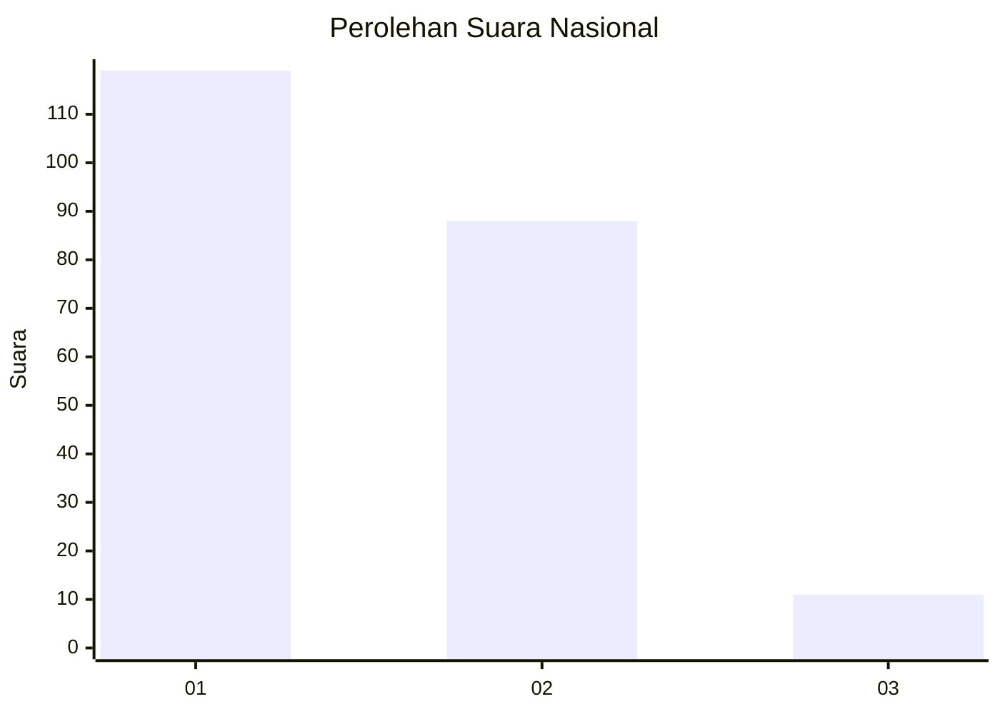
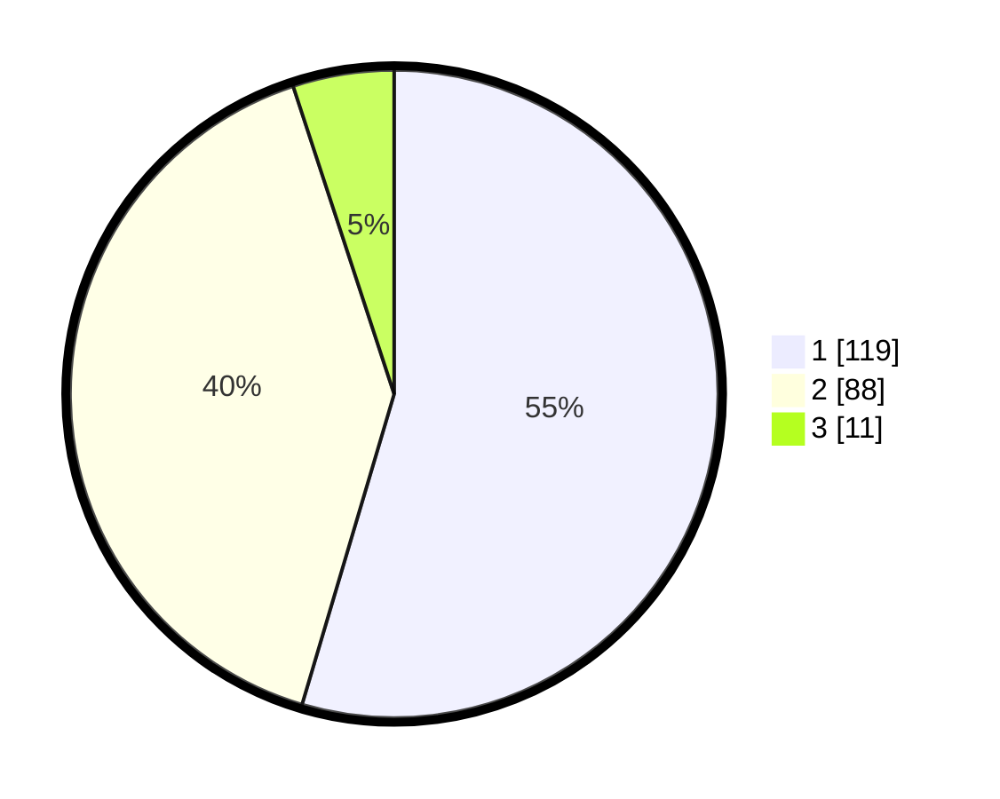

# Hasil

## Grafik

## Tabel

| No. | Nama Paslon    | Suara | Suara (raw) | Persentase |
|:--- |:-------------- | -----:| -----------:| ----------:|
| 1   | ANIES MUHAIMIN | 119   | [119][p-1]  | 54,59      |
| 2   | PRABOWO GIBRAN | 88    | [88][p-2]   | 40,37      |
| 3   | GANJAR MAHFUD  | 11    | [11][p-3]   | 5,05       |

[p-1]: https://github.com/gigit-pemilu/pemilu-2024/blob/main/pilpres/hitung-suara/sub/81-maluku/sub/05-seram-bagian-timur/sub/03-werinama/sub/2001-batuasa/sub/003-tps/sub/paslon-1.txt
[p-2]: https://github.com/gigit-pemilu/pemilu-2024/blob/main/pilpres/hitung-suara/sub/81-maluku/sub/05-seram-bagian-timur/sub/03-werinama/sub/2001-batuasa/sub/003-tps/sub/paslon-2.txt
[p-3]: https://github.com/gigit-pemilu/pemilu-2024/blob/main/pilpres/hitung-suara/sub/81-maluku/sub/05-seram-bagian-timur/sub/03-werinama/sub/2001-batuasa/sub/003-tps/sub/paslon-3.txt

## Foto C Plano

https://sirekap-obj-formc.kpu.go.id/b023/pemilu/ppwp/81/05/03/20/01/8105032001003-20240215-160457--52a0154b-48c1-4366-a514-cd9276a8e23a.jpg

https://sirekap-obj-formc.kpu.go.id/b023/pemilu/ppwp/81/05/03/20/01/8105032001003-20240215-160149--a30ad425-c51c-470f-b432-0129a94ec654.jpg

https://sirekap-obj-formc.kpu.go.id/b023/pemilu/ppwp/81/05/03/20/01/8105032001003-20240215-160922--6cba0213-6fc3-4084-b7ca-b933630f5e09.jpg

## Metadata

| Key        | Value               |
| ---------- | ------------------- |
| Time Stamp | 2024-02-15 21:01:18 |

