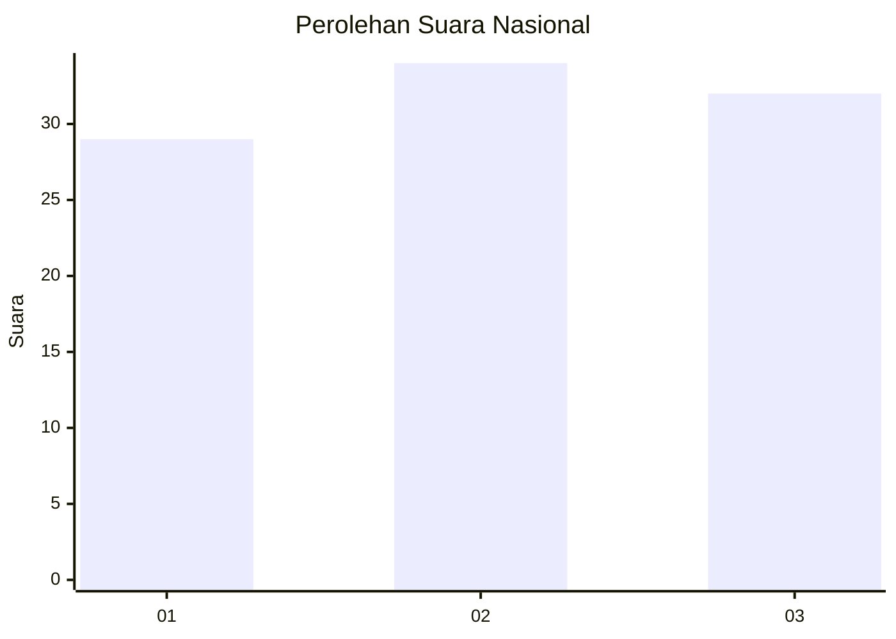
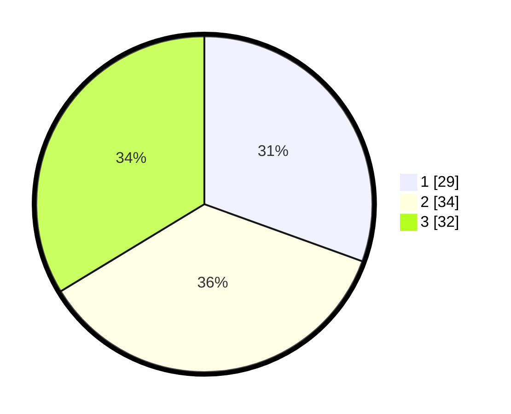

# Hasil

## Grafik

## Tabel

| No. | Nama Paslon    | Suara | Suara (raw) | Persentase |
|:--- |:-------------- | -----:| -----------:| ----------:|
| 1   | ANIES MUHAIMIN | 29    | [29][p-1]   | 30,53      |
| 2   | PRABOWO GIBRAN | 34    | [34][p-2]   | 35,79      |
| 3   | GANJAR MAHFUD  | 32    | [32][p-3]   | 33,68      |

[p-1]: https://github.com/gigit-pemilu/pemilu-2024/blob/main/pilpres/hitung-suara/sub/81-maluku/sub/05-seram-bagian-timur/sub/05-wakate/sub/2006-amarlaut/sub/004-tps/sub/paslon-1.txt
[p-2]: https://github.com/gigit-pemilu/pemilu-2024/blob/main/pilpres/hitung-suara/sub/81-maluku/sub/05-seram-bagian-timur/sub/05-wakate/sub/2006-amarlaut/sub/004-tps/sub/paslon-2.txt
[p-3]: https://github.com/gigit-pemilu/pemilu-2024/blob/main/pilpres/hitung-suara/sub/81-maluku/sub/05-seram-bagian-timur/sub/05-wakate/sub/2006-amarlaut/sub/004-tps/sub/paslon-3.txt

## Foto C Plano

https://sirekap-obj-formc.kpu.go.id/0662/pemilu/ppwp/81/05/05/20/06/8105052006004-20240215-175930--4ac79482-f73d-47ed-9613-6520162ee2b8.jpg

https://sirekap-obj-formc.kpu.go.id/0662/pemilu/ppwp/81/05/05/20/06/8105052006004-20240215-180731--550a34f3-f014-4670-83b0-93ed8ebd1ec4.jpg

https://sirekap-obj-formc.kpu.go.id/0662/pemilu/ppwp/81/05/05/20/06/8105052006004-20240215-181836--870b8622-6a0f-4375-8c9c-688ecca959a7.jpg

## Metadata

| Key        | Value               |
| ---------- | ------------------- |
| Time Stamp | 2024-02-16 08:30:27 |

