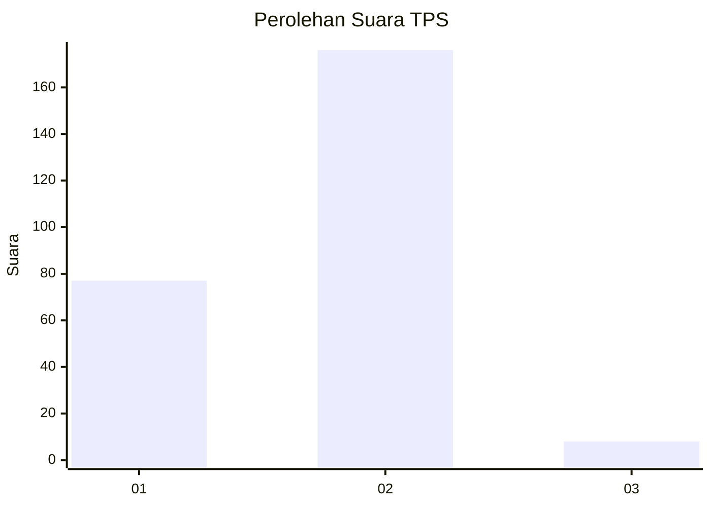
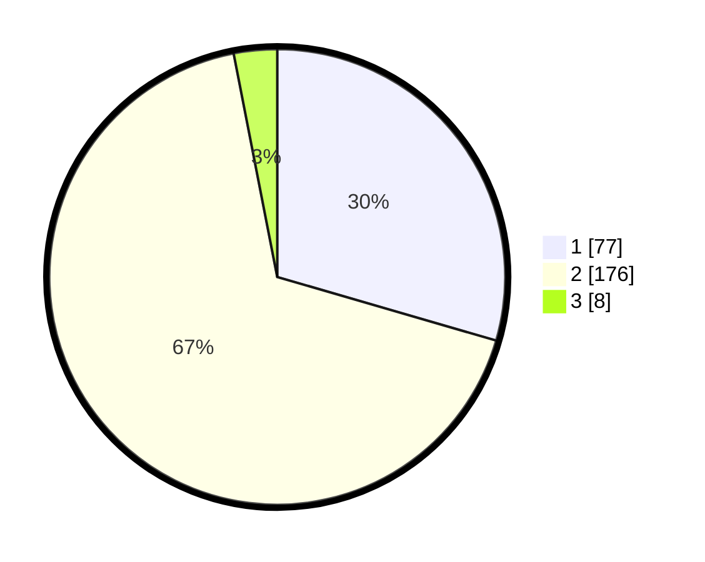

# Hasil

## Grafik

## Tabel

| No. | Nama Paslon    | Suara | Suara (raw) | Persentase |
|:--- |:-------------- | -----:| -----------:| ----------:|
| 1   | ANIES MUHAIMIN | 77    | [77][p-1]   | 29,50      |
| 2   | PRABOWO GIBRAN | 176   | [176][p-2]  | 67,43      |
| 3   | GANJAR MAHFUD  | 8     | [8][p-3]    | 3,07       |

[p-1]: https://github.com/gigit-pemilu/pemilu-2024-81-maluku/blob/main/pilpres/hitung-suara/sub/81-maluku/sub/05-seram-bagian-timur/sub/06-tutuk-tolu/sub/2006-waras-waras/sub/002-tps/sub/paslon-1.txt
[p-2]: https://github.com/gigit-pemilu/pemilu-2024-81-maluku/blob/main/pilpres/hitung-suara/sub/81-maluku/sub/05-seram-bagian-timur/sub/06-tutuk-tolu/sub/2006-waras-waras/sub/002-tps/sub/paslon-2.txt
[p-3]: https://github.com/gigit-pemilu/pemilu-2024-81-maluku/blob/main/pilpres/hitung-suara/sub/81-maluku/sub/05-seram-bagian-timur/sub/06-tutuk-tolu/sub/2006-waras-waras/sub/002-tps/sub/paslon-3.txt

## Foto C Plano

https://sirekap-obj-formc.kpu.go.id/8720/pemilu/ppwp/81/05/06/20/06/8105062006002-20240216-173141--e65591fc-fbef-420f-a790-7cef150b976e.jpg

https://sirekap-obj-formc.kpu.go.id/8720/pemilu/ppwp/81/05/06/20/06/8105062006002-20240215-205611--647cfd90-6ec3-4fb2-93b5-91a918cbea14.jpg

https://sirekap-obj-formc.kpu.go.id/8720/pemilu/ppwp/81/05/06/20/06/8105062006002-20240215-205732--e428b3e9-5282-4bf5-b1fd-2003d7eb39b8.jpg

## Metadata

| Key        | Value               |
| ---------- | ------------------- |
| Time Stamp | 2024-02-16 21:01:00 |

