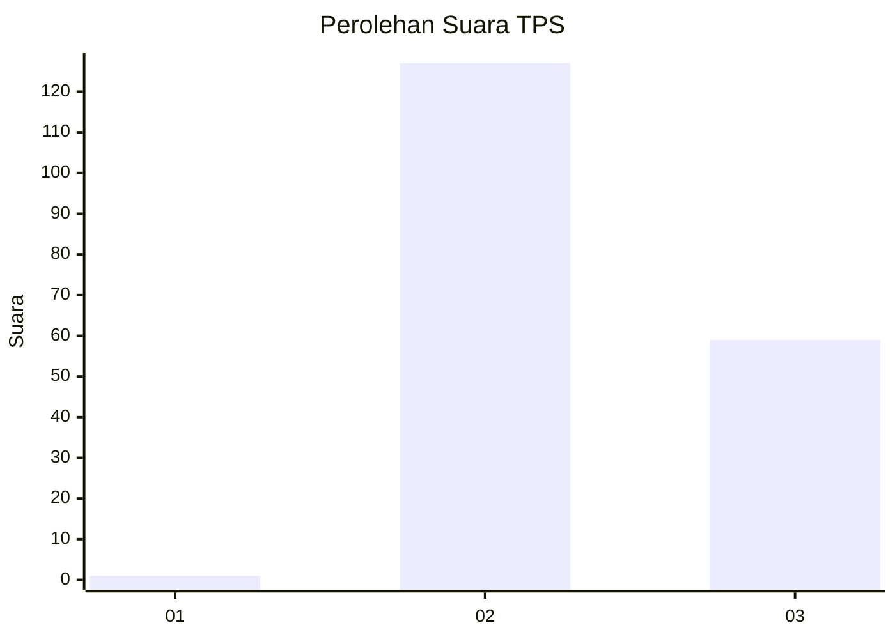
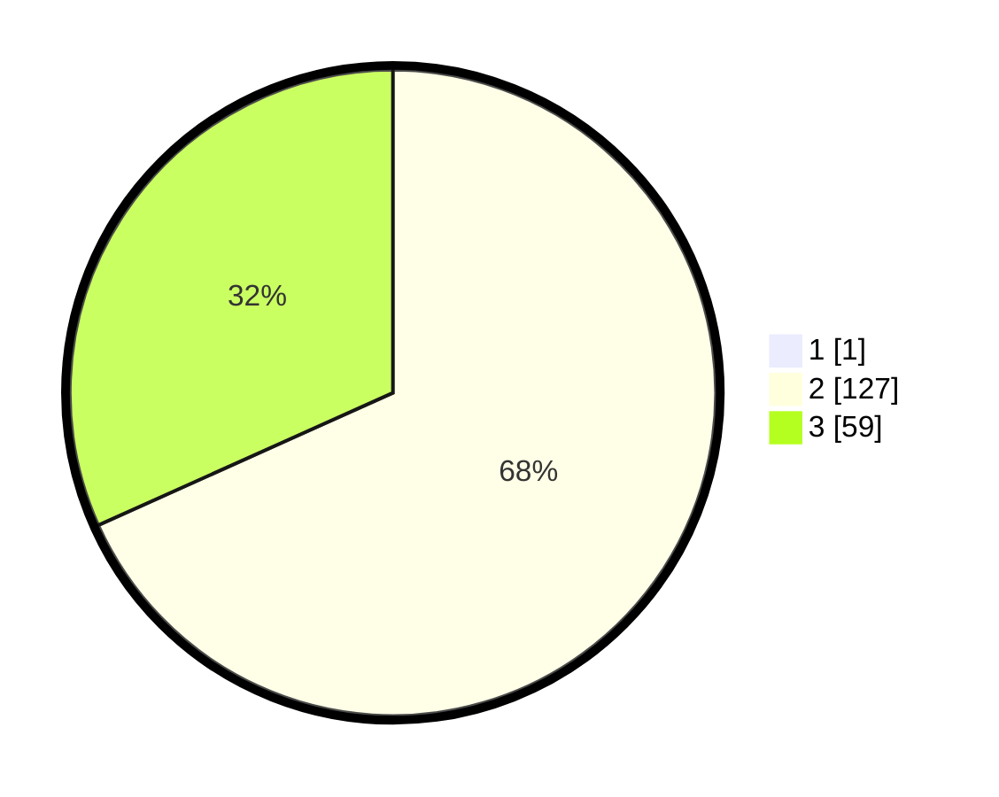

# Hasil

## Grafik

## Tabel

| No. | Nama Paslon    | Suara | Suara (raw) | Persentase |
|:--- |:-------------- | -----:| -----------:| ----------:|
| 1   | ANIES MUHAIMIN | 1     | [1][p-1]    | 0,53       |
| 2   | PRABOWO GIBRAN | 127   | [127][p-2]  | 67,91      |
| 3   | GANJAR MAHFUD  | 59    | [59][p-3]   | 31,55      |

[p-1]: https://github.com/gigit-pemilu/pemilu-2024-81-maluku/blob/main/pilpres/hitung-suara/sub/81-maluku/sub/05-seram-bagian-timur/sub/07-siwalalat/sub/2007-nayet/sub/001-tps/sub/paslon-1.txt
[p-2]: https://github.com/gigit-pemilu/pemilu-2024-81-maluku/blob/main/pilpres/hitung-suara/sub/81-maluku/sub/05-seram-bagian-timur/sub/07-siwalalat/sub/2007-nayet/sub/001-tps/sub/paslon-2.txt
[p-3]: https://github.com/gigit-pemilu/pemilu-2024-81-maluku/blob/main/pilpres/hitung-suara/sub/81-maluku/sub/05-seram-bagian-timur/sub/07-siwalalat/sub/2007-nayet/sub/001-tps/sub/paslon-3.txt

## Foto C Plano

https://sirekap-obj-formc.kpu.go.id/f852/pemilu/ppwp/81/05/07/20/07/8105072007001-20240217-074759--185bc4fa-e2fb-4e3a-ac2d-05fcbb4a3c0d.jpg

https://sirekap-obj-formc.kpu.go.id/f852/pemilu/ppwp/81/05/07/20/07/8105072007001-20240217-075155--e4658a5e-6770-45f9-8a67-a86f19b28551.jpg

https://sirekap-obj-formc.kpu.go.id/f852/pemilu/ppwp/81/05/07/20/07/8105072007001-20240217-075318--22c60a5b-9e87-4ed3-adb5-dc667acb1a98.jpg

## Metadata

| Key        | Value               |
| ---------- | ------------------- |
| Time Stamp | 2024-02-17 11:00:02 |

