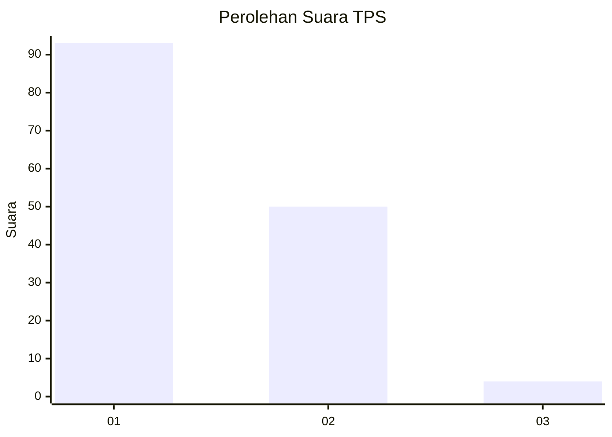
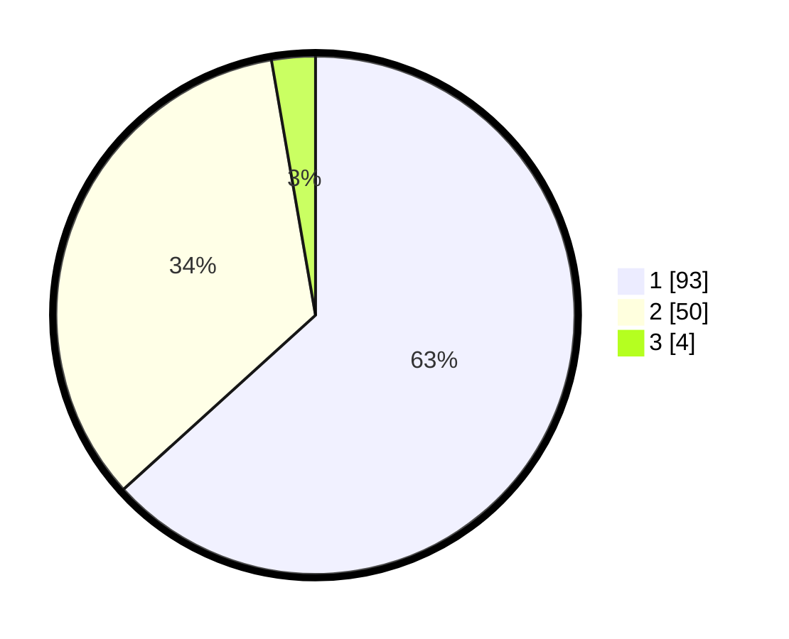

# Hasil

## Grafik

## Tabel

| No. | Nama Paslon    | Suara | Suara (raw) | Persentase |
|:--- |:-------------- | -----:| -----------:| ----------:|
| 1   | ANIES MUHAIMIN | 93    | [93][p-1]   | 63,27      |
| 2   | PRABOWO GIBRAN | 50    | [50][p-2]   | 34,01      |
| 3   | GANJAR MAHFUD  | 4     | [4][p-3]    | 2,72       |

[p-1]: https://github.com/gigit-pemilu/pemilu-2024-81-maluku/blob/main/pilpres/hitung-suara/sub/81-maluku/sub/05-seram-bagian-timur/sub/08-kilmury/sub/2001-selor/sub/002-tps/sub/paslon-1.txt
[p-2]: https://github.com/gigit-pemilu/pemilu-2024-81-maluku/blob/main/pilpres/hitung-suara/sub/81-maluku/sub/05-seram-bagian-timur/sub/08-kilmury/sub/2001-selor/sub/002-tps/sub/paslon-2.txt
[p-3]: https://github.com/gigit-pemilu/pemilu-2024-81-maluku/blob/main/pilpres/hitung-suara/sub/81-maluku/sub/05-seram-bagian-timur/sub/08-kilmury/sub/2001-selor/sub/002-tps/sub/paslon-3.txt

## Foto C Plano

https://sirekap-obj-formc.kpu.go.id/272b/pemilu/ppwp/81/05/08/20/01/8105082001002-20240215-095217--48e8ed33-b88b-412f-baf0-8deb2b7cc089.jpg

https://sirekap-obj-formc.kpu.go.id/272b/pemilu/ppwp/81/05/08/20/01/8105082001002-20240215-100046--890d2361-23e5-41e0-8bcb-5d180c752329.jpg

https://sirekap-obj-formc.kpu.go.id/272b/pemilu/ppwp/81/05/08/20/01/8105082001002-20240215-100752--f541a4ae-476d-43ad-a30a-c0cad0ef45e2.jpg

## Metadata

| Key        | Value               |
| ---------- | ------------------- |
| Time Stamp | 2024-02-15 15:00:29 |

