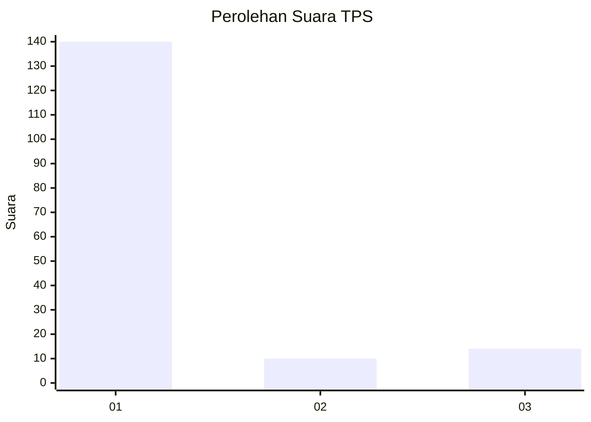
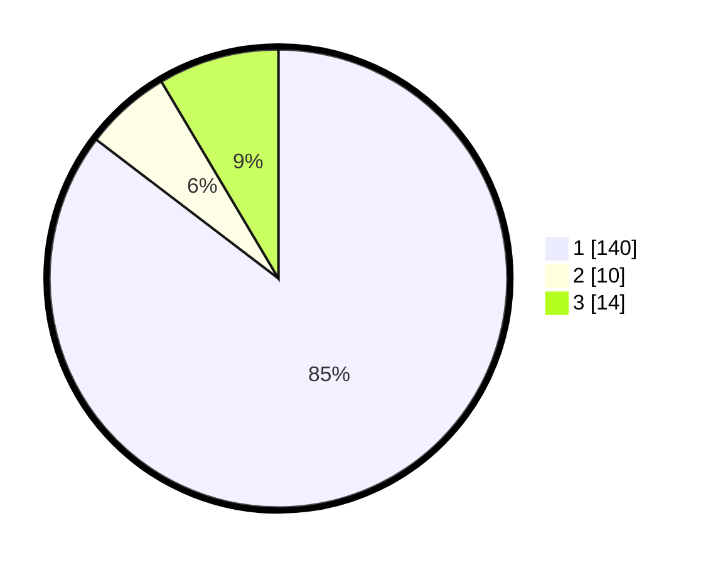

# Hasil

## Grafik

## Tabel

| No. | Nama Paslon    | Suara | Suara (raw) | Persentase |
|:--- |:-------------- | -----:| -----------:| ----------:|
| 1   | ANIES MUHAIMIN | 140   | [140][p-1]  | 85,37      |
| 2   | PRABOWO GIBRAN | 10    | [10][p-2]   | 6,10       |
| 3   | GANJAR MAHFUD  | 14    | [14][p-3]   | 8,54       |

[p-1]: https://github.com/gigit-pemilu/pemilu-2024-81-maluku/blob/main/pilpres/hitung-suara/sub/81-maluku/sub/05-seram-bagian-timur/sub/11-gorom-timur/sub/2016-adar/sub/001-tps/sub/paslon-1.txt
[p-2]: https://github.com/gigit-pemilu/pemilu-2024-81-maluku/blob/main/pilpres/hitung-suara/sub/81-maluku/sub/05-seram-bagian-timur/sub/11-gorom-timur/sub/2016-adar/sub/001-tps/sub/paslon-2.txt
[p-3]: https://github.com/gigit-pemilu/pemilu-2024-81-maluku/blob/main/pilpres/hitung-suara/sub/81-maluku/sub/05-seram-bagian-timur/sub/11-gorom-timur/sub/2016-adar/sub/001-tps/sub/paslon-3.txt

## Foto C Plano

https://sirekap-obj-formc.kpu.go.id/49e5/pemilu/ppwp/81/05/11/20/16/8105112016001-20240217-200934--d29e317e-2039-469a-abef-df390a01d1b3.jpg

https://sirekap-obj-formc.kpu.go.id/49e5/pemilu/ppwp/81/05/11/20/16/8105112016001-20240217-201035--53a1f203-4c8c-424a-98b3-1bd15993dfff.jpg

https://sirekap-obj-formc.kpu.go.id/49e5/pemilu/ppwp/81/05/11/20/16/8105112016001-20240217-201308--25c7a5ac-0845-425a-845d-e4e4b23b9145.jpg

## Metadata

| Key        | Value               |
| ---------- | ------------------- |
| Time Stamp | 2024-02-25 13:00:00 |

