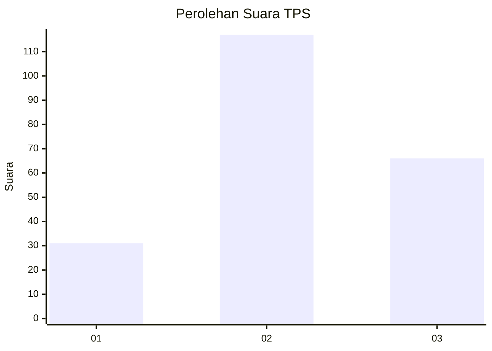
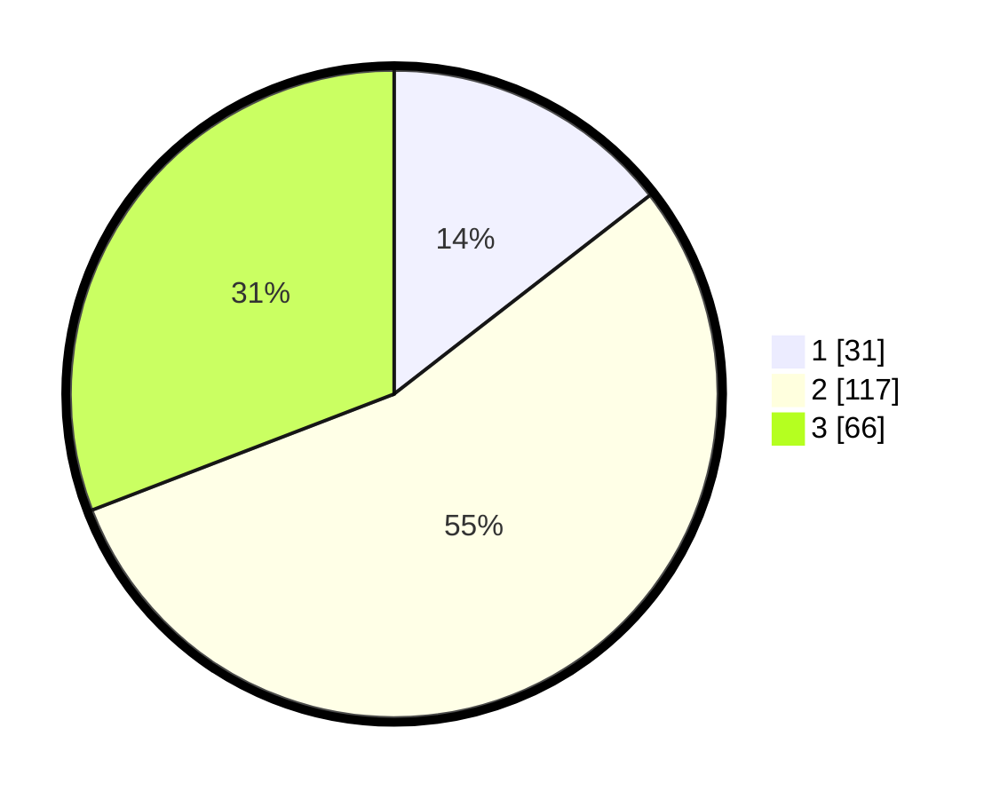

# Hasil

## Grafik

## Tabel

| No. | Nama Paslon    | Suara | Suara (raw) | Persentase |
|:--- |:-------------- | -----:| -----------:| ----------:|
| 1   | ANIES MUHAIMIN | 31    | [31][p-1]   | 14,49      |
| 2   | PRABOWO GIBRAN | 117   | [117][p-2]  | 54,67      |
| 3   | GANJAR MAHFUD  | 66    | [66][p-3]   | 30,84      |

[p-1]: https://github.com/gigit-pemilu/pemilu-2024-81-maluku/blob/main/pilpres/hitung-suara/sub/81-maluku/sub/05-seram-bagian-timur/sub/12-bula-barat/sub/2003-waematakabo/sub/002-tps/sub/paslon-1.txt
[p-2]: https://github.com/gigit-pemilu/pemilu-2024-81-maluku/blob/main/pilpres/hitung-suara/sub/81-maluku/sub/05-seram-bagian-timur/sub/12-bula-barat/sub/2003-waematakabo/sub/002-tps/sub/paslon-2.txt
[p-3]: https://github.com/gigit-pemilu/pemilu-2024-81-maluku/blob/main/pilpres/hitung-suara/sub/81-maluku/sub/05-seram-bagian-timur/sub/12-bula-barat/sub/2003-waematakabo/sub/002-tps/sub/paslon-3.txt

## Foto C Plano

https://sirekap-obj-formc.kpu.go.id/5ee6/pemilu/ppwp/81/05/12/20/03/8105122003002-20240215-185301--8fd008b8-a2a0-4089-9eca-8ccbd684cd48.jpg

https://sirekap-obj-formc.kpu.go.id/5ee6/pemilu/ppwp/81/05/12/20/03/8105122003002-20240215-211317--187a919f-f509-4000-83b3-1f3541492e9a.jpg

https://sirekap-obj-formc.kpu.go.id/5ee6/pemilu/ppwp/81/05/12/20/03/8105122003002-20240215-193301--51a74b20-e8ed-4aae-bcf6-1f5f3a791b8f.jpg

## Metadata

| Key        | Value               |
| ---------- | ------------------- |
| Time Stamp | 2024-02-20 13:00:00 |

