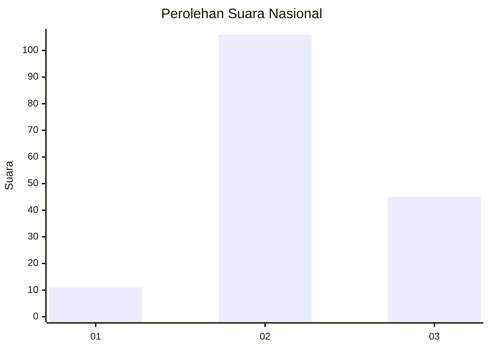

# Hasil

## Grafik

## Tabel

| No. | Nama Paslon    | Suara | Suara (raw) | Persentase |
|:--- |:-------------- | -----:| -----------:| ----------:|
| 1   | ANIES MUHAIMIN | 11    | [11][p-1]   | 6,79       |
| 2   | PRABOWO GIBRAN | 106   | [106][p-2]  | 65,43      |
| 3   | GANJAR MAHFUD  | 45    | [45][p-3]   | 27,78      |

[p-1]: https://github.com/gigit-pemilu/pemilu-2024/blob/main/pilpres/hitung-suara/sub/81-maluku/sub/05-seram-bagian-timur/sub/12-bula-barat/sub/2004-waiketam-baru/sub/002-tps/sub/paslon-1.txt
[p-2]: https://github.com/gigit-pemilu/pemilu-2024/blob/main/pilpres/hitung-suara/sub/81-maluku/sub/05-seram-bagian-timur/sub/12-bula-barat/sub/2004-waiketam-baru/sub/002-tps/sub/paslon-2.txt
[p-3]: https://github.com/gigit-pemilu/pemilu-2024/blob/main/pilpres/hitung-suara/sub/81-maluku/sub/05-seram-bagian-timur/sub/12-bula-barat/sub/2004-waiketam-baru/sub/002-tps/sub/paslon-3.txt

## Foto C Plano

https://sirekap-obj-formc.kpu.go.id/02d2/pemilu/ppwp/81/05/12/20/04/8105122004002-20240215-065732--bf42e474-effa-4921-8e86-884cdbc9a47d.jpg

https://sirekap-obj-formc.kpu.go.id/02d2/pemilu/ppwp/81/05/12/20/04/8105122004002-20240215-065913--5389141c-95ae-43bf-b30f-c26ce29b87ff.jpg

https://sirekap-obj-formc.kpu.go.id/02d2/pemilu/ppwp/81/05/12/20/04/8105122004002-20240215-070110--323f962e-7afc-47e9-affa-fbc3675e7584.jpg

## Metadata

| Key        | Value               |
| ---------- | ------------------- |
| Time Stamp | 2024-02-15 20:00:44 |

