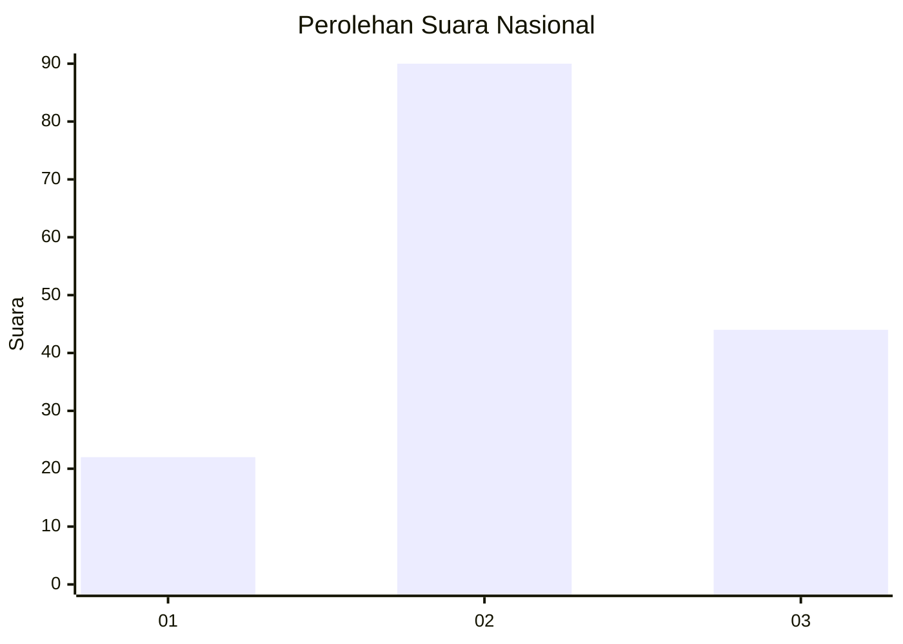
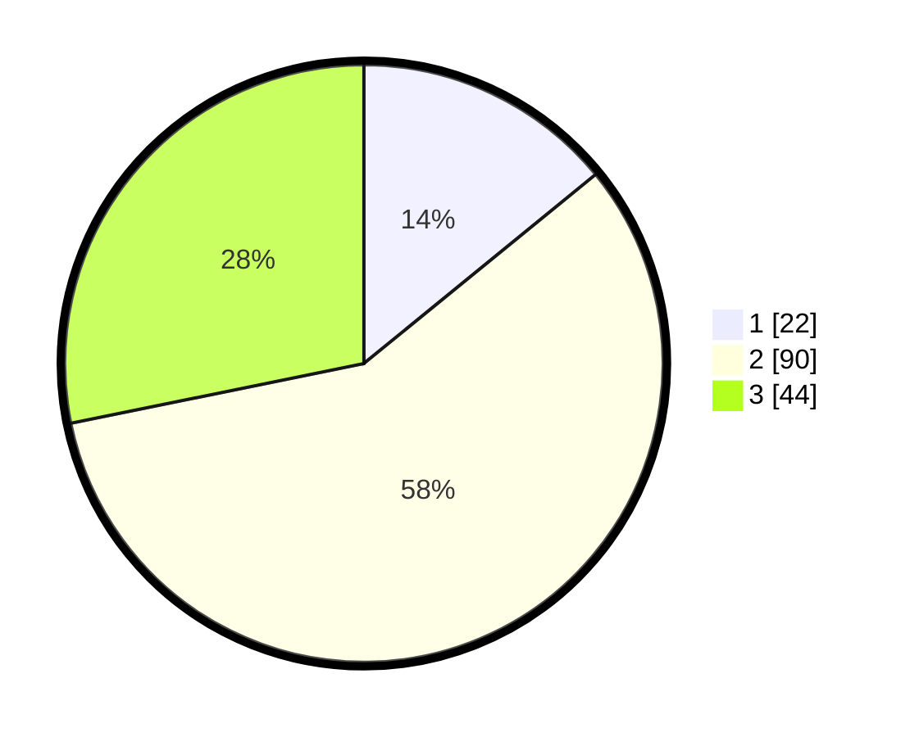

# Hasil

## Grafik

## Tabel

| No. | Nama Paslon    | Suara | Suara (raw) | Persentase |
|:--- |:-------------- | -----:| -----------:| ----------:|
| 1   | ANIES MUHAIMIN | 22    | [22][p-1]   | 14,10      |
| 2   | PRABOWO GIBRAN | 90    | [90][p-2]   | 57,69      |
| 3   | GANJAR MAHFUD  | 44    | [44][p-3]   | 28,21      |

[p-1]: https://github.com/gigit-pemilu/pemilu-2024/blob/main/pilpres/hitung-suara/sub/81-maluku/sub/05-seram-bagian-timur/sub/12-bula-barat/sub/2004-waiketam-baru/sub/003-tps/sub/paslon-1.txt
[p-2]: https://github.com/gigit-pemilu/pemilu-2024/blob/main/pilpres/hitung-suara/sub/81-maluku/sub/05-seram-bagian-timur/sub/12-bula-barat/sub/2004-waiketam-baru/sub/003-tps/sub/paslon-2.txt
[p-3]: https://github.com/gigit-pemilu/pemilu-2024/blob/main/pilpres/hitung-suara/sub/81-maluku/sub/05-seram-bagian-timur/sub/12-bula-barat/sub/2004-waiketam-baru/sub/003-tps/sub/paslon-3.txt

## Foto C Plano

https://sirekap-obj-formc.kpu.go.id/4ea2/pemilu/ppwp/81/05/12/20/04/8105122004003-20240215-055856--c468c78f-c4ca-43bc-a854-d6292cb86db6.jpg

https://sirekap-obj-formc.kpu.go.id/4ea2/pemilu/ppwp/81/05/12/20/04/8105122004003-20240215-060056--bd6c5e39-65c2-478c-92fa-9e4f98bddfe4.jpg

https://sirekap-obj-formc.kpu.go.id/4ea2/pemilu/ppwp/81/05/12/20/04/8105122004003-20240215-060246--1aa679e7-24b8-4efb-8710-4b047b65c017.jpg

## Metadata

| Key        | Value               |
| ---------- | ------------------- |
| Time Stamp | 2024-02-15 21:01:18 |

