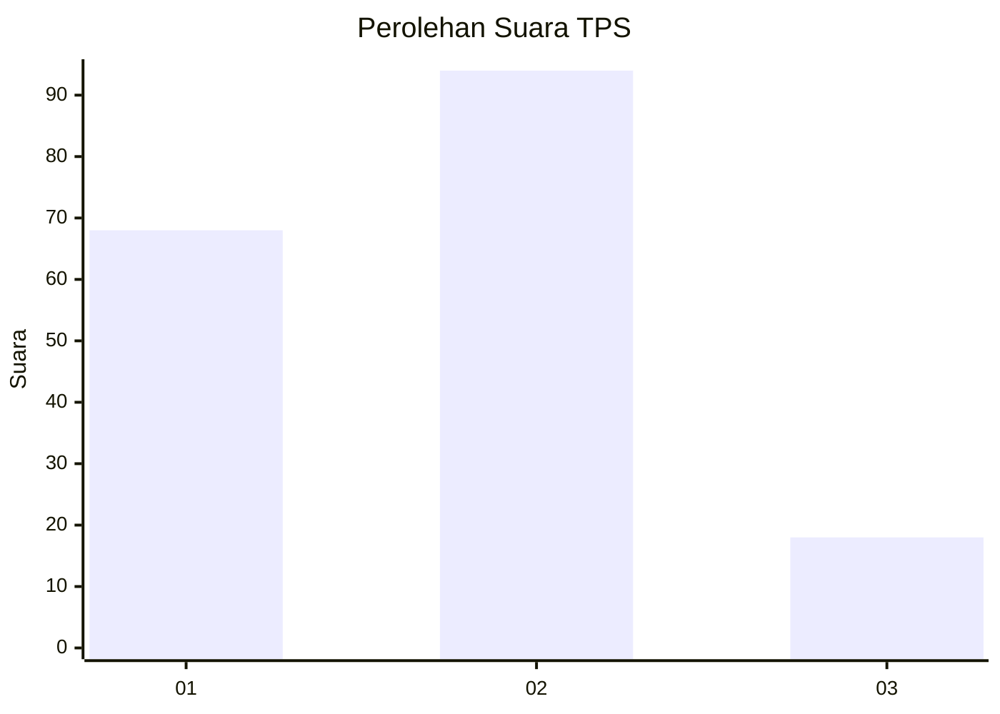
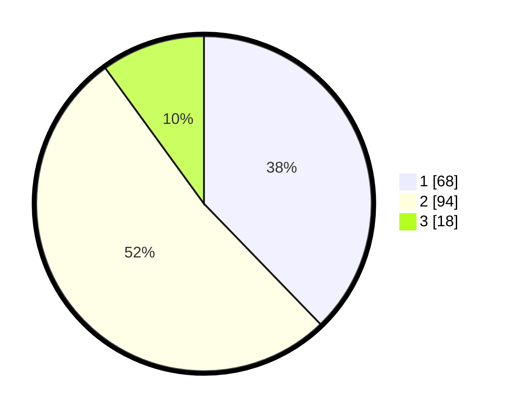

# Hasil

## Grafik

## Tabel

| No. | Nama Paslon    | Suara | Suara (raw) | Persentase |
|:--- |:-------------- | -----:| -----------:| ----------:|
| 1   | ANIES MUHAIMIN | 68    | [68][p-1]   | 37,78      |
| 2   | PRABOWO GIBRAN | 94    | [94][p-2]   | 52,22      |
| 3   | GANJAR MAHFUD  | 18    | [18][p-3]   | 10,00      |

[p-1]: https://github.com/gigit-pemilu/pemilu-2024-81-maluku/blob/main/pilpres/hitung-suara/sub/81-maluku/sub/05-seram-bagian-timur/sub/14-siritaun-wida-timur/sub/2007-lian-tasik/sub/002-tps/sub/paslon-1.txt
[p-2]: https://github.com/gigit-pemilu/pemilu-2024-81-maluku/blob/main/pilpres/hitung-suara/sub/81-maluku/sub/05-seram-bagian-timur/sub/14-siritaun-wida-timur/sub/2007-lian-tasik/sub/002-tps/sub/paslon-2.txt
[p-3]: https://github.com/gigit-pemilu/pemilu-2024-81-maluku/blob/main/pilpres/hitung-suara/sub/81-maluku/sub/05-seram-bagian-timur/sub/14-siritaun-wida-timur/sub/2007-lian-tasik/sub/002-tps/sub/paslon-3.txt

## Foto C Plano

https://sirekap-obj-formc.kpu.go.id/f64f/pemilu/ppwp/81/05/14/20/07/8105142007002-20240215-201552--4479cb92-4b3a-43f3-aa38-07afdad49e3d.jpg

https://sirekap-obj-formc.kpu.go.id/f64f/pemilu/ppwp/81/05/14/20/07/8105142007002-20240215-182419--c7280a16-eb3d-41f4-b988-42eabdcdcc5d.jpg

https://sirekap-obj-formc.kpu.go.id/f64f/pemilu/ppwp/81/05/14/20/07/8105142007002-20240215-201953--538b05ac-8c81-4311-a5ad-259833a0a3af.jpg

## Metadata

| Key        | Value               |
| ---------- | ------------------- |
| Time Stamp | 2024-02-15 23:29:50 |

