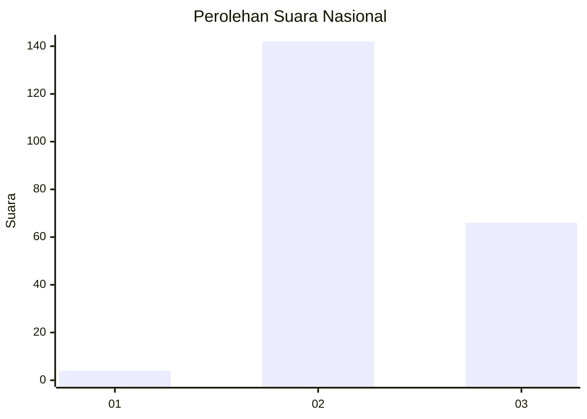
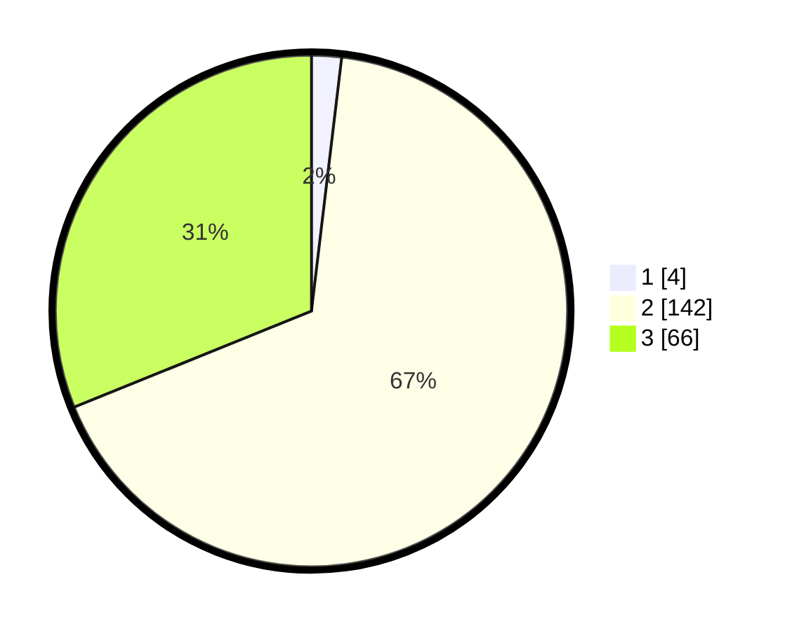

# Hasil

## Grafik

## Tabel

| No. | Nama Paslon    | Suara | Suara (raw) | Persentase |
|:--- |:-------------- | -----:| -----------:| ----------:|
| 1   | ANIES MUHAIMIN | 4     | [4][p-1]    | 1,89       |
| 2   | PRABOWO GIBRAN | 142   | [142][p-2]  | 66,98      |
| 3   | GANJAR MAHFUD  | 66    | [66][p-3]   | 31,13      |

[p-1]: https://github.com/gigit-pemilu/pemilu-2024/blob/main/pilpres/hitung-suara/sub/81-maluku/sub/06-seram-bagian-barat/sub/01-kairatu/sub/2008-kamarian/sub/002-tps/sub/paslon-1.txt
[p-2]: https://github.com/gigit-pemilu/pemilu-2024/blob/main/pilpres/hitung-suara/sub/81-maluku/sub/06-seram-bagian-barat/sub/01-kairatu/sub/2008-kamarian/sub/002-tps/sub/paslon-2.txt
[p-3]: https://github.com/gigit-pemilu/pemilu-2024/blob/main/pilpres/hitung-suara/sub/81-maluku/sub/06-seram-bagian-barat/sub/01-kairatu/sub/2008-kamarian/sub/002-tps/sub/paslon-3.txt

## Foto C Plano

https://sirekap-obj-formc.kpu.go.id/2a81/pemilu/ppwp/81/06/01/20/08/8106012008002-20240215-074954--45f13aa3-6f07-4c14-babf-28817f242ce3.jpg

https://sirekap-obj-formc.kpu.go.id/2a81/pemilu/ppwp/81/06/01/20/08/8106012008002-20240215-075340--5d200b44-7b35-4935-896d-ac39efa575e8.jpg

https://sirekap-obj-formc.kpu.go.id/2a81/pemilu/ppwp/81/06/01/20/08/8106012008002-20240215-075517--354a9fa7-b2d2-4338-9138-9be78a2838d5.jpg

## Metadata

| Key        | Value               |
| ---------- | ------------------- |
| Time Stamp | 2024-02-19 06:16:00 |

