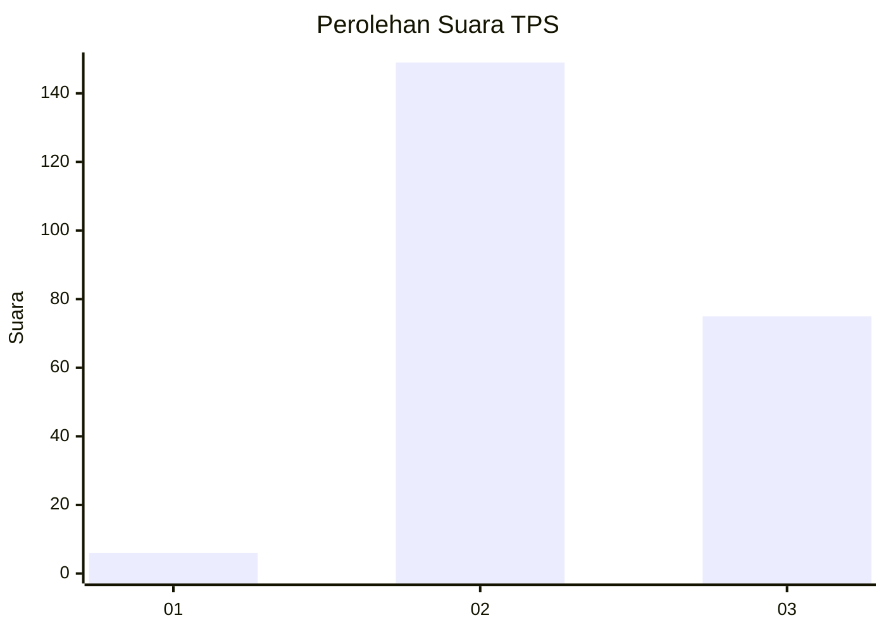
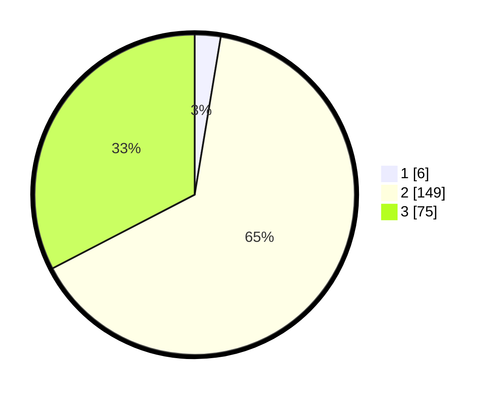

# Hasil

## Grafik

## Tabel

| No. | Nama Paslon    | Suara | Suara (raw) | Persentase |
|:--- |:-------------- | -----:| -----------:| ----------:|
| 1   | ANIES MUHAIMIN | 6     | [6][p-1]    | 2,61       |
| 2   | PRABOWO GIBRAN | 149   | [149][p-2]  | 64,78      |
| 3   | GANJAR MAHFUD  | 75    | [75][p-3]   | 32,61      |

[p-1]: https://github.com/gigit-pemilu/pemilu-2024-81-maluku/blob/main/pilpres/hitung-suara/sub/81-maluku/sub/06-seram-bagian-barat/sub/01-kairatu/sub/2008-kamarian/sub/004-tps/sub/paslon-1.txt
[p-2]: https://github.com/gigit-pemilu/pemilu-2024-81-maluku/blob/main/pilpres/hitung-suara/sub/81-maluku/sub/06-seram-bagian-barat/sub/01-kairatu/sub/2008-kamarian/sub/004-tps/sub/paslon-2.txt
[p-3]: https://github.com/gigit-pemilu/pemilu-2024-81-maluku/blob/main/pilpres/hitung-suara/sub/81-maluku/sub/06-seram-bagian-barat/sub/01-kairatu/sub/2008-kamarian/sub/004-tps/sub/paslon-3.txt

## Foto C Plano

https://sirekap-obj-formc.kpu.go.id/1c5b/pemilu/ppwp/81/06/01/20/08/8106012008004-20240215-134001--c39368f5-8200-4ebf-a9c7-dd8e4f3e830e.jpg

https://sirekap-obj-formc.kpu.go.id/1c5b/pemilu/ppwp/81/06/01/20/08/8106012008004-20240215-114432--a2e5cf5f-c8a2-4c4c-881a-e07e35ee3715.jpg

https://sirekap-obj-formc.kpu.go.id/1c5b/pemilu/ppwp/81/06/01/20/08/8106012008004-20240215-114622--78fe16aa-c692-474e-8fde-5df5e2d82df7.jpg

## Metadata

| Key        | Value               |
| ---------- | ------------------- |
| Time Stamp | 2024-02-16 12:51:22 |

