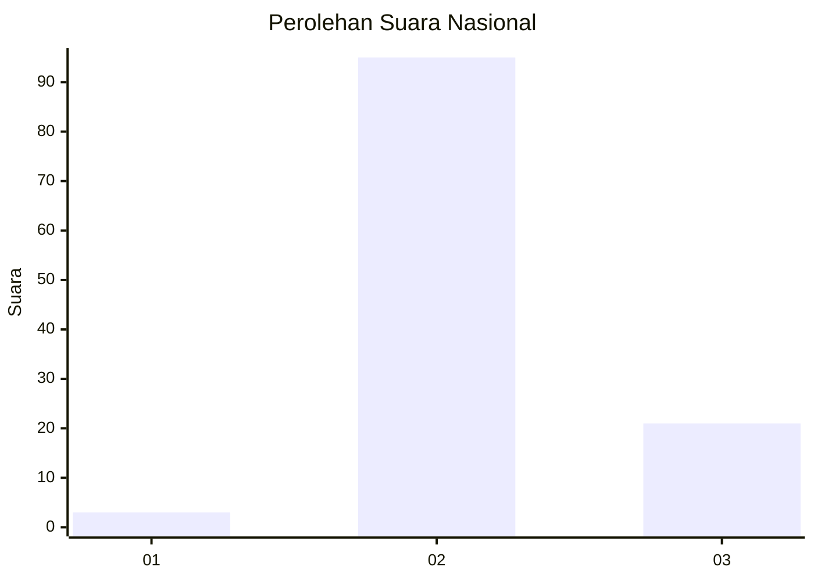
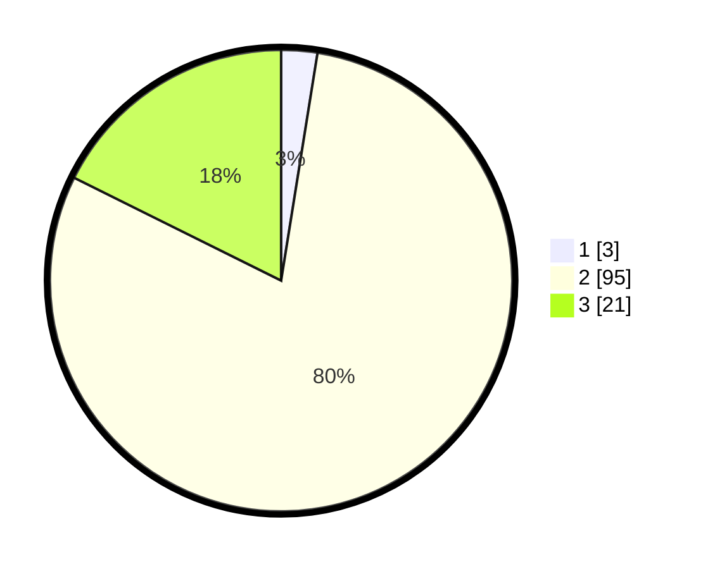

# Hasil

## Grafik

## Tabel

| No. | Nama Paslon    | Suara | Suara (raw) | Persentase |
|:--- |:-------------- | -----:| -----------:| ----------:|
| 1   | ANIES MUHAIMIN | 3     | [3][p-1]    | 2,52       |
| 2   | PRABOWO GIBRAN | 95    | [95][p-2]   | 79,83      |
| 3   | GANJAR MAHFUD  | 21    | [21][p-3]   | 17,65      |

[p-1]: https://github.com/gigit-pemilu/pemilu-2024/blob/main/pilpres/hitung-suara/sub/81-maluku/sub/06-seram-bagian-barat/sub/01-kairatu/sub/2008-kamarian/sub/006-tps/sub/paslon-1.txt
[p-2]: https://github.com/gigit-pemilu/pemilu-2024/blob/main/pilpres/hitung-suara/sub/81-maluku/sub/06-seram-bagian-barat/sub/01-kairatu/sub/2008-kamarian/sub/006-tps/sub/paslon-2.txt
[p-3]: https://github.com/gigit-pemilu/pemilu-2024/blob/main/pilpres/hitung-suara/sub/81-maluku/sub/06-seram-bagian-barat/sub/01-kairatu/sub/2008-kamarian/sub/006-tps/sub/paslon-3.txt

## Foto C Plano

https://sirekap-obj-formc.kpu.go.id/f490/pemilu/ppwp/81/06/01/20/08/8106012008006-20240215-104535--e80f73f3-1388-4e2e-9b83-d87dbe1f34ca.jpg

https://sirekap-obj-formc.kpu.go.id/f490/pemilu/ppwp/81/06/01/20/08/8106012008006-20240215-104659--d66746d6-00d8-49b4-9dea-6aa64d3ab8b0.jpg

https://sirekap-obj-formc.kpu.go.id/f490/pemilu/ppwp/81/06/01/20/08/8106012008006-20240215-104813--c2cd00ab-7564-443b-af11-eb1b97da02be.jpg

## Metadata

| Key        | Value               |
| ---------- | ------------------- |
| Time Stamp | 2024-02-19 06:16:00 |

