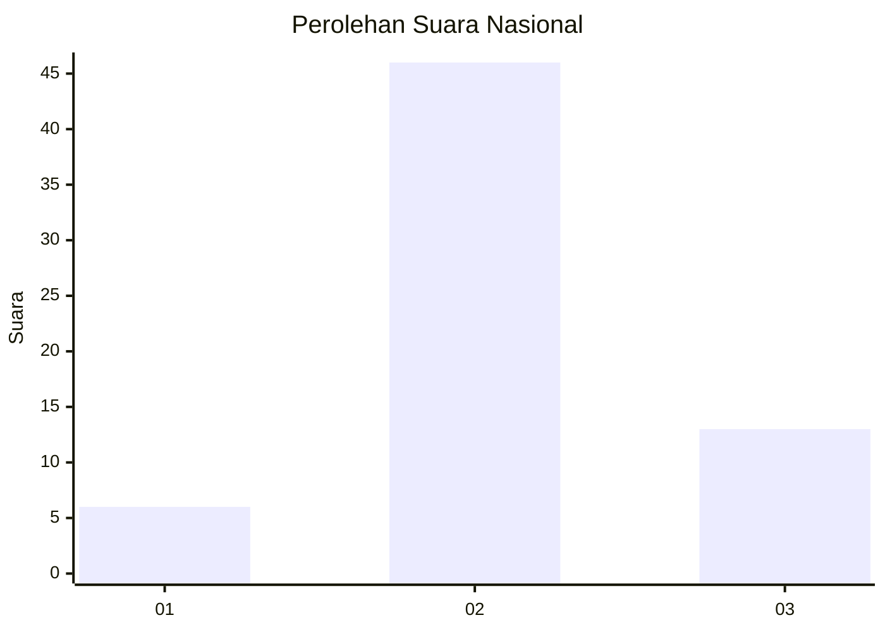
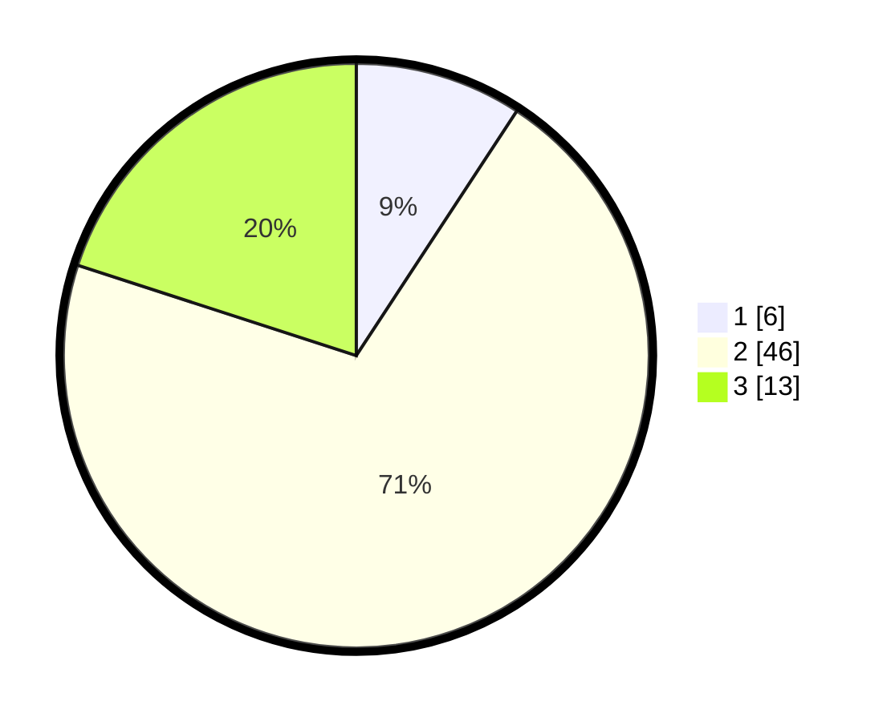

# Hasil

## Grafik

## Tabel

| No. | Nama Paslon    | Suara | Suara (raw) | Persentase |
|:--- |:-------------- | -----:| -----------:| ----------:|
| 1   | ANIES MUHAIMIN | 6     | [6][p-1]    | 9,23       |
| 2   | PRABOWO GIBRAN | 46    | [46][p-2]   | 70,77      |
| 3   | GANJAR MAHFUD  | 13    | [13][p-3]   | 20,00      |

[p-1]: https://github.com/gigit-pemilu/pemilu-2024/blob/main/pilpres/hitung-suara/sub/81-maluku/sub/06-seram-bagian-barat/sub/01-kairatu/sub/2010-kairatu/sub/029-tps/sub/paslon-1.txt
[p-2]: https://github.com/gigit-pemilu/pemilu-2024/blob/main/pilpres/hitung-suara/sub/81-maluku/sub/06-seram-bagian-barat/sub/01-kairatu/sub/2010-kairatu/sub/029-tps/sub/paslon-2.txt
[p-3]: https://github.com/gigit-pemilu/pemilu-2024/blob/main/pilpres/hitung-suara/sub/81-maluku/sub/06-seram-bagian-barat/sub/01-kairatu/sub/2010-kairatu/sub/029-tps/sub/paslon-3.txt

## Foto C Plano

https://sirekap-obj-formc.kpu.go.id/93a5/pemilu/ppwp/81/06/01/20/10/8106012010029-20240214-212055--d07da1a9-7d1e-4e8f-b1be-3d853c3364fb.jpg

https://sirekap-obj-formc.kpu.go.id/93a5/pemilu/ppwp/81/06/01/20/10/8106012010029-20240214-212322--e251f692-0556-44aa-8b45-cb0319086d80.jpg

https://sirekap-obj-formc.kpu.go.id/93a5/pemilu/ppwp/81/06/01/20/10/8106012010029-20240214-212606--9f9b5310-58bc-403d-b080-90a16b17be7c.jpg

## Metadata

| Key        | Value               |
| ---------- | ------------------- |
| Time Stamp | 2024-02-19 06:16:00 |

