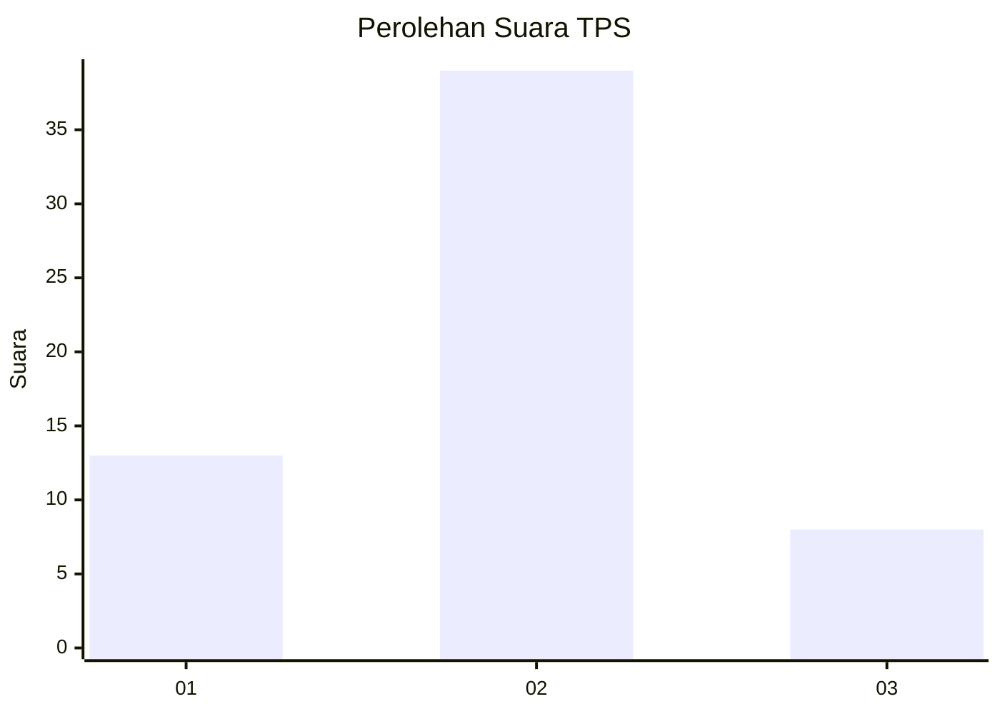
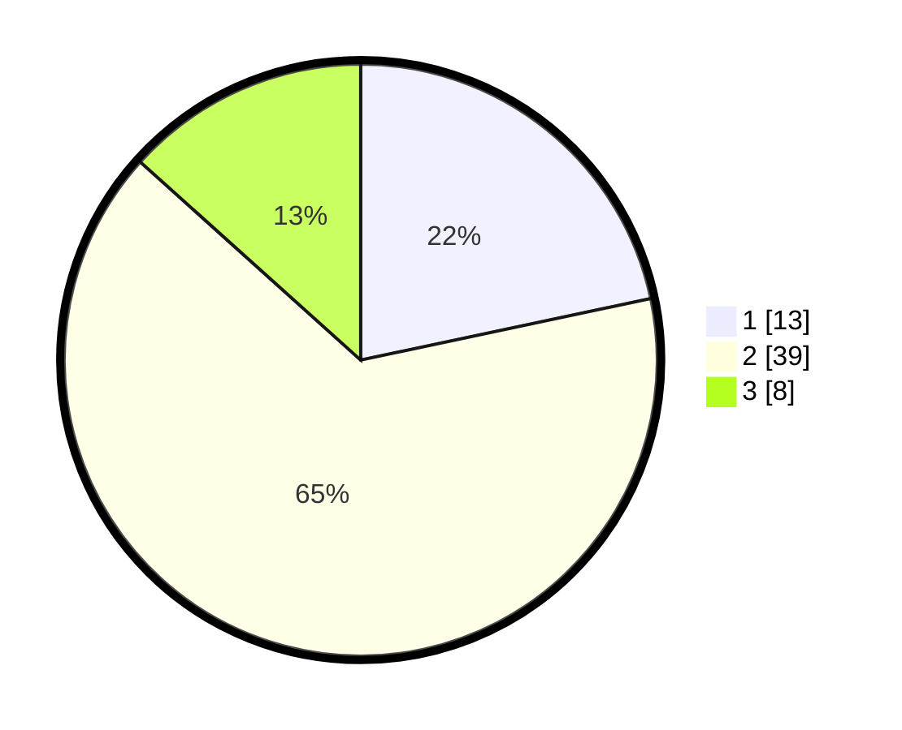

# Hasil

## Grafik

## Tabel

| No. | Nama Paslon    | Suara | Suara (raw) | Persentase |
|:--- |:-------------- | -----:| -----------:| ----------:|
| 1   | ANIES MUHAIMIN | 13    | [13][p-1]   | 21,67      |
| 2   | PRABOWO GIBRAN | 39    | [39][p-2]   | 65,00      |
| 3   | GANJAR MAHFUD  | 8     | [8][p-3]    | 13,33      |

[p-1]: https://github.com/gigit-pemilu/pemilu-2024-81-maluku/blob/main/pilpres/hitung-suara/sub/81-maluku/sub/06-seram-bagian-barat/sub/01-kairatu/sub/2012-hatusua/sub/004-tps/sub/paslon-1.txt
[p-2]: https://github.com/gigit-pemilu/pemilu-2024-81-maluku/blob/main/pilpres/hitung-suara/sub/81-maluku/sub/06-seram-bagian-barat/sub/01-kairatu/sub/2012-hatusua/sub/004-tps/sub/paslon-2.txt
[p-3]: https://github.com/gigit-pemilu/pemilu-2024-81-maluku/blob/main/pilpres/hitung-suara/sub/81-maluku/sub/06-seram-bagian-barat/sub/01-kairatu/sub/2012-hatusua/sub/004-tps/sub/paslon-3.txt

## Foto C Plano

https://sirekap-obj-formc.kpu.go.id/dcbc/pemilu/ppwp/81/06/01/20/12/8106012012004-20240215-135235--4207c30e-ebc3-4c91-9829-148202342b1a.jpg

https://sirekap-obj-formc.kpu.go.id/dcbc/pemilu/ppwp/81/06/01/20/12/8106012012004-20240215-135644--c549b07c-54e7-4059-9acf-1088667bbb35.jpg

https://sirekap-obj-formc.kpu.go.id/dcbc/pemilu/ppwp/81/06/01/20/12/8106012012004-20240215-135925--351b3ec4-8a93-4016-9e92-567a3873aff8.jpg

## Metadata

| Key        | Value               |
| ---------- | ------------------- |
| Time Stamp | 2024-02-19 06:16:00 |

