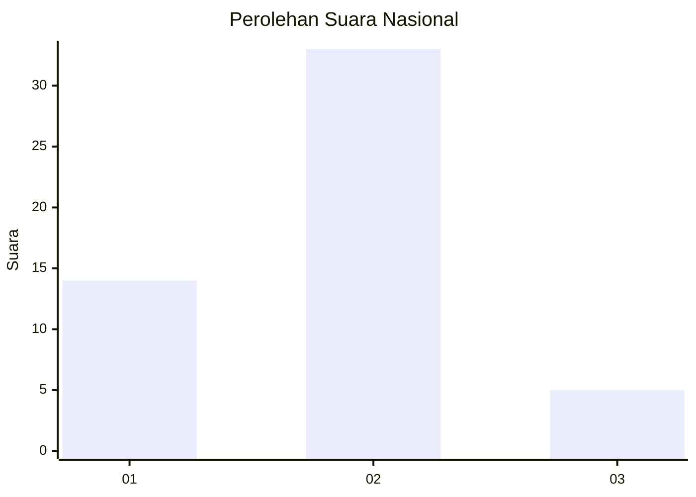
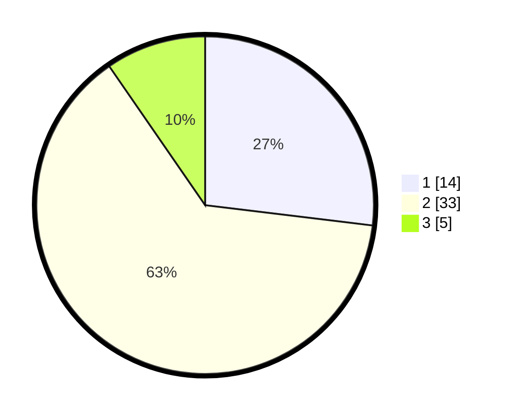

# Hasil

## Grafik

## Tabel

| No. | Nama Paslon    | Suara | Suara (raw) | Persentase |
|:--- |:-------------- | -----:| -----------:| ----------:|
| 1   | ANIES MUHAIMIN | 14    | [14][p-1]   | 26,92      |
| 2   | PRABOWO GIBRAN | 33    | [33][p-2]   | 63,46      |
| 3   | GANJAR MAHFUD  | 5     | [5][p-3]    | 9,62       |

[p-1]: https://github.com/gigit-pemilu/pemilu-2024/blob/main/pilpres/hitung-suara/sub/81-maluku/sub/06-seram-bagian-barat/sub/03-taniwel/sub/2003-niwelehu/sub/003-tps/sub/paslon-1.txt
[p-2]: https://github.com/gigit-pemilu/pemilu-2024/blob/main/pilpres/hitung-suara/sub/81-maluku/sub/06-seram-bagian-barat/sub/03-taniwel/sub/2003-niwelehu/sub/003-tps/sub/paslon-2.txt
[p-3]: https://github.com/gigit-pemilu/pemilu-2024/blob/main/pilpres/hitung-suara/sub/81-maluku/sub/06-seram-bagian-barat/sub/03-taniwel/sub/2003-niwelehu/sub/003-tps/sub/paslon-3.txt

## Foto C Plano

https://sirekap-obj-formc.kpu.go.id/bce4/pemilu/ppwp/81/06/03/20/03/8106032003003-20240222-215248--4fd355e7-3e32-41cc-abd6-5f19f3539f4b.jpg

https://sirekap-obj-formc.kpu.go.id/bce4/pemilu/ppwp/81/06/03/20/03/8106032003003-20240222-223221--cd183128-6c0a-4364-89d2-c22e3ea9d24b.jpg

https://sirekap-obj-formc.kpu.go.id/bce4/pemilu/ppwp/81/06/03/20/03/8106032003003-20240222-204135--b5aeb5ee-5a0e-42d5-8511-7dc53c682a16.jpg

## Metadata

| Key        | Value               |
| ---------- | ------------------- |
| Time Stamp | 2024-02-22 23:00:00 |

