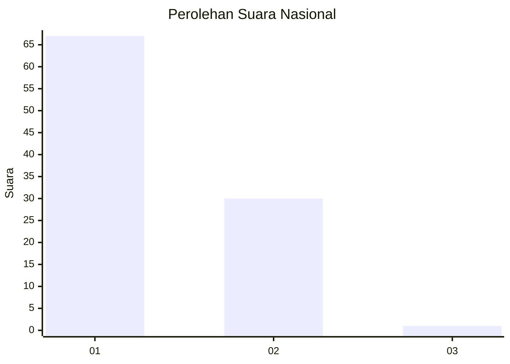
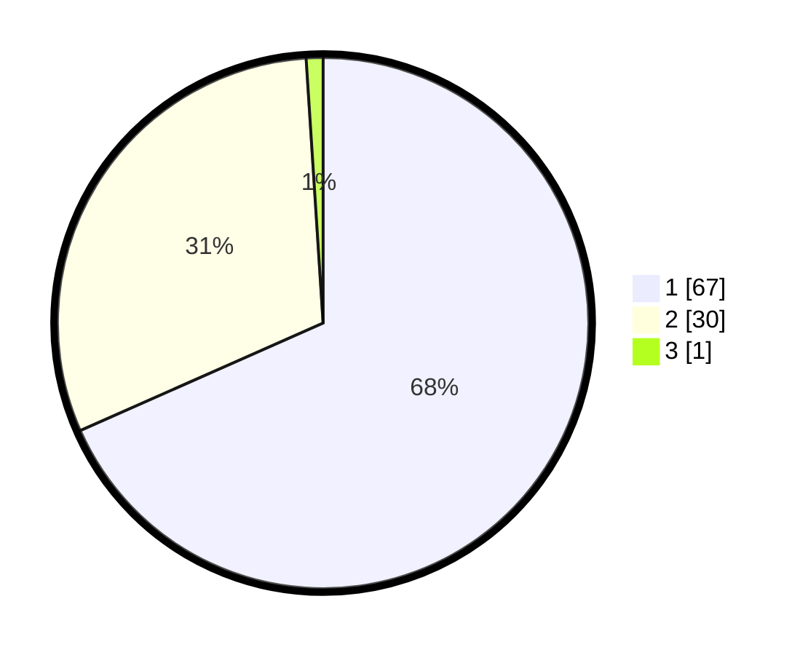

# Hasil

## Grafik

## Tabel

| No. | Nama Paslon    | Suara | Suara (raw) | Persentase |
|:--- |:-------------- | -----:| -----------:| ----------:|
| 1   | ANIES MUHAIMIN | 67    | [67][p-1]   | 68,37      |
| 2   | PRABOWO GIBRAN | 30    | [30][p-2]   | 30,61      |
| 3   | GANJAR MAHFUD  | 1     | [1][p-3]    | 1,02       |

[p-1]: https://github.com/gigit-pemilu/pemilu-2024/blob/main/pilpres/hitung-suara/sub/81-maluku/sub/06-seram-bagian-barat/sub/04-huamual-belakang/sub/2001-waesala/sub/005-tps/sub/paslon-1.txt
[p-2]: https://github.com/gigit-pemilu/pemilu-2024/blob/main/pilpres/hitung-suara/sub/81-maluku/sub/06-seram-bagian-barat/sub/04-huamual-belakang/sub/2001-waesala/sub/005-tps/sub/paslon-2.txt
[p-3]: https://github.com/gigit-pemilu/pemilu-2024/blob/main/pilpres/hitung-suara/sub/81-maluku/sub/06-seram-bagian-barat/sub/04-huamual-belakang/sub/2001-waesala/sub/005-tps/sub/paslon-3.txt

## Foto C Plano

https://sirekap-obj-formc.kpu.go.id/fb6f/pemilu/ppwp/81/06/04/20/01/8106042001005-20240215-033833--9ac3c026-d38a-4a97-a3ee-091753e21469.jpg

https://sirekap-obj-formc.kpu.go.id/fb6f/pemilu/ppwp/81/06/04/20/01/8106042001005-20240215-034013--bb14913c-2d0e-407d-9812-72e701f1af9b.jpg

https://sirekap-obj-formc.kpu.go.id/fb6f/pemilu/ppwp/81/06/04/20/01/8106042001005-20240215-034357--9cf9d671-4b2e-42bc-bd77-58fcbd9140b2.jpg

## Metadata

| Key        | Value               |
| ---------- | ------------------- |
| Time Stamp | 2024-02-17 11:30:03 |

