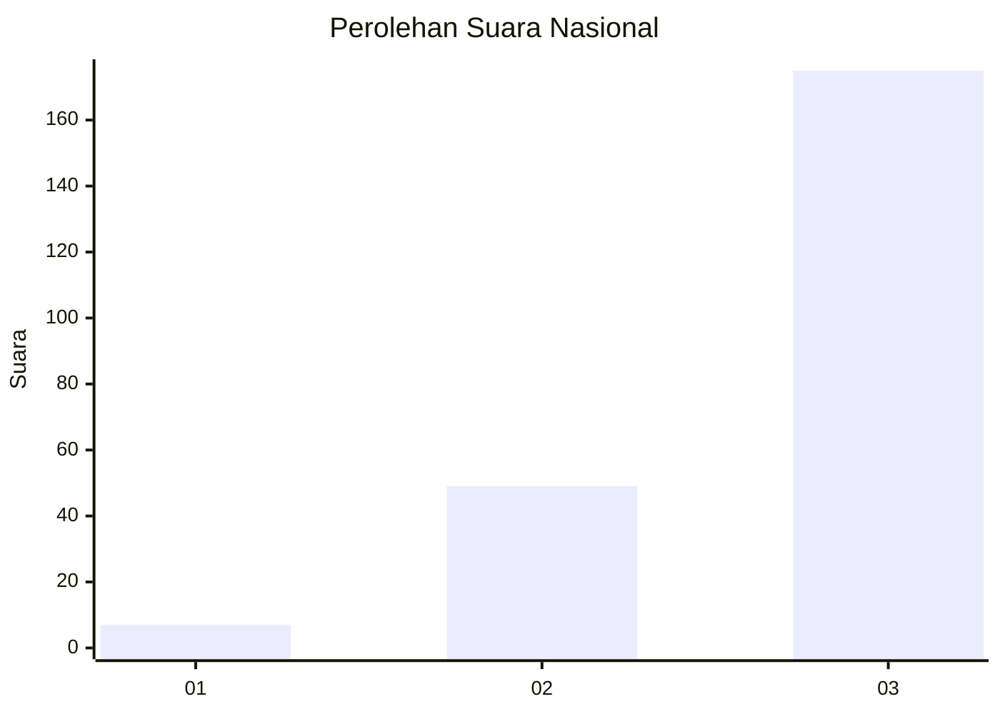
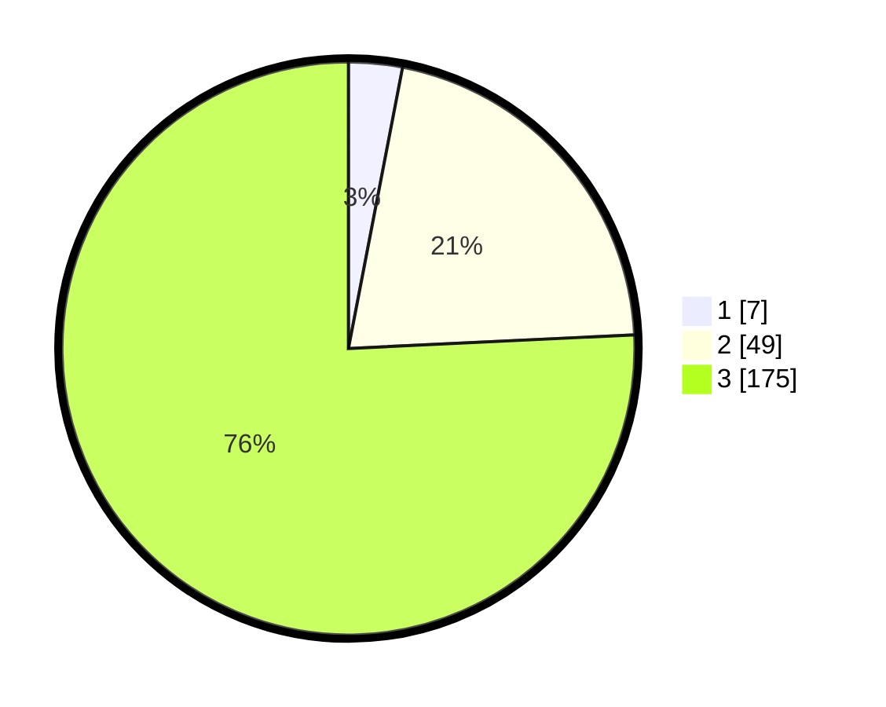

# Hasil

## Grafik

## Tabel

| No. | Nama Paslon    | Suara | Suara (raw) | Persentase |
|:--- |:-------------- | -----:| -----------:| ----------:|
| 1   | ANIES MUHAIMIN | 7     | [7][p-1]    | 3,03       |
| 2   | PRABOWO GIBRAN | 49    | [49][p-2]   | 21,21      |
| 3   | GANJAR MAHFUD  | 175   | [175][p-3]  | 75,76      |

[p-1]: https://github.com/gigit-pemilu/pemilu-2024/blob/main/pilpres/hitung-suara/sub/81-maluku/sub/06-seram-bagian-barat/sub/04-huamual-belakang/sub/2002-allang-asaude/sub/002-tps/sub/paslon-1.txt
[p-2]: https://github.com/gigit-pemilu/pemilu-2024/blob/main/pilpres/hitung-suara/sub/81-maluku/sub/06-seram-bagian-barat/sub/04-huamual-belakang/sub/2002-allang-asaude/sub/002-tps/sub/paslon-2.txt
[p-3]: https://github.com/gigit-pemilu/pemilu-2024/blob/main/pilpres/hitung-suara/sub/81-maluku/sub/06-seram-bagian-barat/sub/04-huamual-belakang/sub/2002-allang-asaude/sub/002-tps/sub/paslon-3.txt

## Foto C Plano

https://sirekap-obj-formc.kpu.go.id/31f1/pemilu/ppwp/81/06/04/20/02/8106042002002-20240215-111627--eb70003e-eae4-48ff-92ed-c72fce4952f8.jpg

https://sirekap-obj-formc.kpu.go.id/31f1/pemilu/ppwp/81/06/04/20/02/8106042002002-20240215-051409--ef9a4032-c9d8-4bb9-b06e-d47f0ad1d337.jpg

https://sirekap-obj-formc.kpu.go.id/31f1/pemilu/ppwp/81/06/04/20/02/8106042002002-20240215-051244--a28fca05-c816-4c82-b4c1-482e40e0604d.jpg

## Metadata

| Key        | Value               |
| ---------- | ------------------- |
| Time Stamp | 2024-02-17 12:00:00 |

