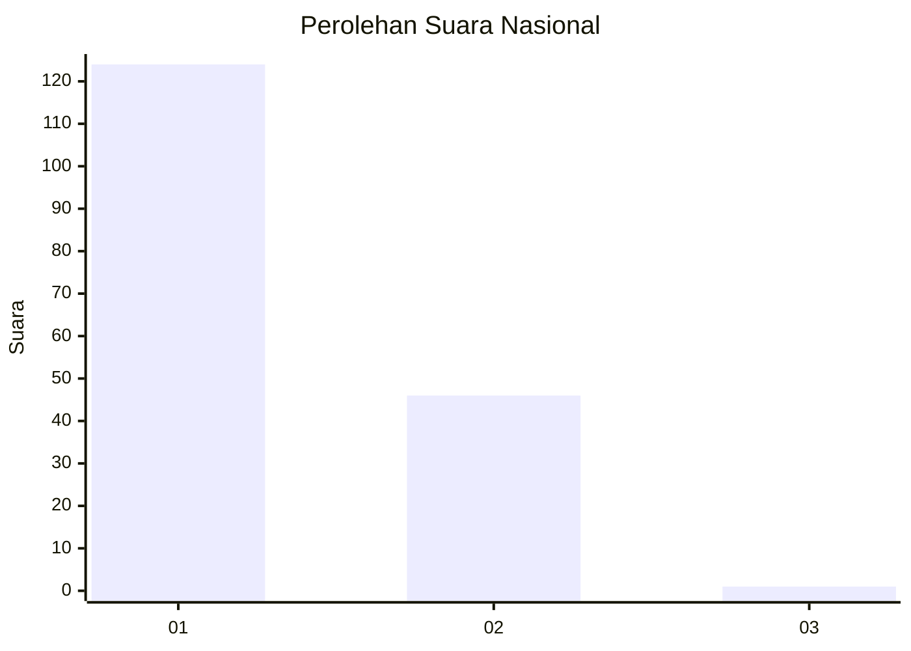
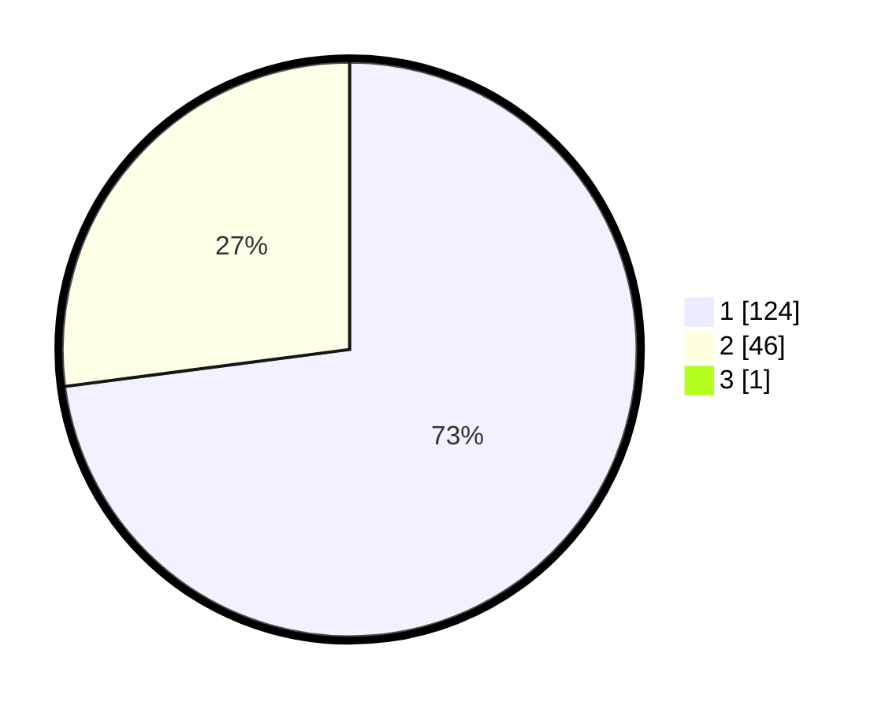

# Hasil

## Grafik

## Tabel

| No. | Nama Paslon    | Suara | Suara (raw) | Persentase |
|:--- |:-------------- | -----:| -----------:| ----------:|
| 1   | ANIES MUHAIMIN | 124   | [124][p-1]  | 72,51      |
| 2   | PRABOWO GIBRAN | 46    | [46][p-2]   | 26,90      |
| 3   | GANJAR MAHFUD  | 1     | [1][p-3]    | 0,58       |

[p-1]: https://github.com/gigit-pemilu/pemilu-2024/blob/main/pilpres/hitung-suara/sub/81-maluku/sub/06-seram-bagian-barat/sub/05-amalatu/sub/2005-hualoy/sub/007-tps/sub/paslon-1.txt
[p-2]: https://github.com/gigit-pemilu/pemilu-2024/blob/main/pilpres/hitung-suara/sub/81-maluku/sub/06-seram-bagian-barat/sub/05-amalatu/sub/2005-hualoy/sub/007-tps/sub/paslon-2.txt
[p-3]: https://github.com/gigit-pemilu/pemilu-2024/blob/main/pilpres/hitung-suara/sub/81-maluku/sub/06-seram-bagian-barat/sub/05-amalatu/sub/2005-hualoy/sub/007-tps/sub/paslon-3.txt

## Foto C Plano

https://sirekap-obj-formc.kpu.go.id/1b88/pemilu/ppwp/81/06/05/20/05/8106052005007-20240215-205755--d414c24c-8923-4f44-b553-d7ccd4dd6b5b.jpg

https://sirekap-obj-formc.kpu.go.id/1b88/pemilu/ppwp/81/06/05/20/05/8106052005007-20240215-211627--e8e5f5d7-e552-4057-8419-5bb9b0deddfe.jpg

https://sirekap-obj-formc.kpu.go.id/1b88/pemilu/ppwp/81/06/05/20/05/8106052005007-20240215-211147--7dab3a81-72f3-475d-841b-20f6e60f3105.jpg

## Metadata

| Key        | Value               |
| ---------- | ------------------- |
| Time Stamp | 2024-02-17 13:37:34 |

