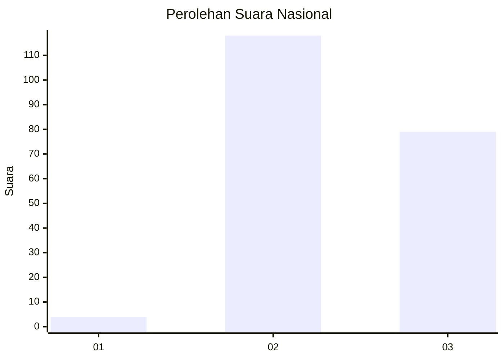
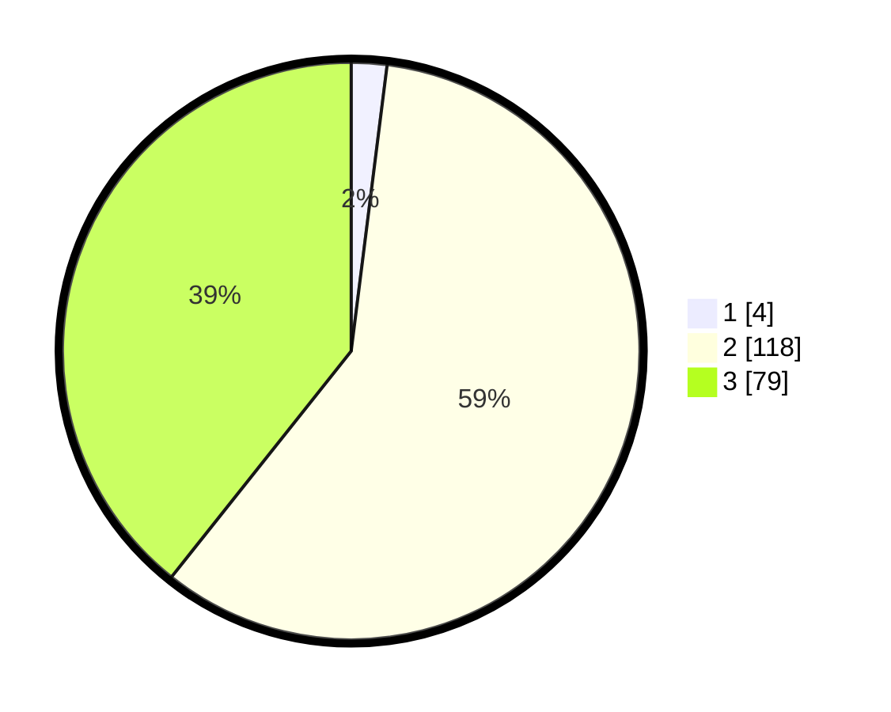

# Hasil

## Grafik

## Tabel

| No. | Nama Paslon    | Suara | Suara (raw) | Persentase |
|:--- |:-------------- | -----:| -----------:| ----------:|
| 1   | ANIES MUHAIMIN | 4     | [4][p-1]    | 1,99       |
| 2   | PRABOWO GIBRAN | 118   | [118][p-2]  | 58,71      |
| 3   | GANJAR MAHFUD  | 79    | [79][p-3]   | 39,30      |

[p-1]: https://github.com/gigit-pemilu/pemilu-2024/blob/main/pilpres/hitung-suara/sub/81-maluku/sub/06-seram-bagian-barat/sub/08-huamual/sub/2002-lokki/sub/003-tps/sub/paslon-1.txt
[p-2]: https://github.com/gigit-pemilu/pemilu-2024/blob/main/pilpres/hitung-suara/sub/81-maluku/sub/06-seram-bagian-barat/sub/08-huamual/sub/2002-lokki/sub/003-tps/sub/paslon-2.txt
[p-3]: https://github.com/gigit-pemilu/pemilu-2024/blob/main/pilpres/hitung-suara/sub/81-maluku/sub/06-seram-bagian-barat/sub/08-huamual/sub/2002-lokki/sub/003-tps/sub/paslon-3.txt

## Foto C Plano

https://sirekap-obj-formc.kpu.go.id/b556/pemilu/ppwp/81/06/08/20/02/8106082002003-20240215-162618--e9672d21-9811-453b-a75b-ed36f62d1542.jpg

https://sirekap-obj-formc.kpu.go.id/b556/pemilu/ppwp/81/06/08/20/02/8106082002003-20240215-130009--a4d9cad5-ee6e-45b7-8679-11bd1a4b204b.jpg

https://sirekap-obj-formc.kpu.go.id/b556/pemilu/ppwp/81/06/08/20/02/8106082002003-20240215-130119--d57ddd7b-6f70-4c14-9408-1612a92790bf.jpg

## Metadata

| Key        | Value               |
| ---------- | ------------------- |
| Time Stamp | 2024-02-15 23:29:50 |

