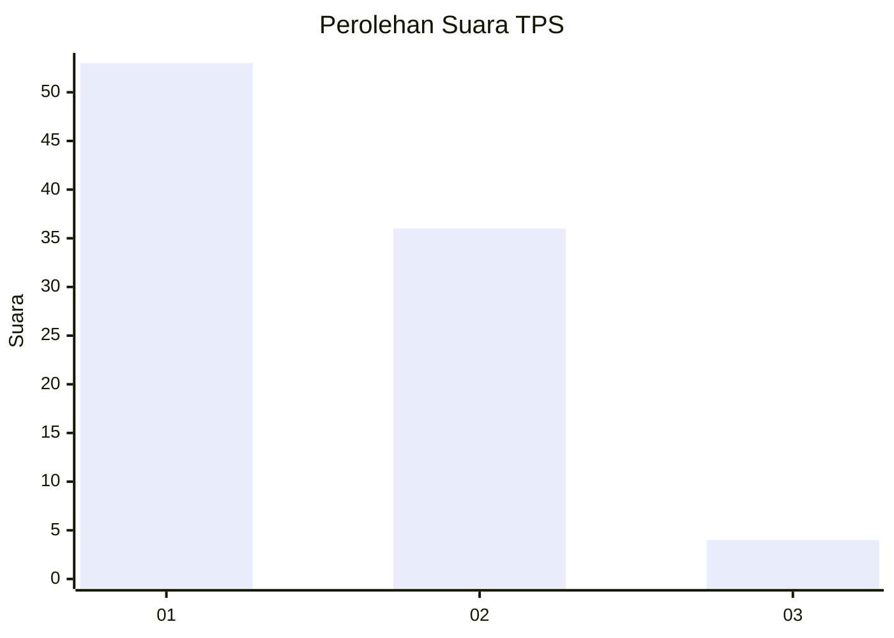
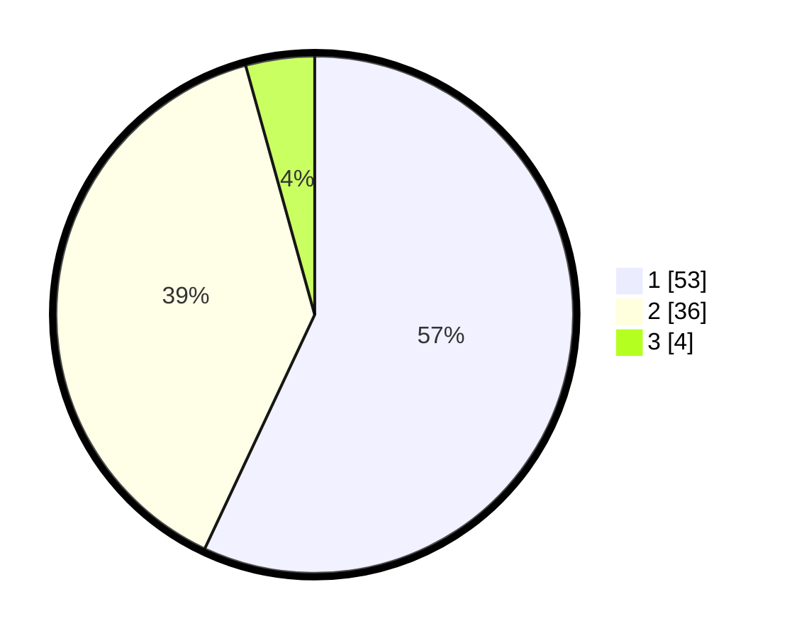

# Hasil

## Grafik

## Tabel

| No. | Nama Paslon    | Suara | Suara (raw) | Persentase |
|:--- |:-------------- | -----:| -----------:| ----------:|
| 1   | ANIES MUHAIMIN | 53    | [53][p-1]   | 56,99      |
| 2   | PRABOWO GIBRAN | 36    | [36][p-2]   | 38,71      |
| 3   | GANJAR MAHFUD  | 4     | [4][p-3]    | 4,30       |

[p-1]: https://github.com/gigit-pemilu/pemilu-2024-81-maluku/blob/main/pilpres/hitung-suara/sub/81-maluku/sub/06-seram-bagian-barat/sub/08-huamual/sub/2002-lokki/sub/039-tps/sub/paslon-1.txt
[p-2]: https://github.com/gigit-pemilu/pemilu-2024-81-maluku/blob/main/pilpres/hitung-suara/sub/81-maluku/sub/06-seram-bagian-barat/sub/08-huamual/sub/2002-lokki/sub/039-tps/sub/paslon-2.txt
[p-3]: https://github.com/gigit-pemilu/pemilu-2024-81-maluku/blob/main/pilpres/hitung-suara/sub/81-maluku/sub/06-seram-bagian-barat/sub/08-huamual/sub/2002-lokki/sub/039-tps/sub/paslon-3.txt

## Foto C Plano

https://sirekap-obj-formc.kpu.go.id/e9cb/pemilu/ppwp/81/06/08/20/02/8106082002039-20240215-081842--ed0b3992-9c64-4a52-ad35-9a6e1ace540d.jpg

https://sirekap-obj-formc.kpu.go.id/e9cb/pemilu/ppwp/81/06/08/20/02/8106082002039-20240215-082218--029f75a6-d4ee-4462-8fb4-2eb35064fa5b.jpg

https://sirekap-obj-formc.kpu.go.id/e9cb/pemilu/ppwp/81/06/08/20/02/8106082002039-20240215-082700--bc9106d1-adc4-48dc-b1ae-4716dbae5fc7.jpg

## Metadata

| Key        | Value               |
| ---------- | ------------------- |
| Time Stamp | 2024-02-17 13:37:34 |

