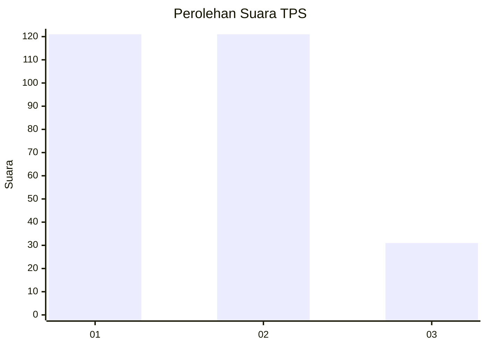
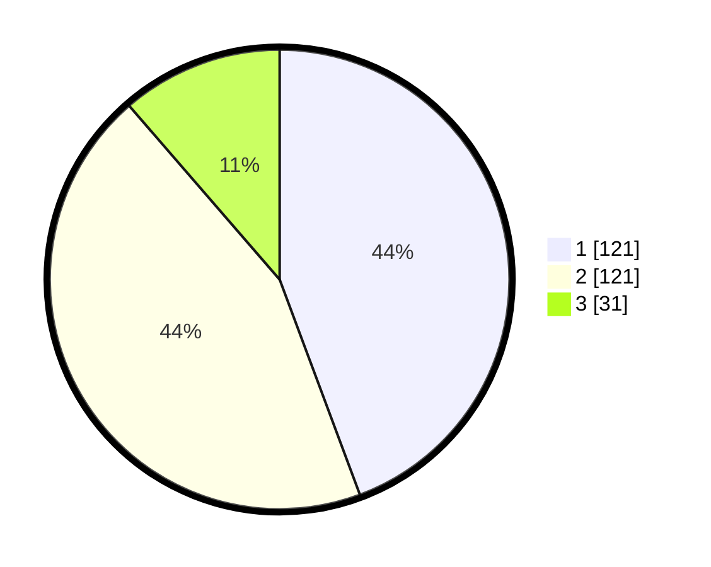

# Hasil

## Grafik

## Tabel

| No. | Nama Paslon    | Suara | Suara (raw) | Persentase |
|:--- |:-------------- | -----:| -----------:| ----------:|
| 1   | ANIES MUHAIMIN | 121   | [121][p-1]  | 44,32      |
| 2   | PRABOWO GIBRAN | 121   | [121][p-2]  | 44,32      |
| 3   | GANJAR MAHFUD  | 31    | [31][p-3]   | 11,36      |

[p-1]: https://github.com/gigit-pemilu/pemilu-2024-81-maluku/blob/main/pilpres/hitung-suara/sub/81-maluku/sub/06-seram-bagian-barat/sub/08-huamual/sub/2003-luhu/sub/003-tps/sub/paslon-1.txt
[p-2]: https://github.com/gigit-pemilu/pemilu-2024-81-maluku/blob/main/pilpres/hitung-suara/sub/81-maluku/sub/06-seram-bagian-barat/sub/08-huamual/sub/2003-luhu/sub/003-tps/sub/paslon-2.txt
[p-3]: https://github.com/gigit-pemilu/pemilu-2024-81-maluku/blob/main/pilpres/hitung-suara/sub/81-maluku/sub/06-seram-bagian-barat/sub/08-huamual/sub/2003-luhu/sub/003-tps/sub/paslon-3.txt

## Foto C Plano

https://sirekap-obj-formc.kpu.go.id/38c8/pemilu/ppwp/81/06/08/20/03/8106082003003-20240215-060522--be76f62b-0172-410e-8d85-013c3b285c60.jpg

https://sirekap-obj-formc.kpu.go.id/38c8/pemilu/ppwp/81/06/08/20/03/8106082003003-20240215-060639--3db77ab8-5c3c-4bfe-9819-66b38cfcd22c.jpg

https://sirekap-obj-formc.kpu.go.id/38c8/pemilu/ppwp/81/06/08/20/03/8106082003003-20240215-060752--72500efb-792c-4988-9ec7-3fabce7f4953.jpg

## Metadata

| Key        | Value               |
| ---------- | ------------------- |
| Time Stamp | 2024-02-17 13:37:34 |

