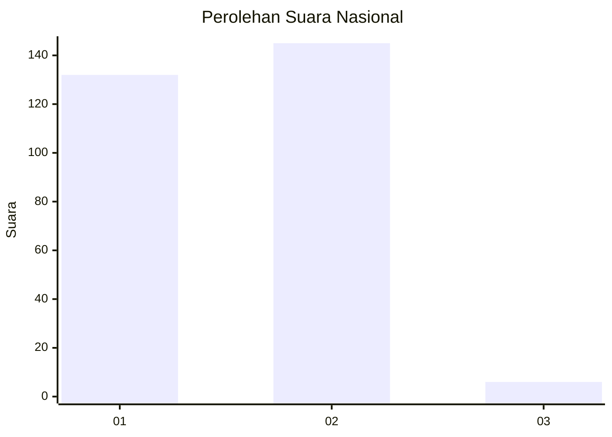
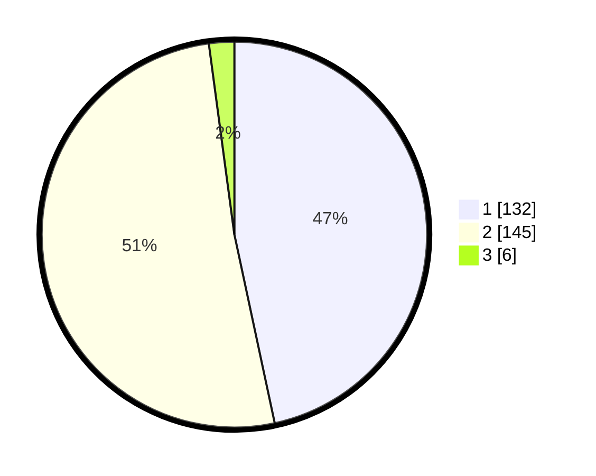

# Hasil

## Grafik

## Tabel

| No. | Nama Paslon    | Suara | Suara (raw) | Persentase |
|:--- |:-------------- | -----:| -----------:| ----------:|
| 1   | ANIES MUHAIMIN | 132   | [132][p-1]  | 46,64      |
| 2   | PRABOWO GIBRAN | 145   | [145][p-2]  | 51,24      |
| 3   | GANJAR MAHFUD  | 6     | [6][p-3]    | 2,12       |

[p-1]: https://github.com/gigit-pemilu/pemilu-2024/blob/main/pilpres/hitung-suara/sub/81-maluku/sub/06-seram-bagian-barat/sub/08-huamual/sub/2003-luhu/sub/028-tps/sub/paslon-1.txt
[p-2]: https://github.com/gigit-pemilu/pemilu-2024/blob/main/pilpres/hitung-suara/sub/81-maluku/sub/06-seram-bagian-barat/sub/08-huamual/sub/2003-luhu/sub/028-tps/sub/paslon-2.txt
[p-3]: https://github.com/gigit-pemilu/pemilu-2024/blob/main/pilpres/hitung-suara/sub/81-maluku/sub/06-seram-bagian-barat/sub/08-huamual/sub/2003-luhu/sub/028-tps/sub/paslon-3.txt

## Foto C Plano

https://sirekap-obj-formc.kpu.go.id/23bb/pemilu/ppwp/81/06/08/20/03/8106082003028-20240215-093814--677e5939-c307-42eb-bf51-5ed656b517c5.jpg

https://sirekap-obj-formc.kpu.go.id/23bb/pemilu/ppwp/81/06/08/20/03/8106082003028-20240215-092108--ed655af8-9d6f-4341-84dd-3f4953578a6b.jpg

https://sirekap-obj-formc.kpu.go.id/23bb/pemilu/ppwp/81/06/08/20/03/8106082003028-20240215-095245--ed29ed92-27fc-4d5a-a941-bfb7471318b0.jpg

## Metadata

| Key        | Value               |
| ---------- | ------------------- |
| Time Stamp | 2024-02-17 13:37:34 |

