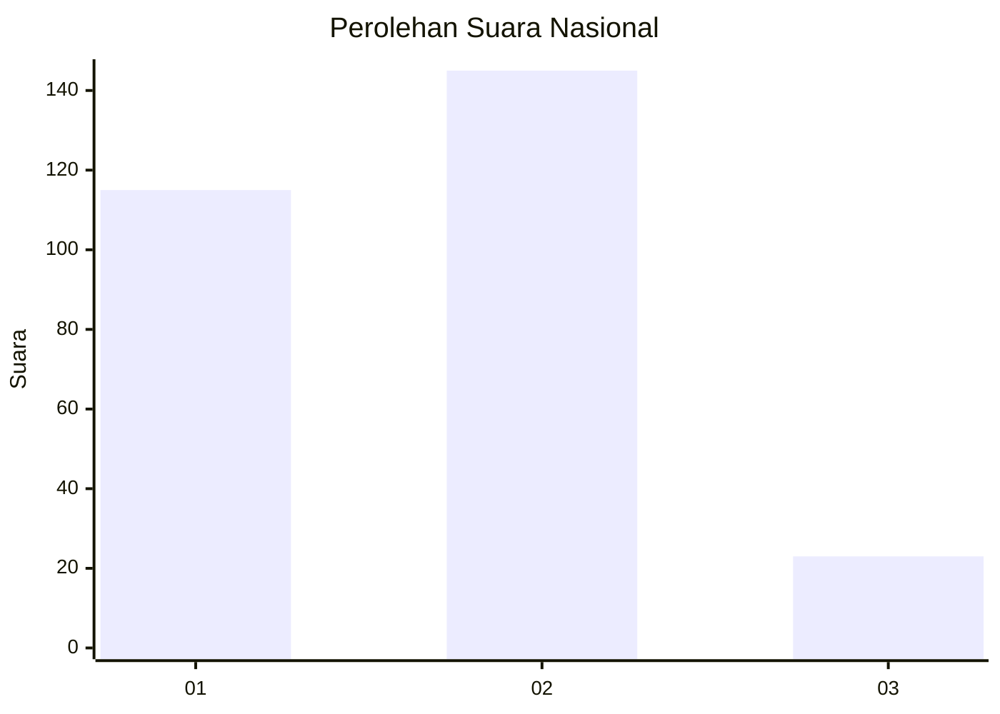
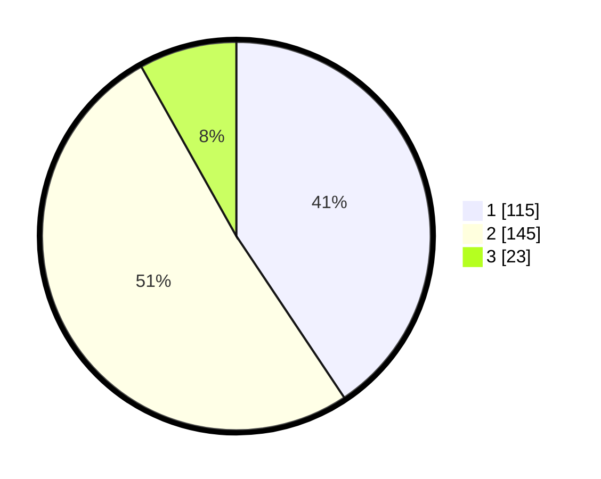

# Hasil

## Grafik

## Tabel

| No. | Nama Paslon    | Suara | Suara (raw) | Persentase |
|:--- |:-------------- | -----:| -----------:| ----------:|
| 1   | ANIES MUHAIMIN | 115   | [115][p-1]  | 40,64      |
| 2   | PRABOWO GIBRAN | 145   | [145][p-2]  | 51,24      |
| 3   | GANJAR MAHFUD  | 23    | [23][p-3]   | 8,13       |

[p-1]: https://github.com/gigit-pemilu/pemilu-2024/blob/main/pilpres/hitung-suara/sub/81-maluku/sub/06-seram-bagian-barat/sub/08-huamual/sub/2003-luhu/sub/079-tps/sub/paslon-1.txt
[p-2]: https://github.com/gigit-pemilu/pemilu-2024/blob/main/pilpres/hitung-suara/sub/81-maluku/sub/06-seram-bagian-barat/sub/08-huamual/sub/2003-luhu/sub/079-tps/sub/paslon-2.txt
[p-3]: https://github.com/gigit-pemilu/pemilu-2024/blob/main/pilpres/hitung-suara/sub/81-maluku/sub/06-seram-bagian-barat/sub/08-huamual/sub/2003-luhu/sub/079-tps/sub/paslon-3.txt

## Foto C Plano

https://sirekap-obj-formc.kpu.go.id/1fca/pemilu/ppwp/81/06/08/20/03/8106082003079-20240215-125151--b9bd978f-dc04-4381-842e-4ee1a11e8d0e.jpg

https://sirekap-obj-formc.kpu.go.id/1fca/pemilu/ppwp/81/06/08/20/03/8106082003079-20240215-125341--d267984d-ff6a-417d-9329-da80e6aa0679.jpg

https://sirekap-obj-formc.kpu.go.id/1fca/pemilu/ppwp/81/06/08/20/03/8106082003079-20240215-161621--1d0a89f6-fabb-469e-b4f4-2b953dc8700a.jpg

## Metadata

| Key        | Value               |
| ---------- | ------------------- |
| Time Stamp | 2024-02-19 11:00:00 |

