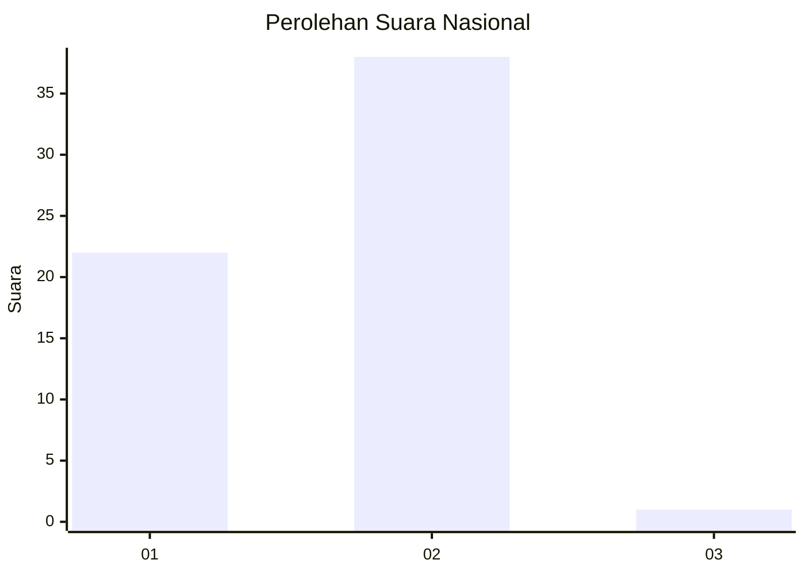
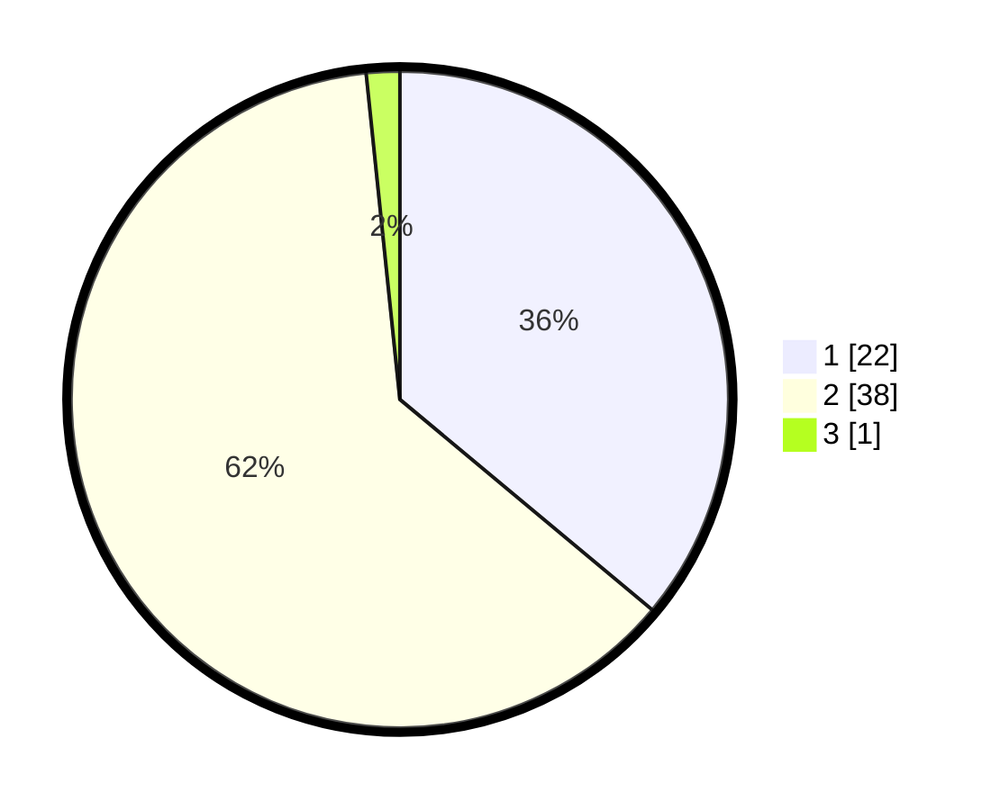

# Hasil

## Grafik

## Tabel

| No. | Nama Paslon    | Suara | Suara (raw) | Persentase |
|:--- |:-------------- | -----:| -----------:| ----------:|
| 1   | ANIES MUHAIMIN | 22    | [22][p-1]   | 36,07      |
| 2   | PRABOWO GIBRAN | 38    | [38][p-2]   | 62,30      |
| 3   | GANJAR MAHFUD  | 1     | [1][p-3]    | 1,64       |

[p-1]: https://github.com/gigit-pemilu/pemilu-2024/blob/main/pilpres/hitung-suara/sub/81-maluku/sub/06-seram-bagian-barat/sub/09-kepulauan-manipa/sub/2001-luhutuban/sub/010-tps/sub/paslon-1.txt
[p-2]: https://github.com/gigit-pemilu/pemilu-2024/blob/main/pilpres/hitung-suara/sub/81-maluku/sub/06-seram-bagian-barat/sub/09-kepulauan-manipa/sub/2001-luhutuban/sub/010-tps/sub/paslon-2.txt
[p-3]: https://github.com/gigit-pemilu/pemilu-2024/blob/main/pilpres/hitung-suara/sub/81-maluku/sub/06-seram-bagian-barat/sub/09-kepulauan-manipa/sub/2001-luhutuban/sub/010-tps/sub/paslon-3.txt

## Foto C Plano

https://sirekap-obj-formc.kpu.go.id/2a95/pemilu/ppwp/81/06/09/20/01/8106092001010-20240215-202143--79c5df2c-51bd-40c4-b97d-c4a2bbf90bca.jpg

https://sirekap-obj-formc.kpu.go.id/2a95/pemilu/ppwp/81/06/09/20/01/8106092001010-20240215-202350--640518fa-9905-4ae0-97ac-ce67fc5b1fea.jpg

https://sirekap-obj-formc.kpu.go.id/2a95/pemilu/ppwp/81/06/09/20/01/8106092001010-20240216-002518--32da5c38-b1b4-4206-befd-f2840b0e8321.jpg

## Metadata

| Key        | Value               |
| ---------- | ------------------- |
| Time Stamp | 2024-02-16 05:30:26 |

## DATA PEMILIH TETAP

Jumlah pemilih dalam DPT: **60**.
 * L: **34**.
 * P: **26**.

## DATA PENGGUNA HAK PILIH

Jumlah pengguna hak pilih dalam DPT: **51**.
 * L: **28**.
 * P: **23**.

Jumlah pengguna hak pilih dalam DPTb: **0**.
 * L: **0**.
 * P: **0**.

Jumlah pengguna hak pilih dalam DPK: **10**.
 * L: **7**.
 * P: **3**.

Jumlah pengguna hak pilih: **61**.
 * L: **35**.
 * P: **26**.

## JUMLAH SUARA SAH DAN TIDAK SAH

JUMLAH SELURUH SUARA SAH: **61**.

JUMLAH SUARA TIDAK SAH: **0**.

JUMLAH SELURUH SUARA SAH DAN SUARA TIDAK SAH: **61**.

