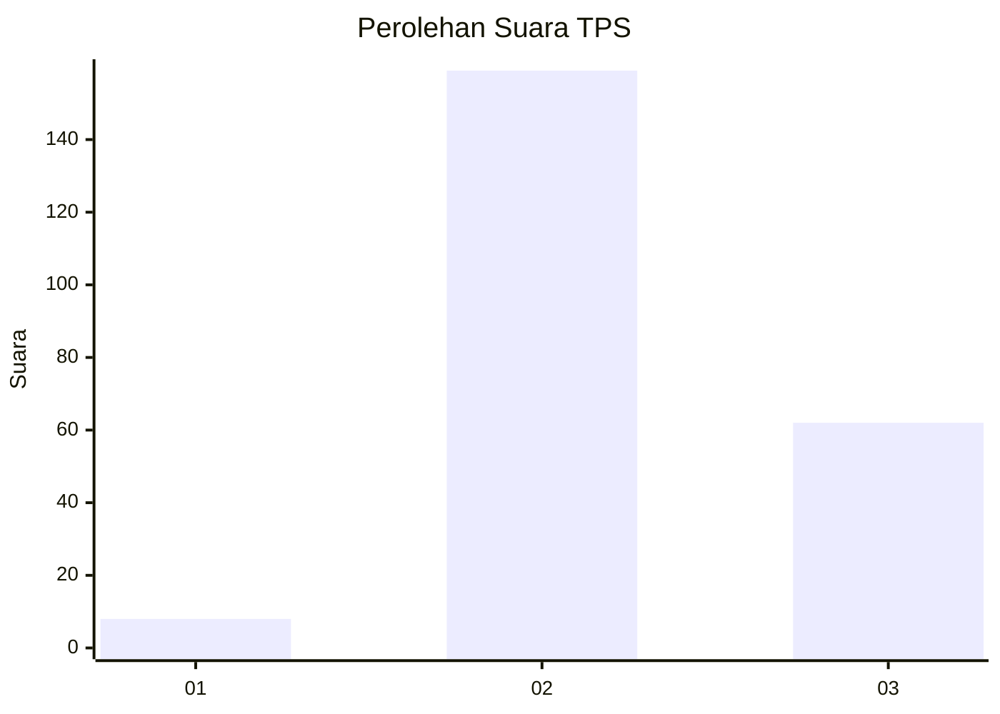
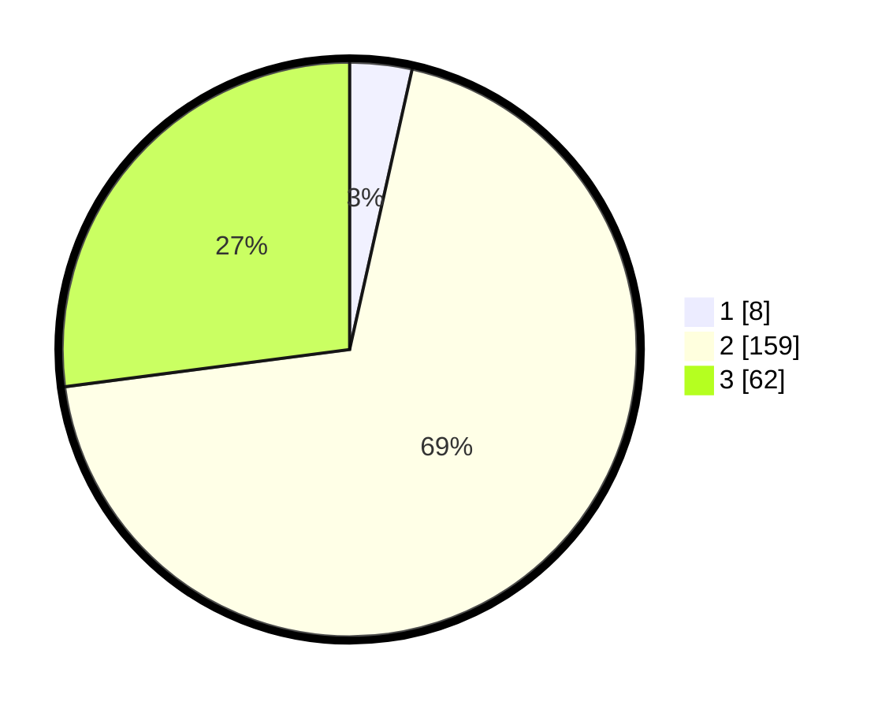

# Hasil

## Grafik

## Tabel

| No. | Nama Paslon    | Suara | Suara (raw) | Persentase |
|:--- |:-------------- | -----:| -----------:| ----------:|
| 1   | ANIES MUHAIMIN | 8     | [8][p-1]    | 3,49       |
| 2   | PRABOWO GIBRAN | 159   | [159][p-2]  | 69,43      |
| 3   | GANJAR MAHFUD  | 62    | [62][p-3]   | 27,07      |

[p-1]: https://github.com/gigit-pemilu/pemilu-2024-81-maluku/blob/main/pilpres/hitung-suara/sub/81-maluku/sub/06-seram-bagian-barat/sub/11-elpaputih/sub/2002-sanahu/sub/001-tps/sub/paslon-1.txt
[p-2]: https://github.com/gigit-pemilu/pemilu-2024-81-maluku/blob/main/pilpres/hitung-suara/sub/81-maluku/sub/06-seram-bagian-barat/sub/11-elpaputih/sub/2002-sanahu/sub/001-tps/sub/paslon-2.txt
[p-3]: https://github.com/gigit-pemilu/pemilu-2024-81-maluku/blob/main/pilpres/hitung-suara/sub/81-maluku/sub/06-seram-bagian-barat/sub/11-elpaputih/sub/2002-sanahu/sub/001-tps/sub/paslon-3.txt

## Foto C Plano

https://sirekap-obj-formc.kpu.go.id/a865/pemilu/ppwp/81/06/11/20/02/8106112002001-20240216-053958--e2ca1019-e7ad-432c-937a-cd39997749af.jpg

https://sirekap-obj-formc.kpu.go.id/a865/pemilu/ppwp/81/06/11/20/02/8106112002001-20240216-054244--3bab8905-314e-48b0-8f02-f1cd64c87af0.jpg

https://sirekap-obj-formc.kpu.go.id/a865/pemilu/ppwp/81/06/11/20/02/8106112002001-20240216-233637--d88840dc-6a9f-4925-a7a6-766d9606a7ba.jpg

## Metadata

| Key        | Value               |
| ---------- | ------------------- |
| Time Stamp | 2024-02-17 11:30:03 |

