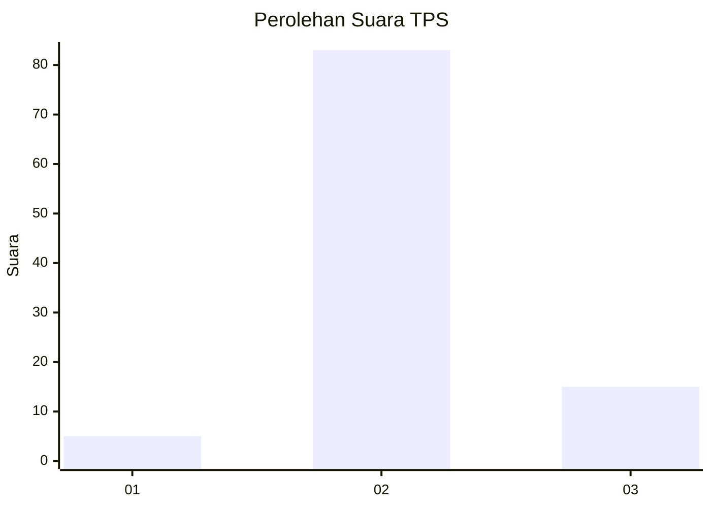
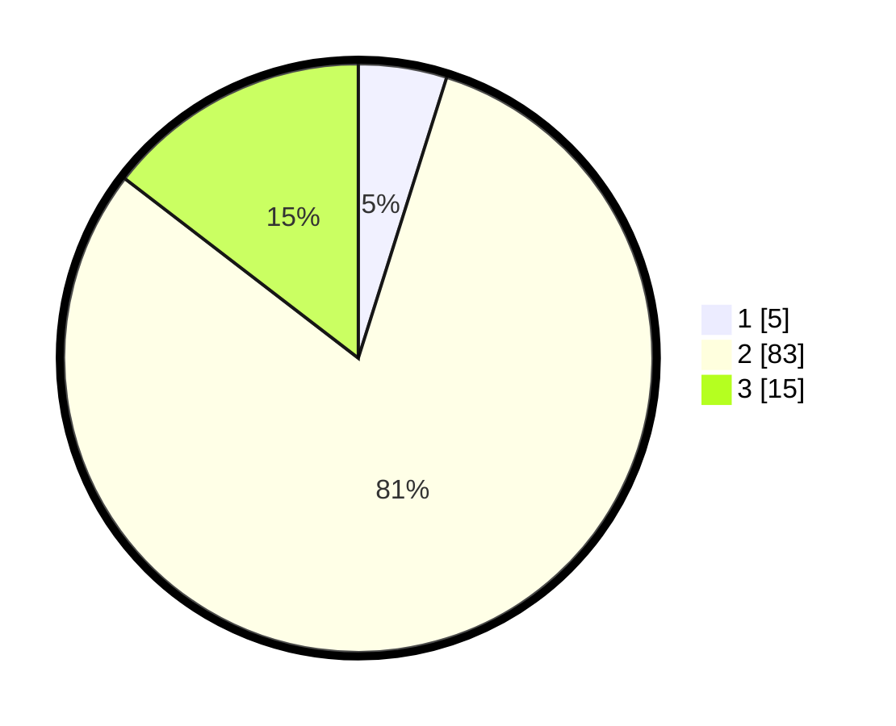

# Hasil

## Grafik

## Tabel

| No. | Nama Paslon    | Suara | Suara (raw) | Persentase |
|:--- |:-------------- | -----:| -----------:| ----------:|
| 1   | ANIES MUHAIMIN | 5     | [5][p-1]    | 4,85       |
| 2   | PRABOWO GIBRAN | 83    | [83][p-2]   | 80,58      |
| 3   | GANJAR MAHFUD  | 15    | [15][p-3]   | 14,56      |

[p-1]: https://github.com/gigit-pemilu/pemilu-2024-81-maluku/blob/main/pilpres/hitung-suara/sub/81-maluku/sub/06-seram-bagian-barat/sub/11-elpaputih/sub/2002-sanahu/sub/003-tps/sub/paslon-1.txt
[p-2]: https://github.com/gigit-pemilu/pemilu-2024-81-maluku/blob/main/pilpres/hitung-suara/sub/81-maluku/sub/06-seram-bagian-barat/sub/11-elpaputih/sub/2002-sanahu/sub/003-tps/sub/paslon-2.txt
[p-3]: https://github.com/gigit-pemilu/pemilu-2024-81-maluku/blob/main/pilpres/hitung-suara/sub/81-maluku/sub/06-seram-bagian-barat/sub/11-elpaputih/sub/2002-sanahu/sub/003-tps/sub/paslon-3.txt

## Foto C Plano

https://sirekap-obj-formc.kpu.go.id/9a2d/pemilu/ppwp/81/06/11/20/02/8106112002003-20240215-023727--5773efa7-9b5b-4cce-bbe2-a56898beda3f.jpg

https://sirekap-obj-formc.kpu.go.id/9a2d/pemilu/ppwp/81/06/11/20/02/8106112002003-20240215-030053--2169cda9-703c-43d3-8e9d-5d2446b834a7.jpg

https://sirekap-obj-formc.kpu.go.id/9a2d/pemilu/ppwp/81/06/11/20/02/8106112002003-20240215-025830--244c7a59-4b23-48bb-9eb2-37c7a86f3b82.jpg

## Metadata

| Key        | Value               |
| ---------- | ------------------- |
| Time Stamp | 2024-02-17 11:30:03 |

