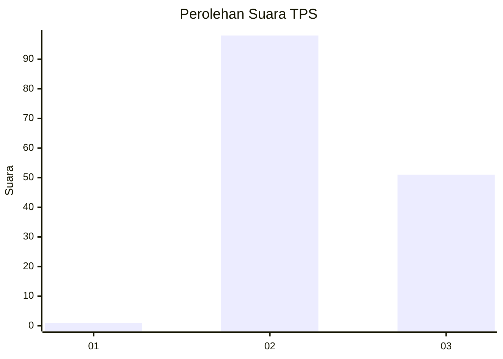
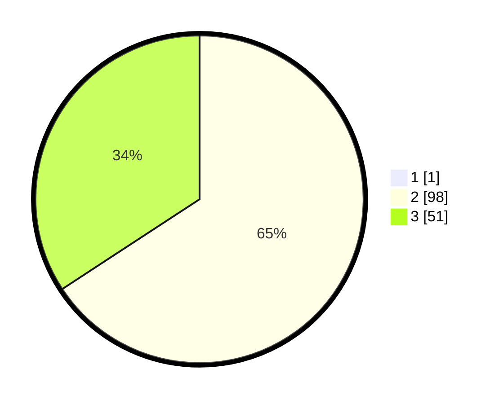

# Hasil

## Grafik

## Tabel

| No. | Nama Paslon    | Suara | Suara (raw) | Persentase |
|:--- |:-------------- | -----:| -----------:| ----------:|
| 1   | ANIES MUHAIMIN | 1     | [1][p-1]    | 0,67       |
| 2   | PRABOWO GIBRAN | 98    | [98][p-2]   | 65,33      |
| 3   | GANJAR MAHFUD  | 51    | [51][p-3]   | 34,00      |

[p-1]: https://github.com/gigit-pemilu/pemilu-2024-81-maluku/blob/main/pilpres/hitung-suara/sub/81-maluku/sub/06-seram-bagian-barat/sub/11-elpaputih/sub/2003-wasia/sub/001-tps/sub/paslon-1.txt
[p-2]: https://github.com/gigit-pemilu/pemilu-2024-81-maluku/blob/main/pilpres/hitung-suara/sub/81-maluku/sub/06-seram-bagian-barat/sub/11-elpaputih/sub/2003-wasia/sub/001-tps/sub/paslon-2.txt
[p-3]: https://github.com/gigit-pemilu/pemilu-2024-81-maluku/blob/main/pilpres/hitung-suara/sub/81-maluku/sub/06-seram-bagian-barat/sub/11-elpaputih/sub/2003-wasia/sub/001-tps/sub/paslon-3.txt

## Foto C Plano

https://sirekap-obj-formc.kpu.go.id/5fd1/pemilu/ppwp/81/06/11/20/03/8106112003001-20240215-111628--d23e7c89-e771-47e5-8129-e8635ed58a8a.jpg

https://sirekap-obj-formc.kpu.go.id/5fd1/pemilu/ppwp/81/06/11/20/03/8106112003001-20240215-112158--38eb9056-974a-4d5c-89be-1fea218f22fa.jpg

https://sirekap-obj-formc.kpu.go.id/5fd1/pemilu/ppwp/81/06/11/20/03/8106112003001-20240215-112315--c2c27dd5-d1b4-4e8f-9312-fa0e2d2e7da2.jpg

## Metadata

| Key        | Value               |
| ---------- | ------------------- |
| Time Stamp | 2024-02-16 11:00:29 |

